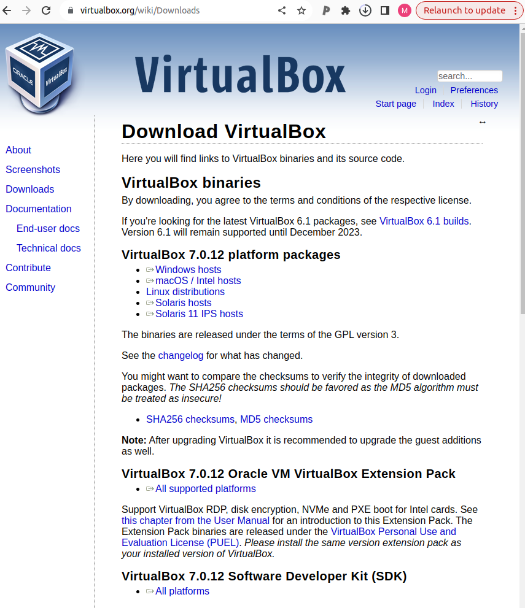
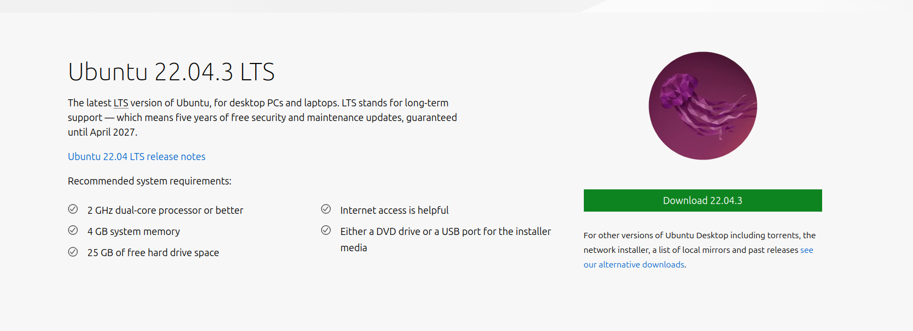
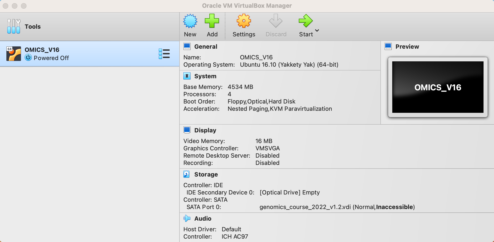
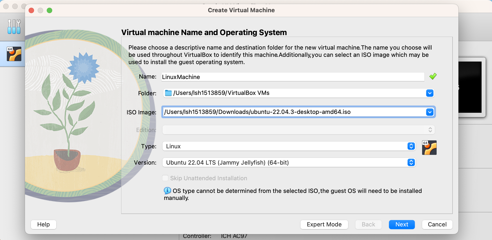
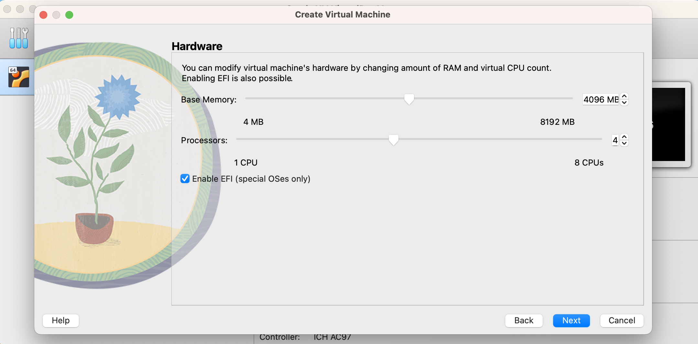
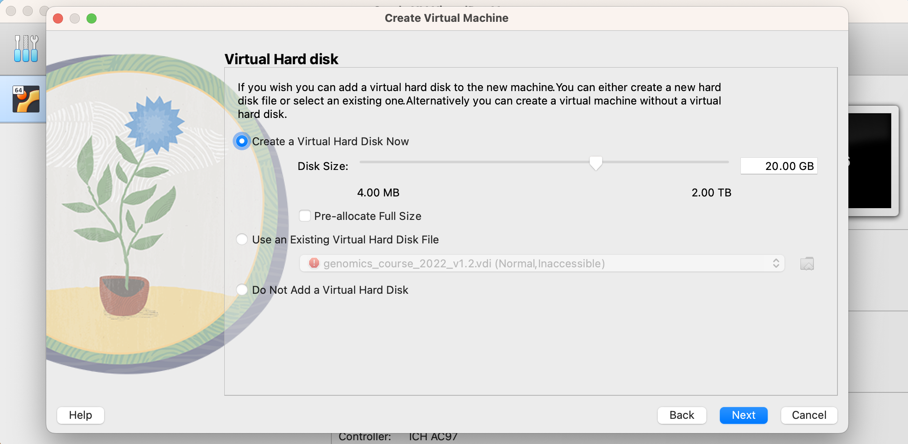
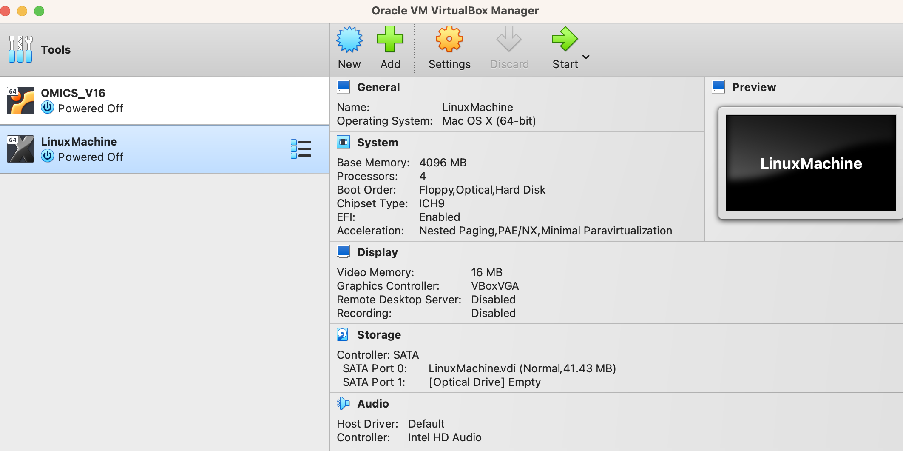

# Virtual Box: Setting Up Linux

## What is Virtual Box

VirtualBox is a free tool that lets you use different operating systems on one computer. It works on Windows, macOS, Linux, and Solaris, and supports many types of operating systems inside it. It's easy to use, has useful features like saving your virtual machine's state, supports USB devices, and provides decent performance. VirtualBox is popular among users who need to run different operating systems without needing multiple physical computers, and it's supported by a helpful community.

 
[**Virtual Box Website Link**](https://www.virtualbox.org/) 
 

## Step-by-step Setup 

### **Step 1**  

Install Virtual Box from [**https://www.virtualbox.org/wiki/Downloads**](https://www.virtualbox.org/wiki/Downloads). 
    Remember to select the correct installation client depending on your 
    operating system (windows, macOS, etc). 

### **Step 2** 

Download the latest version of Linux Ubuntu from [**https://ubuntu.com/download/desktop**](https://ubuntu.com/download/desktop). This will be an
ISO file (e.g. ubuntu-22.04.3-desktop-amd64.iso) which is approximately 5GB. 

### **Step 3** 

Open Virtual Box on your computer and select to **NEW** to create new virtual machine.

### **Step 4** 

Name machine and select the ISO file (downloaded in step 2). Make sure to set 
**Type** as **Linux** and select **Version** which matches you ISO file e.g. Ubuntu 22.04 LTS (Jammy Jellyfish)

### **Step 5** 

Set memory usage and storage space. Do not max this out! 

### **Step 6** 

Select to create a Virtual Hard Disk

### **Step 7** 

Finish creating the instance and click **START** to launch our Virtual Machine.

