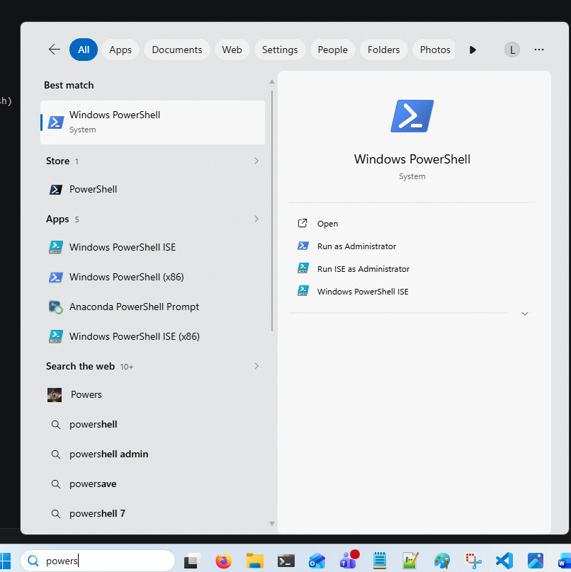
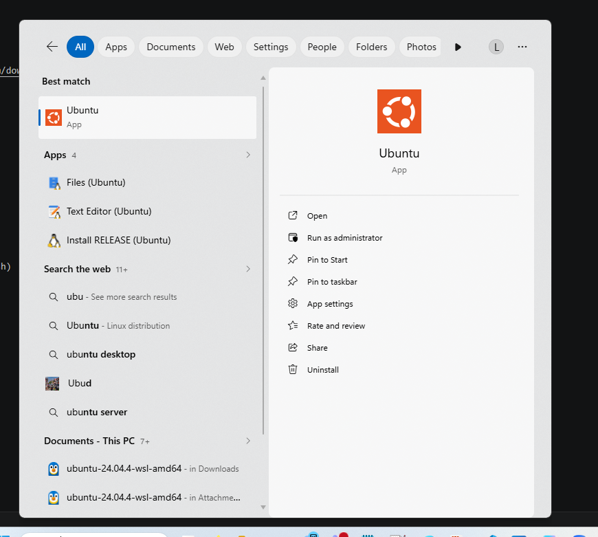
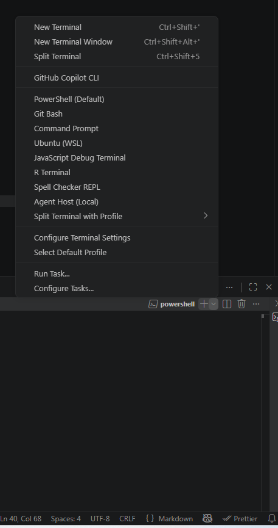
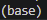

# Setting up your machines

## What is Linux

Linux is an open-source operating system commonly used in bioinformatics, data science, and high-performance computing. Unlike Windows or macOS, Linux provides a powerful command-line environment that makes it easier to automate analyses, manage large datasets, and run scientific software efficiently. Many genomics tools, including read aligners, assemblers, and variant callers, are developed primarily for Linux because of its stability, flexibility, and compatibility with research computing environments.

## Windows and mac setup

### **Windows**  

In windows its very easy to setup, what we can do is open up a powershell by searching powershell in the task bar

And once opened we are going to install with a simple command

`wsl --install -d ubuntu`

WSL stands for Windows Subsystem for Linux. This command installs WSL along with the Ubuntu distribution, which is one of the most commonly used versions of Linux. After installation, you’ll be able to run a full Linux environment directly inside Windows.

This will ask you to reboot your system once done, and then we can launch ubuntu after resetting the laptop the same way we opened powershell

Sometimes it wont appear and we will have to type the same command in powershell again and it will work. 

It will ask you for a username and a password, and as you don't need ubuntu to be secure you can set the password to your username so you don't forget, but it is entirely up to you.

### **Mac** 

With Mac we dont need to download linux, as macOS is already a Unix-based operating system and can run most bioinformatics tools natively through the Terminal.

Mac users dont need to but they can install homebrew, which has a lot of packages that we need but it isnt necessary. Instead we can just install Conda

### **Getting VScode to use linux**

Now we have install linux on our machines we can get vscode to use WSL instead of powershell

From the image you can see if we select the plus icon and the arrow next to the plus icon, we can then select ubuntu. This opens a new terminal that is specifically linux based.

### **Installing Conda** 

We can install conda by going to the website and following the tuturial it gives, we only need miniconda not anaconda

[Mac](https://www.anaconda.com/docs/getting-started/miniconda/install/mac-cli-install)

[Linux](https://www.anaconda.com/docs/getting-started/miniconda/install/linux-install)

If you have windows we have installed linux, so we want to install the linux version.

It has instructions to install you can follow so just follow the guide and reset the terminal once installed.

### **All done** 

Great! If it worked you should see the (base) icon next to your name of the PC

Now you can check out the [conda](https://lshtm-genomics.github.io/omics-course/additional-info/conda/) page