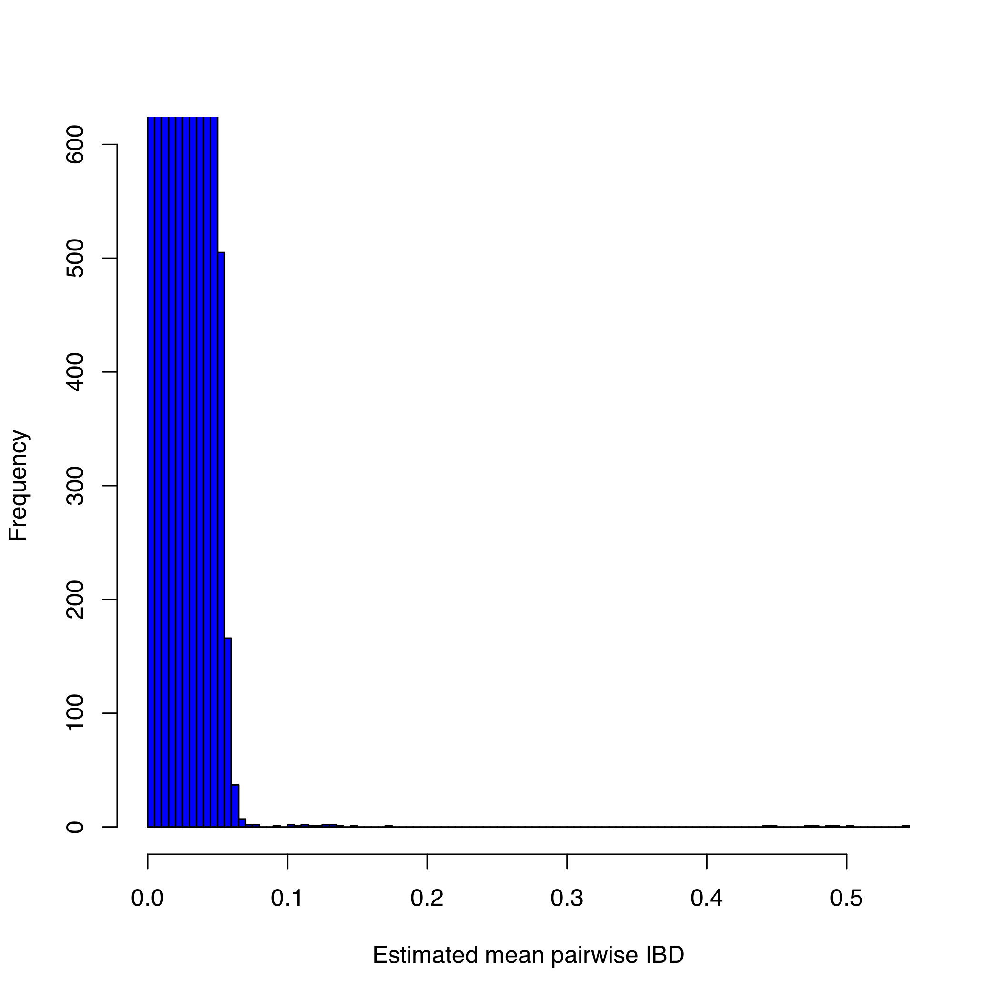
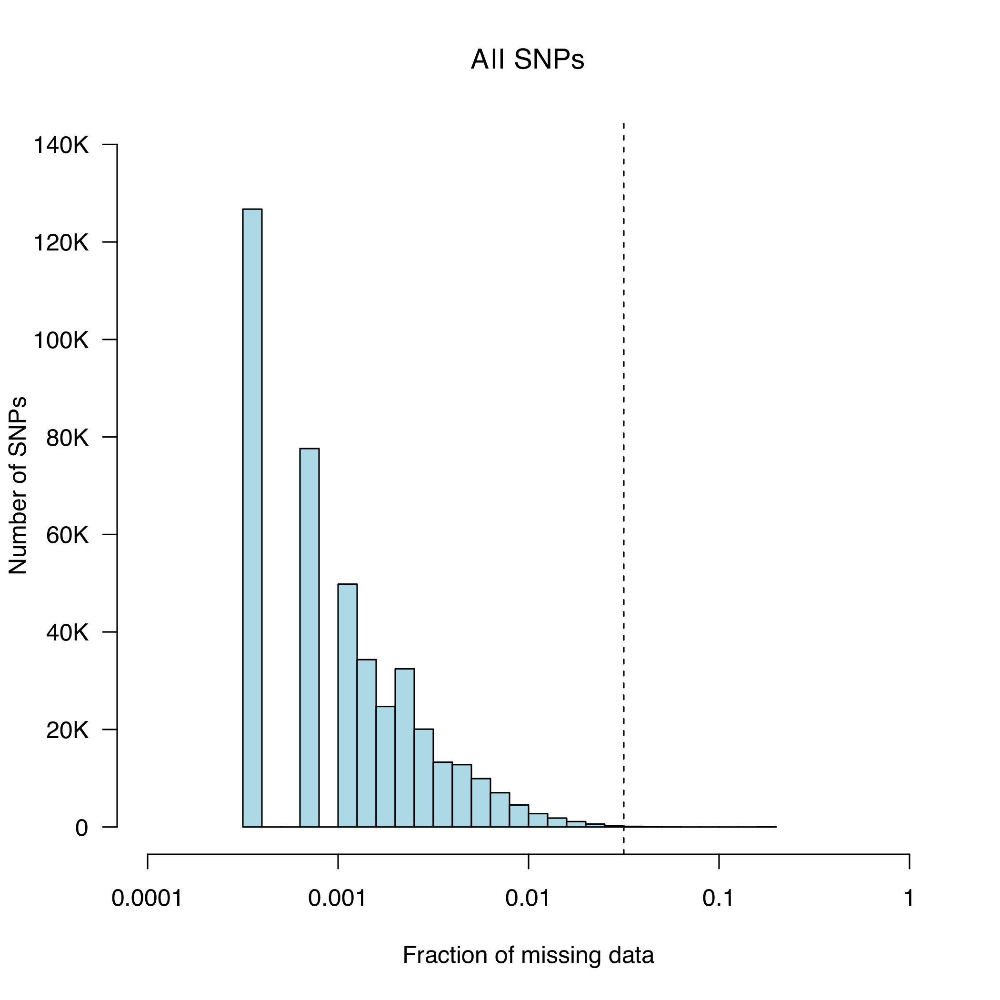

# Genome Wide Aassociation Studies (GWAS) 

The objective of this tutorial is to get you familiar with the basic file format used for GWAS and common tools used for analysis and take you through data Quality control (Crucial in any study!). 

Our dataset is based on a GWAS study for Meningococcal disease in a European population (https://www.nature.com/articles/ng.640).

Data
 * Genome wide SNP data
 * Scripts to facilitate analysis

Software you will need for analysis 
 * Computer workstation with Unix/Linux operating system 
 * PLINK software for genome-wide association analysis: http://pngu.mgh.harvard.edu/_purcell/plink/download.shtml
 * Statistical software for data analysis and graphing such as: R: http://cran.r-project.org/
 * BCFtools

The data for this practical is in the `~/data/gwas` directory. Please navigate to this directory before running any commands. 

## 1. Create BED files for analysis

Convert your plink genotype files to binary format - smaller file easier for manipulation of data. 

**We have already provided you with plink formatted files we won't have to do this step.**

!!! info
    plink allows for the conversion from many different formats to plink format. For example if you had a VCF file you could type:
    ```
    plink --vcf MD.vcf.gz --make-bed --out MD 
    ```

Your data set:

Plink binary formatted dataset consisting of 3004 individuals, 409 cases, 2595 controls, 601089 variants

 * MD.bed – binary-coded information on individuals and variants
 * MD.bim – variant information: “Chromosome”, “Marker name”, “Genetic Distance” (or '0' as dummy variable), “Base-pair coordinate”, “Allele 1”, “Allele 2”. Each SNP must have two alleles.
 * MD.fam – Individual Information. The first 6 columns are mandatory and in the order: “Family ID”, “Individual ID”, “Paternal ID”, “Maternal ID”, “Sex”, “Phenotype”.

Double-check the basic stats of your dataset (number of variants, individuals, controls, cases) by examining MD.bim and MD.fam with bash utilities like `awk` or `wc`. 

What other information is available?

## 2. Sample QC

### Identification of Individuals with discordant sex information

Ideally, if X-chromosome data are available, we would calculate the mean homozygosity rate across X chromosome markers for each individual in the study and identify discordance with our reported Sex phenotype.

**As our data only contains autosomes we will skip this step.**

###  Identification of individuals with elevated missing data rates or outlying heterozygosity rate 

At the shell prompt type: 
```
plink --bfile MD --missing --out MD
```

This creates the files MD.imiss (sample-based missing report) and MD.lmiss (variant-based missing report). The fourth column in the imiss file (N_MISS) gives the number of missing SNPs and the sixth column (F_MISS) gives the proportion of missing SNPs per individual. 

At the shell prompt type:

```
plink --bfile MD --het --out MD
```

This creates the file MD.het where the third column gives the observed number of homozygous genotypes [O(Hom)] and the fifth column gives the number of non-missing genotypes [N(NM)], per individual. 

Calculate the observed heterozygosity rate per individual using the formula (N(NM) - O(Hom))/N(NM) and create a graph where the proportion of missing SNPs per individual is plotted on the x-axis and the observed heterozygosity rate per individual is plotted on the y-axis. Type: 

```
R CMD BATCH imiss-vs-het.Rscript
```

This creates the graph MD.imiss-vs-het.pdf (see below). 


!!! info
    Examine the plot to decide reasonable thresholds at which to exclude individuals based on elevated missing or extreme heterozygosity. 

    Here we will exclude all individuals with a genotype failure rate ≥ 0.0185 (vertical dashed line) and/or heterozygosity rate ± 3 standard deviations from the mean (horizontal dashed lines). 

Add the family ID and individual ID of all the failing this QC using:

```
R CMD BATCH imiss_het_fail.Rscript
```

This produces a file named fail_imiss_het_qc.txt 

!!! question
    How many samples failed this QC stage? 

### Identification of duplicated or related individuals 

To identify duplicate & related individuals, create an Identity-by-State (IBS) matrix – calculated for each pair of individuals based on the shared proportion of alleles. 

To reduce the computational complexity, first prune the dataset so that no pair of SNPs (within a given window e.g 200kb) has linkage disequilibrium (r² > 0.2). Type 

```
plink --bfile MD --indep-pairwise 200 5 0.5 --out MD
```

This creates files with the extension *.prune.in *.prune.out & *.log. Then, to extract pruned SNPs and generate pair-wise IBS, type: 

```
plink --bfile MD --extract MD.prune.in --genome --out MD 
```

This might take a few minutes and creates files with the extension *.genome & *.log 

!!! info
    You can also create a BED file with the pruned SNPs: `plink --bfile MD --extract MD.prune.in --make-bed --out MD.pruned`. Note: `nohup` and `&` are used to allow the command to run in the background thus freeing up the terminal for further use. You can use top to see if the process is still running (remember to press q to exit). Alternatively, you could of course simply run the command in another terminal. 

!!! question
    How many SNPs are in your pruned list? HINT: Have a look at your log file (using the `less` command) or type `wc -l MD.prune.in`

To identify all pairs of individuals with an Idenity-by-descent (IBD) > 0.185. Type: 

```
perl run-IBD-QC.pl MD
```

!!! info
    The code also looks at the individual call rates stored in MD.imiss and outputs the ID of the individual with the lower call rate to **fail_IBD-QC.txt** for each pair of related individuals. 

To visualise the IBD rates, type: 

```
R CMD BATCH  plot-IBD.Rscript
```

This generates MD.IBD-hist.pdf 



!!! info
    Note: The expectation is that IBD = 1 for duplicates or monozygotic twins, IBD = 0.5 for 1st-degree relatives, IBD = 0.25 for 2nd-degree relatives and IBD = 0.125 for 3rd-degree relatives. Due to variation around these values it is typical to exclude one individual from each pair with an IBD > 0.185, which is halfway between the expected IBD for 3rd- and 2nd-degree relatives. 

### Identification of individuals of divergent ancestry 

In the interest of time, this step has been mostly done for you.

Principal components analysis (PCA) is performed with pruned bed file datasets generated before using the ./RUN_PCA.sh command. This generates the following output files: MD.pruned.pca.par, MD.pruned.pca.log, MD.pruned.pca.evec, MD.pruned.pca, MD.pruned.eval. The evec extension file is what you will need to view your PCs

Create a scatter diagram of the first two principal components, including all individuals in the file MD.pruned.pca.evec (the first and second PCs are columns 2 and 3 respectively). Type: 

```
R CMD BATCH plot-pca-results.Rscript
```

This outputs **pca_plot.pdf**


!!! info
    Data in column 4 is used to colour the points according to phenotype (i.e. case vs control). Here, we chose to exclude all individuals with a 2nd principal component score >0.07. 


```
R CMD BATCH write_pca_fail.R
```

To write the FID and IID of the filtered individuals to a file called **fail_pca.txt**. 

!!! question
    How many individuals failed the PCA threshold? 

### Remove all individuals failing QC 

To concatenate all the files listing individuals failing the previous QC steps into single file, at the unix prompt type: 

```
cat fail*txt | sort -k1 | uniq > fail_qc_inds.txt
```

The file fail_qc_inds.txt should now contain a list of unique individuals failing the previous QC steps. 

To remove these from the dataset type: 

```
plink --bfile MD --remove fail_qc_inds.txt --make-bed --out clean.MD
```

!!! question
    How many individuals in total will be excluded from further analysis?

    How many individuals in total do you have for further analysis? HINT: check your log file

## Marker QC

### Identify all markers with an excessive missing data rate 

To calculate the missing genotype rate for each marker type: 

```
plink --bfile clean.MD --missing --out clean.MD
```

The results of this analysis can be found in clean.MD.lmiss. 

Plot a histogram of the missing genotype rate to identify a threshold for extreme genotype failure rate. This can be done using the data in column five of the clean.MD.lmiss file. Type: 

```
R CMD BATCH lmiss-hist.Rscript
```

This generates clean.MD.lmiss.pdf 



We chose to a call-rate threshold of 5% (these SNPs will be removed later in the protocol). 

### Test markers for different genotype call rates between cases and contols 

To test all markers for differences in call rate between cases and controls, at the Unix prompt type: 

```
plink --bfile clean.MD --test-missing --allow-no-sex --out clean.MD
```

The output of this test can be found in clean.MD.missing. 

To create a file called ‘fail-diffmiss-qc.txt’, which contains all SNPs with a significantly different (P<0.00001) missing rate between cases and controls, type 

```
perl run-diffmiss-qc.pl clean.MD
```

!!! question
    How many variants have failed QC? 

### Remove all markers failing QC 

To remove poor SNPs from further analysis and create a new clean (QC’D) MD data file, at the Unix prompt type:

```
plink --bfile clean.MD --exclude fail-diffmiss-qc.txt --maf 0.01 --geno 0.05 --hwe 0.00001 --make-bed --out clean.final.MD
```

In addition to markers failing previous QC steps, those with a MAF < 0.01, missing rate > 0.05 and a HWE P-value < 0.00001 (in controls) are also removed. 

!!! question
    How many variants and individuals pass filters and QC for your GWAS? 


## Perform a GWAS on your QC’d dataset

To run a basic case/control association test, at the unix prompt type:

```
plink --bfile clean.final.MD --assoc --ci 0.95 --adjust --allow-no-sex --out final.MD.assoc
```

Your association output file will contain 12 columns: 

 * CHR - Chromosome
 * SNP - SNP ID
 * BP - Physical position (base-pair)
 * A1 - Minor allele name (based on whole sample)
 * F_A - Frequency of this allele in cases
 * F_U - Frequency of this allele in controls
 * A2 - Major allele name
 * CHISQ - Basic allelic test chi-square (1df)
 * P - Asymptotic p-value for this test
 * OR - Estimated odds ratio (for A1, i.e. A2 is reference)
 * L95 - Lower bound of 95% confidence interval for odds ratio
 * U95 - Upper bound of 95% confidence interval for odds ratio

To visualise your data:

Generate a Quantile-Quantile (QQ) plot of your p-values to look at the distribution of P-values and assess whether genomic inflation is present (lambda>1) (this can also be found in your assoc. log file).


Generate a manhattan plot to visualise where your association signals lie across the chromosomes. Type: 

```
R CMD BATCH GWAS_plots.R
```

This generates both plots: final.MD.assoc_qq.png and final.MD.assoc_mhplot.png 


!!! question
    What do the plots tell you? 

Let’s zoom into a region of interest: the tower of SNPs on CHR1 (coloured in yellow). This the Complement Factor H (CFH) region known to be associated with Meningococcal disease. The previous Rscript in 8.2.2 above also generated the chr1_CFH_region.txt file. 

 * Open the locuszoom webpage: http://locuszoom.org/genform.php?type=yourdata
 * Upload the text file (final.MD.assoc.assoc.adjusted)
 * Set The P-Value column name to be "GC"
 * Set the Marker column name to be "SNP"
 * In the region section, enter the most associated snp (“rs1065489”) with a flanking size of 500KB
 * In the Genome Build/LD Population field select the appropriate hg19 european ref panel.
 * Then press "Plot Data" to generate your plot.

