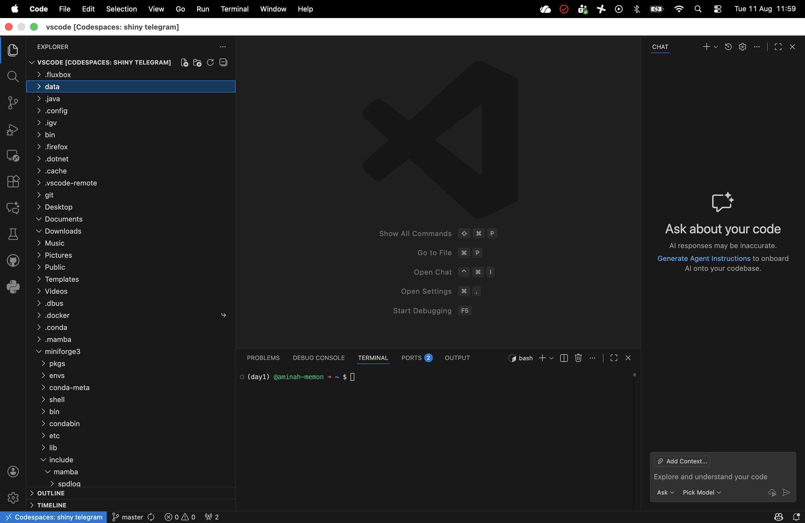
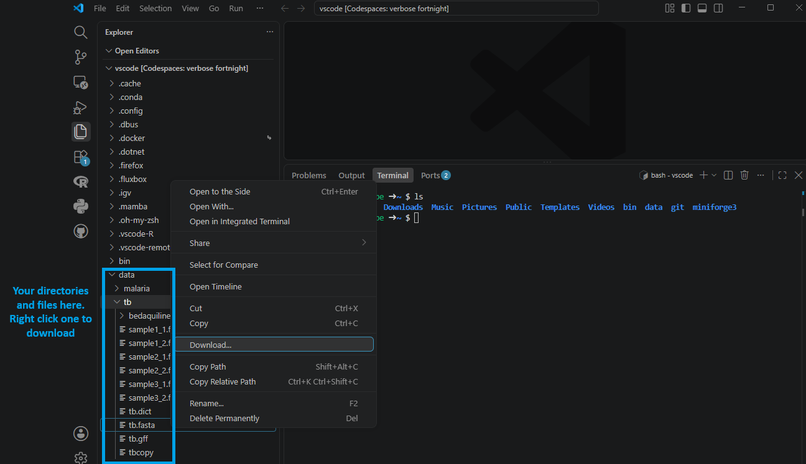

# Getting connected

### Introduction

There are two components you will need to understand before we get connected.

####  GitHub Codespaces

GitHub Codespaces is a cloud-based development environment that allows users to run and edit code directly in a virtual machine (VM) hosted by GitHub. It provides a fully configured workspace, pre-installed with necessary tools like Git, Python, and Docker, eliminating the need for users to set up a local environment. Every GitHub user has a certain number of free Codespace hours per month (120 for a free account), making it an ideal solution for doing some occasional bioinformatics. 

#### Visual Studio Code (VS Code)

VS Code is a lightweight yet powerful code editor that supports multiple programming languages. It also allows users to connect to GitHub Codespaces, allowing users to work on cloud-based VMs as if they were local files.
Users will launch GitHub Codespaces via VS Code, enabling them to interact with their virtual machine through a familiar coding interface.

- Explorer (the left panel): here you will find all your folders and files e.g. ~/data/
- Terminal (bottom panel): here you can run code and commands.
  - The `+` icon next to `bash` allows you to open multiple terminals at once.
- File (top left): You can use this to create new files to store code and scripts. 

The left-hand panel is very useful, because you can create images and files from commands in the terminal and view them directly in vs-code by selecting the image or file created.

You can also download files straight from VS Code to your machine which we will be doing a lot this course. Simply click the files in the left-hand panel and right click the file or folder you want to download to your machine.

#### How does codespaces and VS code Work Together:

1. Users launch GitHub Codespaces to create a cloud-based virtual machine.
2. They connect to the VM using VS Code, accessing the terminal and code files.

This setup allows users to work on cloud-hosted projects with command-line access, making it ideal for bioinformatics and data analysis workflows.

## Getting set up

### 1. Set up a GitHub account

Head over to https://github.com/ and sign up for an account. You can skip this step if you already have an account.

### 2. Download Visual Studio Code

Get the latest version of vscode from https://code.visualstudio.com/ and follow install instructions from the website. Please note the default version is for Windows, ensure to click additional options if using Mac.

### 3. Download IGV

For the course we have a few sections where we view alignments, variants, and more in IGV. Therefore, we need to make sure we have IGV installed, you can do so by clicking [here](https://igv.org/doc/desktop/). You might be prompted to install java as well which if you are then it is recommended to do so.

### 4. Get connected

You can connect to your GitHub Codespace using the following steps:

1. Open Visual Studio Code.
2. Install the GitHub Codespaces extension by clicking on the following link and following instructions: [GitHub Codespaces](https://marketplace.visualstudio.com/items?itemName=GitHub.codespaces).
3. Open the command palette by pressing `Ctrl+Shift+P` (Windows/Linux) or `Cmd+Shift+P` (Mac).
4. Type `Create new Codespace` and select the option.
5. Enter `lshtm-genomics/codespaces` in the repository field.
6. Select the `day1` template.
7. Select `2 cores, 8GB RAM, 32 GB storage` option.

It should take a few minutes to create the Codespace. Once it's ready, you will be able to access the terminal and files directly from VS Code. Most practicals have different codespaces, and we will tell you which codespace to run at the start of each practical.

!!! danger "Important"
    When you are finished working, make sure to stop the Codespace to using up your free hours. You can do this by opening up the command palette (`Cmd+Shift+P` or `Ctrl+Shift+P`) and typing `Codespaces: Stop Current Codespace`. You will be able to restart that Codespace at any time by selecting `Codespaces: Connect to Codespace` from the command palette.

That's it! You're now connected to your GitHub Codespace and ready to start your bioinformatics journey. 
