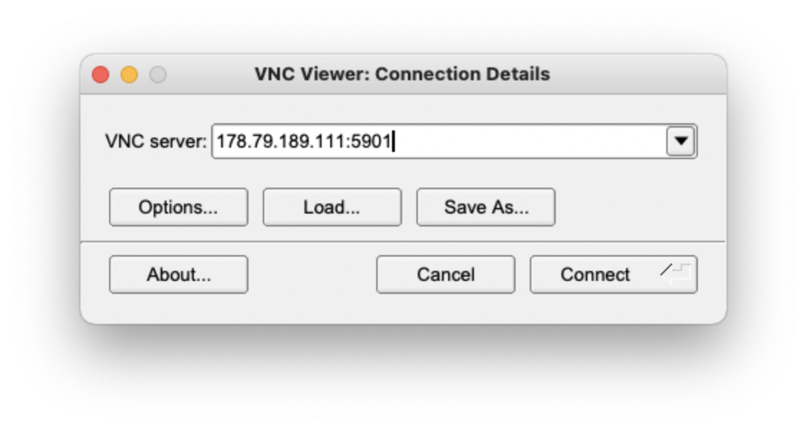
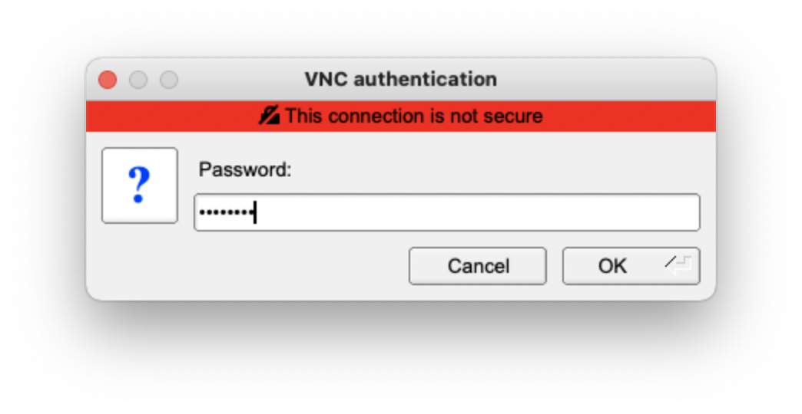
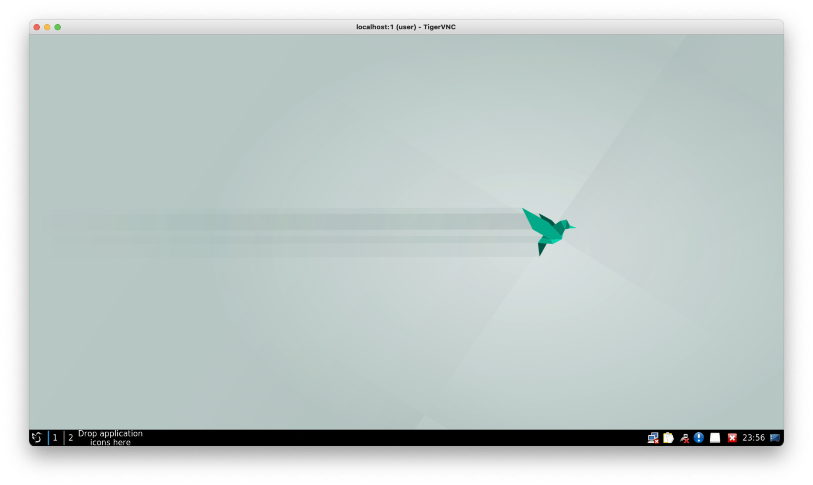

# Getting connected

## 1. Download and install TigerVNC. 

Click the following link to download the appropriate installer depending on your OS: 

* [MacOS](https://sourceforge.net/projects/tigervnc/files/stable/1.12.0/TigerVNC-1.12.0.dmg/download)
* [Windows](https://sourceforge.net/projects/tigervnc/files/stable/1.12.0/vncviewer64-1.12.0.exe/download)

Install using instructions provided.

## 2. Start TigerVNC 

Start TigerVNC and enter the IP address followed by **:5901** that you have been provided and click connect. For example if you IP address is **178.79.189.111** then enter such as in the screenshot below

{: style="width:50%"}

## 3. Enter you password

Enter the password **genomics** and click **OK**

{: style="width:50%"}

You should now see your virtual desktop and can start using it. 

