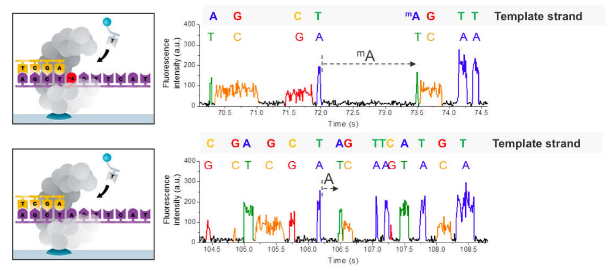
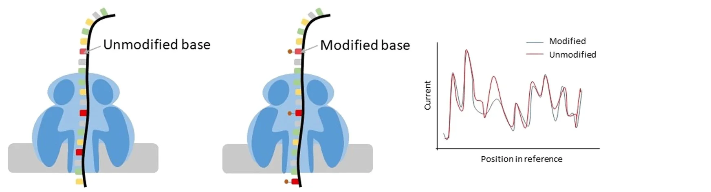
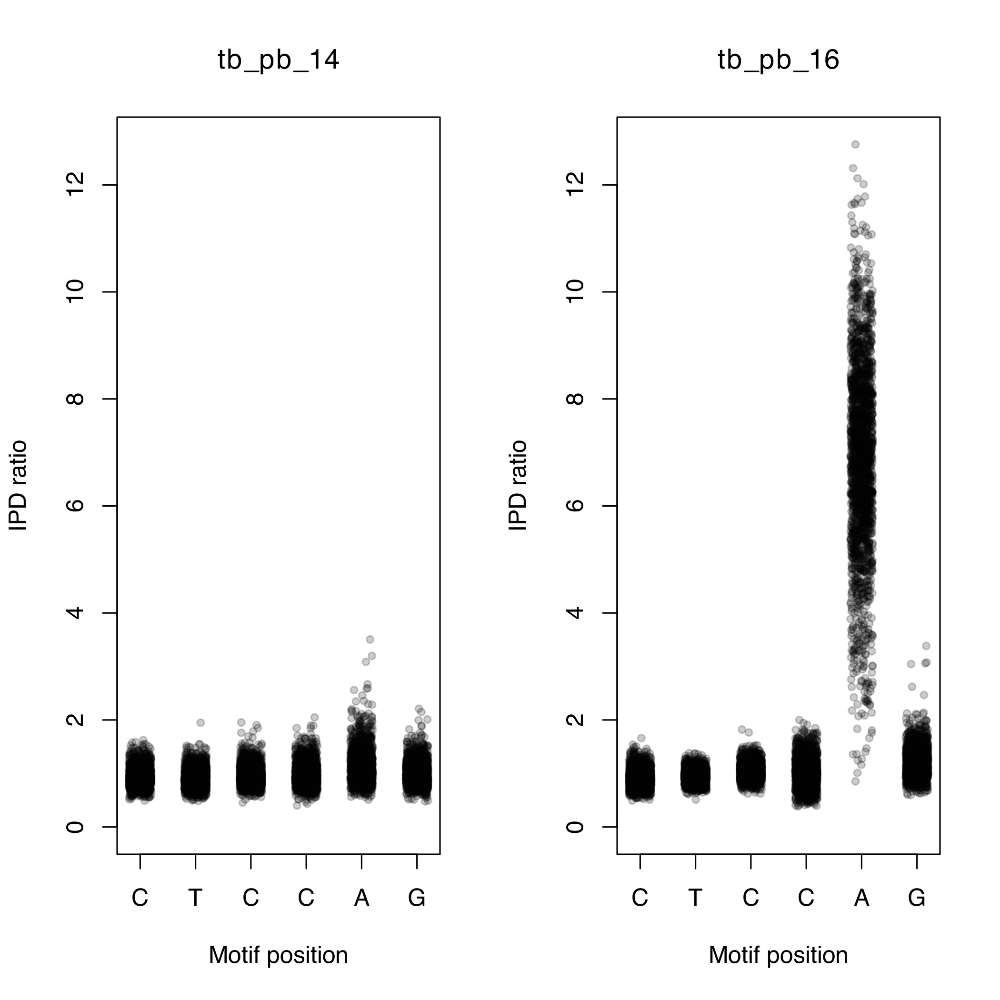
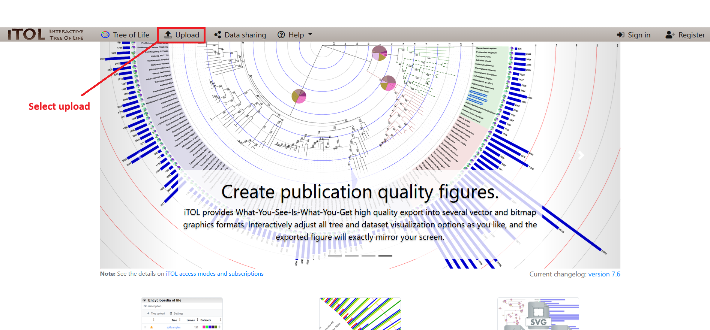
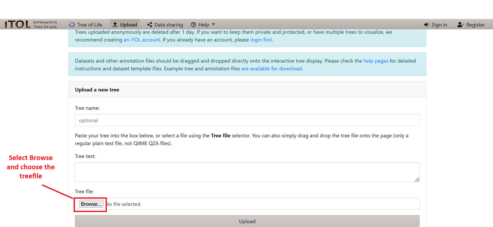
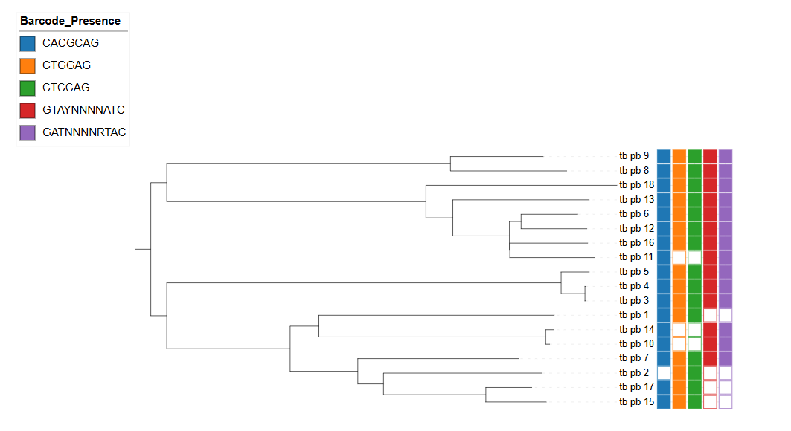
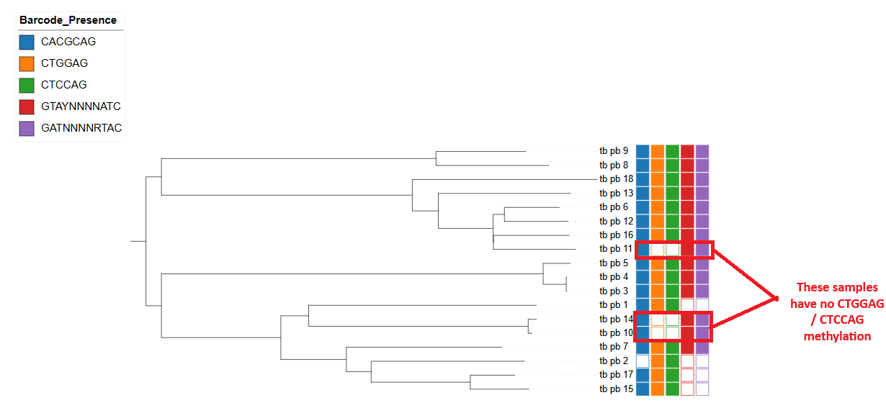
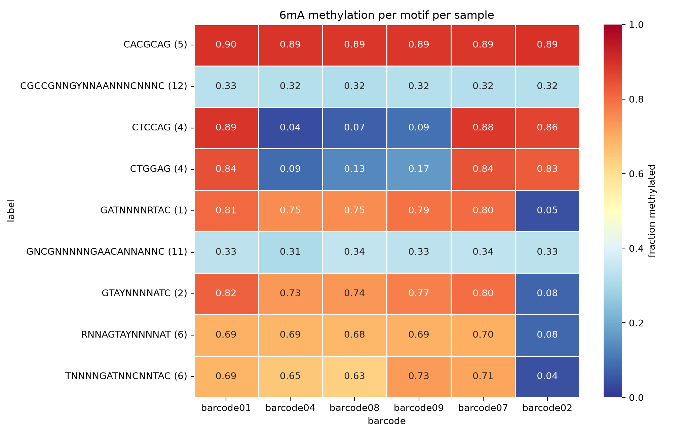

# Methylation

!!! Warning
    Be sure to use the `methylation` Codespace when initiating VM for this practical.

## Objectives

By the end of this practical you should: 

* Understand the file formats used to represent methylation data from both PacBio, and Nanopore technology
* Know how to merge and perform quality control
* Visualise methylation data
* Analyse multi sample VCF files

## Introduction

In the previous practicals, we have worked with sequencing data generated using Illumina and Oxford Nanopore technologies. In this practical, we will focus on long-read sequencing technologies, specifically Pacific Biosciences (PacBio) Single Molecule Real-Time (SMRT) sequencing and Oxford Nanopore sequencing.

Both PacBio and Nanopore can produce long sequencing reads, which provide several advantages over short-read technologies such as Illumina, particularly for genome assembly and the analysis of complex genomic regions. The two platforms also generate data that can be used to investigate DNA methylation, although the approaches used to detect methylation differ between technologies.

In this practical, we will explore applications of both PacBio and Nanopore sequencing, with a particular focus on:

* Genome assembly
* DNA methylation analysis
* Comparing approaches for analysing long-read sequencing data


## Methylation

Methylation refers to the addition of methyl groups (CH₃) to DNA and is an important form of epigenetic modification. In bacteria, DNA methylation is often carried out by DNA methyltransferases (MTases), many of which are part of restriction-modification systems.

Restriction enzymes recognise specific DNA sequences and cut DNA at these sites. The paired MTase methylates the same recognition sites in the bacterial genome, protecting the bacterium's own DNA from being cut. This provides a defence mechanism against foreign DNA, such as bacteriophages. Methylation can also affect the binding of other DNA-binding proteins and influence gene expression, which can be important for interactions between pathogens and their environment.

### Detecting methylation with PacBio

PacBio SMRT sequencing records the activity of a DNA polymerase as it incorporates fluorescently labelled nucleotides. In addition to base calls, the data records the inter-pulse duration (IPD), which is the time between successive nucleotide incorporations. Methylated bases can cause the polymerase to take longer to incorporate nucleotides. By comparing observed IPD values with an in silico control, an IPD ratio can be calculated and used to identify modified bases.

Once methylation sites have been identified, their surrounding sequence can be analysed to identify enriched sequence motifs, which may correspond to MTase recognition sites.

### Detecting methylation with Nanopore

Oxford Nanopore detects methylation using a different approach. As native DNA passes through a protein nanopore, it causes changes in an ionic electrical current. Methylated bases alter this current compared with unmethylated bases.

These changes in the electrical signal can be detected using machine-learning models, allowing DNA methylation to be identified directly from the sequencing data without chemical conversion. Thus, PacBio detects methylation through changes in polymerase kinetics, while Nanopore detects it through changes in electrical current.




# Pacbio

## Exercise 1: Analysing motif summary reports

Activate the conda environment, navigate to the methylation practical directory, and take a look at the contents: 

```
conda activate methylation
cd ~/data/methylation/pacbio
ls
```

There are several files present. We will first take a look at the files ending with **.motif_summary.csv**. We can open these files using vscode by selecting the file on the left hand side. Let's view the contents of **tb_pb_1.motif_summary.csv**. 


You should now see a spreadsheet containing a number of different columns: 


* **motifString**: Detected motif sequence for this site such as “GATC”.
* **centerPos**: Position in motif of modification (0-based).
* **modificationType**: Modification type – a generic tag "modified_base" is used for unidentified bases. For identified bases, m6A, m4C, and m5C are used.
* **fraction**: The percent of time this motif is detected as modified in the genome. (Fraction of instances of this motif with modification QV or identification QV above the QV threshold.)
* **nDetected**: Number of instances of this motif that are detected as modified. (Number of instances of this motif with modification QV or identification QV above threshold.)
* **nGenome**: Number of occurrences of this motif in the reference sequence genome.
* **groupTag**: A name identifying the complete double-strand recognition motif. For paired motifs this is “/”, for example “GAGA/TCTC”. For palindromic or unpaired motifs this is the same as motifString.
* **partnerMotifString**: motifString of paired motif (motif with reverse-complementary motifString).
* **meanScore**: Mean Modification QV of instances of this motif that are detected as modified.
* **meanIpdRatio**: Mean IPD ratio of instances of this motif that are detected as modified.
* **meanCoverage**: Mean coverage of instances of this motif that are detected as modified.
* **objectiveScore**: Score of this motif in the motif finder algorithm. The algorithm considers higher objective scores to be more confidently identified motifs in the genome based on several factors.

We can see that three unique motifs have been detected (CACGCAG, CTGGAG and CTCCAG). If you look at the second and third motifs you may have noticed that the '**groupTag**' is the same. These sequences are actually palindromic sequences, i.e. the reverse complement of 'CTGGAG' is 'CTCCAG' and vice versa. At these motifs, methylation occurs on both strands of DNA on the same motifs at the A nucleotide. The 'CACGCAG' motif, on the other hand, is only methylated at one position. 

!!! question
    Take a look at the fraction column. Is the motif always methylated?
    Is there any relationship between the size of the motif and the number of times it was detected? Why do you think this is? 

Using the same method as described above, open up '**tb_pb_3.motif_summary.csv**'. Can you see any new motifs? This isolate has many more motifs that have been reported. You may notice that some motifs use symbols other than the standard nucleotides. The motifs are represented using the IUPAC standard nomenclature for representing nucleotides. For example, in the 'GATNNNNRTAC' motif the **N** represents any nucleotide and the R represents either an A or a G. This means that the MTase which methylates this motif will ignore the 4th-7th positions. 

!!! question
    === "Question 1"
        An MTase recognises the motif 'GATNNNNRTAC'. Which of these sequences will it methylate?
        
        A: CATGTCAATAC
        
        B: GATGTCAATAC
        
        C: GATGTCACTAC
    === "Answer 1"
        B: GATGTCAATAC

There are several motifs with very low '**fraction**'. If an MTase is active it would be expected to methylate most of the sites in the genome. Motifs with low fraction can potentially represent a false motif. As in variant detection, with these noisy datasets false motifs can be introduced. 

!!! question
    Take a look at the '**meanScore**' column. Are they all similar values? Do you see any relationship between '**fraction**' and '**meanScore**'? 

We can use the '**meanScore**' column to filter out false motifs. Take a look at a few more **.motif_summary.csv** files and see if you can find any overlaps between the motifs found. 

We can visualise the methylation by plotting the IPD ratio against the motif position. To do this we must: 

1. Find the locations of the motif in the genome
2. Extract the IPD ratio for each motif base in the genome
3. Plot the IPD ratio against the position in the motif

The modifications and motifs pipeline also provides a CSV file containing all the positions in the genome as rows and several columns of information for each position (including the IPD ratio). Take a look at an example: 

```
zcat tb_pb_14.ipd.csv | head
```

This is a very large file, so its better to just view the first few lines in the terminal. The first few lines should look like the example below. 

!!! terminal "Terminal output"
    ```
    refName,tpl,strand,base,score,tMean,tErr,modelPrediction,ipdRatio,coverage,frac,fracLow,fracUp
    "WBB445_ARS7496|quiver",1,0,T,2,0.644,0.189,0.696,0.926,7,,,
    "WBB445_ARS7496|quiver",1,1,A,0,0.576,0.204,0.882,0.653,8,,,
    "WBB445_ARS7496|quiver",2,0,T,6,0.766,0.264,0.597,1.283,8,,,
    "WBB445_ARS7496|quiver",2,1,A,5,0.927,0.237,0.804,1.153,8,,,
    "WBB445_ARS7496|quiver",3,0,G,7,1.231,0.589,0.689,1.788,9,,,
    "WBB445_ARS7496|quiver",3,1,C,1,0.425,0.169,0.554,0.768,8,,,
    "WBB445_ARS7496|quiver",4,0,A,1,0.919,0.260,1.275,0.720,9,,,
    "WBB445_ARS7496|quiver",4,1,T,1,0.428,0.192,0.696,0.615,9,,,
    "WBB445_ARS7496|quiver",5,0,C,6,0.936,0.277,0.722,1.296,9,,,
    ```

We will use the `analyse_motif_ipd.py` script to extract the IPD ratios from this file. We need to provide 1) the ipd.csv file, 2) the motif you would like to analyse and 3) the genome assembly for the sample (to find the motif locations). Let's analyse the 'CTCCAG' motif for tb_pb_14 and tb_pb_16: 

```
python analyse_motif_ipd.py tb_pb_14.ipd.csv.gz CTCCAG tb_pb_14.assembly.fa
python analyse_motif_ipd.py tb_pb_16.ipd.csv.gz CTCCAG tb_pb_16.assembly.fa 
```

!!! question
    The script will output the number of times the motif was found in the genome. Why do you think there are differences? 

Now we can visualise this with the `plot_ipd.R` script. We need to provide 1) the sample names, 2) the motif we are analysing and 3) the output file. The output will be in PDF format. 

```
Rscript plot_ipd.R tb_pb_14,tb_pb_16 CTCCAG CTCCAG.pdf
```

Using the file browser, locate the PDF file ~/data/methylation/. Double click on the CTCCAG.pdf file and it should open in a PDF viewer program. You should be able to see a figure similar to the one below. 



You should be able to see that tb_pb_16 has elevated IPD ratios (indicating methylation) on the 5th position of the motif while tb_pb_14 does not. Check to see if this is concordant with the motif_summary CSV files for these samples. 

We will now create the same plot for the 'GTAYNNNNATC' motif for samples tb_pb_1 and tb_pb_4. 

```
python analyse_motif_ipd.py tb_pb_2.ipd.csv.gz GTAYNNNNATC tb_pb_2.assembly.fa
python analyse_motif_ipd.py tb_pb_16.ipd.csv.gz GTAYNNNNATC tb_pb_16.assembly.fa
Rscript plot_ipd.R tb_pb_16,tb_pb_2 GTAYNNNNATC GTAYNNNNATC.pdf
```

!!! question 
    === "Question 2"
        Which sample has evidence for methylation at the 'GATNNNNRTAC' motif.
    === "Answer 2"
        Sample tb_pb_16. There are elevated IPD ratios on the third position (A).

**Finally try to follow to same commands to visualise the methylation at 'CACGCAG' for samples tb_pb_16 and tb_pb_2.**

Let's try and combine all the individual datasets into a merged dataset. We have created a script to take the CSV files and create a matrix where the rows represent samples, the columns represent motifs and the cells represents the fraction that the motif is methylated in a particular sample. It takes an input file with the names of all the CSV files which we must first create. 

To do this we can run the following command: 

```
ls *.motif_summary.csv > files.txt
```

Take a look at the file you just created by running `head files.txt`.

It should look something like this: 

!!! terminal "Terminal output"
    ```
    tb_pb_1.motif_summary.csv
    tb_pb_10.motif_summary.csv
    tb_pb_11.motif_summary.csv
    tb_pb_12.motif_summary.csv
    tb_pb_13.motif_summary.csv
    tb_pb_14.motif_summary.csv
    tb_pb_15.motif_summary.csv
    tb_pb_16.motif_summary.csv
    tb_pb_17.motif_summary.csv
    tb_pb_2.motif_summary.csv
    ```

We can now pass this file to the `combine_motifs.py` script: 

```
python combine_motifs.py files.txt unfiltered_motifs.csv
```

Take a look at the '**unfiltered_motifs.csv**' file. There are many motifs which are present in only one sample. These likely represent noise in the data and should be filtered out. Rerun the command with a quality filter: 

```
python combine_motifs.py files.txt filtered_motifs.csv --min_qual 60
```

We have specified the minimum QV of the motif to be 60. Take a look at the filtered_motifs.csv file using gnumeric and look at the difference. You should now have 5 motifs. This will serve as our final high-quality list of motifs.

It is evident that some samples have methylation on certain motifs while others do not. We will now try to understand if there is a particular pattern to the methylation seen in the data. The methylation pattern can either be random or specific to a certain strain. To do this we will reconstruct the phylogeny and overlay the methylation information.

Using the same raw data and the SMRT portal analysis suite we have generated whole genome assemblies for the samples. These were then aligned to the reference and variants were called. The variants from all the samples were merged to a single FASTA formatted file. We can use this file to create the phylogenetic tree, but first lets go to the `tree` directory.

```
cd ~/data/methylation/tree
```

Try to remember the command to create the tree and run it in the terminal using 'pacbio.fasta' as the input fasta. If you need the solution click on the button below. 

!!! question
    === "Task 1"
        Create a phylogenetic free using the pacbio.fasta file as input.
    === "Solution 1"
        ```
        iqtree -m GTR+G -s pacbio.fasta -bb 1000
        ```

Open up the tree by launching `iTol`, we have provided an annotation file to use. 

Download the files ``pacbio.fasta.treefile`` and ``pacbio_annotation_itol.txt`` from the codespace, then upload the tree to [iTOL](https://itol.embl.de/) to view the phylogeny. 





Once uploaded into iTOL, open the **Datasets** tab in the control panel, and select the annotation file ``pacbio_annotation_itol.txt``.

Midpoint root the tree by selecting **Midpoint Root** from the **Advanced** menu in the control panel near the bottom. 




!!! question
    Look at the different methylation patterns by the colouring. Is it random? 

## Methylation and mutations

Methylation in the five motifs has been linked to the following genes: 

| Motif | Genes |
|-------|-------|
| CTCCAG/CTGGAG | mamA |
| GTAYNNNNATC/GATNNNNRTAC | hdsS.1, hsdM and hsdS |
| CACGCAG | mamB |

Loss of function mutations in MTases can lead to the absence of methylation. We are going to take a look at the CTCCAG/CTGGAG motif which is methylated by the mamA MTase. This protein is encoded by the Rv3263 gene. The methylation pattern is shown on the tree below: 



The 'filtered_motifs.csv' file and the phylogenetic tree indicates that three of the samples have no methylation on the motif (tb_pb_10, tb_pb_11 and tb_pb_14). There are a few scenarios which may be possible: 

1. The isolates all have the same variant which has evolved convergently (where the same mutation has appeared multiple times independently on the tree).
2. The isolates all have different mutations
3. Some isolates share a common mutation

The variants found by aligning the whole genome assemblies to the reference are stored in the multi-sample VCF file 'pacbio.vcf.gz'. We will use bcftools to process this file and extract the relevant information we need. 

### 1. Extracting sample-specific mutations

The first thing we need to do is extract variants which are only present in the three samples. We can do this using the bcftools view command. First let's go back to the pacbio directory and find out how many variants are present in the VCF file: 

```
cd ../pacbio
bcftools view pacbio.ann.vcf.gz -H | wc -l
```

The command can be broken down into several parts: 


* `bcftools view pacbio.vcf.gz`: allows to view contents of the VCF file
* `-H`: This flag prevents header lines present in the file being output
* `|`: The pipe passes the output from whatever command was written before it and passes it to the next.
* `wc -l`: This command counts the number of lines which are passed to it

After running the command we should see an output of 9229, i.e. 9229 variants are present across all samples. We will now add two more parameters to the command. We select only variants present in a select number of samples using the -s flag. We can also restrict our analysis to variants which are present exclusively in our samples using the -x flag. The command will be the following: 

```
bcftools view pacbio.ann.vcf.gz -H  -s tb_pb_10,tb_pb_14,tb_pb_11 -x | wc -l
```

The command will now count 780 variants. 

### 2. Annotating the variants

In order to narrow down the number of variants we need to narrow down our search to only variants in the Rv3263 gene. The VCF file currently only contains information on the position of the variants on the chromosome but no information about genes. We can use `bcftools csq` or `snpEff` to perform the annotation. 


<details>
<summary>How to create snpEff custom databases</summary>

We have annotated your genome for you already using snpEff by creating a custom database so you dont have to but if you wanted to do so in the future you can follow these steps:

First make the snpEff_config directory
```
mkdir -p snpEff_config/
```
Then move the files needed to that directory and creating a config file

```
cp mtb_annotation_file.gff snpEff_config/genes.gff
cp mtb_ref_genome.fa        snpEff_config/sequences.fa
echo "tb.genome : Mycobacterium_tuberculosis" >> snpEff.config
```
Build the database 

```
snpEff build -gff3 -v tb
```

And run snpEff (you need Java installed as well). You can run it with the snpEff.jar file which is downloadable, or conda install it.

```
java -jar snpEff.jar ann -no-downstream -no-upstream -no-intergenic -no-utr  -c snpEff.config  -dataDir snpEff_config/ tb original_vcf_file.vcf.gz > annotated_vcf_file.vcf
```

</details>

```
bcftools view pacbio.ann.vcf.gz -s tb_pb_10,tb_pb_14,tb_pb_11 \
  | bcftools query -f '[%POS\t%SAMPLE\t%GT\t%ANN\n]' \
  | grep -E '^(3643985|3644554)'
```

We have dropped the -H as we are no longer counting lines and the header is needed by the next command. The following new parts have been added:

* `view -s`: Only view these specific samples
* `query -f '[%POS\t%SAMPLE\t%GT\t%ANN\n]'`: Only view these specific fields within the vcf file and filter out all others
* `grep -E '^(3643985|3644554)'`: Looks for lines containing '3643985' or '3644554' and prints them

We can see this command prints out a number of lines. The last two lines represent two variants in VCF format:

!!! terminal "Terminal output"
    ```
    3643985 tb_pb_10        1/1     C|missense_variant|MODERATE|Rv3263|gene:gene3340|transcript|transcript:gene3340|protein_coding|1/1|c.809A>C|p.Glu270Ala|809/1662|809/1662|270/553||
    3643985 tb_pb_14        1/1     C|missense_variant|MODERATE|Rv3263|gene:gene3340|transcript|transcript:gene3340|protein_coding|1/1|c.809A>C|p.Glu270Ala|809/1662|809/1662|270/553||
    3643985 tb_pb_11        0/0     C|missense_variant|MODERATE|Rv3263|gene:gene3340|transcript|transcript:gene3340|protein_coding|1/1|c.809A>C|p.Glu270Ala|809/1662|809/1662|270/553||
    3644554 tb_pb_10        0/0     A|missense_variant|MODERATE|Rv3263|gene:gene3340|transcript|transcript:gene3340|protein_coding|1/1|c.1378G>A|p.Ala460Thr|1378/1662|1378/1662|460/553||
    3644554 tb_pb_14        0/0     A|missense_variant|MODERATE|Rv3263|gene:gene3340|transcript|transcript:gene3340|protein_coding|1/1|c.1378G>A|p.Ala460Thr|1378/1662|1378/1662|460/553||
    3644554 tb_pb_11        1/1     A|missense_variant|MODERATE|Rv3263|gene:gene3340|transcript|transcript:gene3340|protein_coding|1/1|c.1378G>A|p.Ala460Thr|1378/1662|1378/1662|460/553||
    ```


!!! tip "Tip"
    The 3rd column is the genotype of the sample. Each sample will have a genotype entry for each variant. A value of 0/0 means  reference, and 1/1 means alternate. We can select only samples with an alternate genotype by using the command. Try adding `| awk '$3=="1/1"'` to the end of the command.


From the output (above) we can see that tb_pb_10 and tb_pb_14 both have the same mutation (270E>270A) while tb_pb_11 has a different mutation (460A>460T). These mutations are good candidates to take towards functional studies to validate the loss of function effect on the MTase.

# Nanopore

Now we can look at how to analyse Nanopore data that comes from dorado. We have mentioned dorado before and how to get pod5 files to fastq or bam, but to ensure methylation is ran you need to add `--modified-bases` and the methylation you are looking for when running the basecaller. Methylation tags are stored inside the **BAM** files. Motifs are discovered in Nanopore by using a dedicated toolkit that comes from Oxford Nanopore Technologies themselves called **ModKit**. We have run modkit on a few samples already as it takes a while but there is still one last one to be run which is for barcode09, so lets do it now.

## Discovering methylation tags 

First lets go to the Nanopore directory.

```
cd ~/data/methylation/nanopore/
```

Here if you type ``ls`` you will see a ``bams`` folder which is where our methylation tags are stored. Lets have a look inside these bams to see if methylation actually exists.

```
samtools view bams/barcode09.aln.sort.bam | head -1 | grep -o 'MM:Z:[^[:space:]]*'
```
This looks for the `MM` tag inside the bams which is Nanopores way of identifying the modification an the type of modification. Lets have a look at the output.

!!! terminal "Terminal output"
    ```
    MM:Z:A+a.,2,0,0,0,0,0,0,0,0,0,0,0,0,0,0,0,0,0,0,0,0,1,0,0,2,0,0,0,0,0,0,1,0,0,4,0,0,0,0,0,0,0,0,1,0,1,0,0,0,0,0,5,8,0,6,1,0,0,0,0,4,0,0,0,0,2,0,0,0,0,0,0,0,0,0,2,0,0,6,2,0,0,0,0,0,0,0,0,0,0,0,0,0,0,0,0,0,0,0,0,0,0,0,0,0,0,0,0,0,0,0,0,0,0,0,0,0,0,0,0,1,1,0,0,0,0,0,0,0,0,0,0,0,0,0,0,0,0,2,0,0,0,0,0,0,0,0,0,1,0,4,0,0,0,0,0,0,0,0,0,1,3,0,1,6,0,10,1,17,5,0,0,0,0,0,0,0,0,0,0,0,0,0,0,8,0,0,0,0,0,0,0,0,0,0,0,0,0,0,0,0,0,0,0,0,0,4,0,0,0,0,0,0,0,0,0,0,0,0,0,0,0,0,0,0,0,0,0,0,0,0,0,0,0,1,1,0,0,0,0,2,0,0,3,0,0,0,0,0,0,0,0,0,0,0,0,0,6,0,0,0,0,0,0,0,0,0,0,0,0,0,0,0,0,0,0,0,0,1,0,2,0,22,4,0,1,0,0,0,0,0,0,0,0,0,0,2,0,0,0,0,0,0,0,0,0,0,0,0,0,0,0,0,0,0,0,0,0,0,0,0,0,0,0,0,0,0,1,3,0,0,2,0,0,12,0,0,0,0,0,0,0,0,0,0,0,0,0,0,0,0,0,0,1,0,0,0,0,0,0,0,0,0,0,0,1,0,0,0,0,0,0,0,0,0,0,0,0,0,0,0,0,0,0,0,0,0,0,0,0,0,0,1,0,0,0,0,0,0,1,0,0,2,23,0,0,6,5,0,0,0,0,0,0,7,0,0,0,0,0,0,0,0,0,2,0,0,0,0,0,0,0,0,0,0,0,0,0,0,0,0,0,0,0,0,0,0,0,0,0,1,0,0,4,1,0,4,3,1,0,0,0,0,0,3,0,0,0,0,0,4,0,0,1,4,0,0,0,0,0,0,0,0,0,0,0,0,0,0,0,0,0,0,0,0,0,0,18,0,0,0,2,0,6,0,0,2,1,2,2,1,0,4,5,0,0,5,0,0,0,0,0,0,3,0,0,1,2,5,1,4,0,0,13,0,5,0,0,0,0,0,0,0,0,0,0,0,0,1,0,0,3,0,0,0,0,0,0,0,0,0,4,3,26,0,1,11,0,1,1,1,1,0,0,0,0,0,0,0,0,0,0,0,0,0,0,1,0,0,1,0,0,0,0,2,0,0,0,0,0,0,0,0,0,14,2,13,0,0,0,1,0,0,0,0,0,0,0,0,1,0,0,0,0,0,0,0,9,0,0,0,0,0,0,0,0,0,0,0,4,1,0,4,2,0,0,0,0,0,1,0,0,0,0,0,0,0,0,0,0,0,0,0,2,15,21,12,5,0,0,0;C+h.,0,18,1,16,0,0,24,22,2,12,2,54,0,0,4,37,1,11,0,5,15,19,7,38,19,5,9,54,30,0,0,0,0,0,10,12,18,4,4,1,14,8,19,12,7,21,0,0,5,25,0,0,6,32,57,23,0,77,115,0,0,1,2,4,0,0,0,0,2,17,1,0,4,5,12,0,0,0,0,16,26,28,0,0,4,6,25,3,18,36,0,0,0,29,0,6,29,4,7,5,4,61,13,8,81,42,0,0,4,15,8,6,9,36,52,14,0,1,15,9,3,0,0,1,4,4,6,10,0,28,0,15,11,26,3,43;C+m.,0,18,1,16,0,0,24,22,2,12,2,54,0,0,4,37,1,11,0,5,15,19,7,38,19,5,9,54,30,0,0,0,0,0,10,12,18,4,4,1,14,8,19,12,7,21,0,0,5,25,0,0,6,32,57,23,0,77,115,0,0,1,2,4,0,0,0,0,2,17,1,0,4,5,12,0,0,0,0,16,26,28,0,0,4,6,25,3,18,36,0,0,0,29,0,6,29,4,7,5,4,61,13,8,81,42,0,0,4,15,8,6,9,36,52,14,0,1,15,9,3,0,0,1,4,4,6,10,0,28,0,15,11,26,3,43;
    ```

The string after MM:Z: is a compact, machine-readable list of which bases carry a modification. The codes at the start of each block are the useful part which might be hard to see here but there are: A+a = 6mA, C+m = 5mC, C+h = 5hmC, so this read has all three modifications called. The long list of numbers is a space-saving encoding of which A (or C) positions are modified (each number is how many bases to skip to the next modified one), with the confidence scores stored separately in the paired ML tag. You never read these by hand, modkit decodes them for us and turns them into the tidy per-position bedmethyl table in the next step.

First we will get the methylation and output it to a **bedmethyl** file.

```
modkit pileup bams/barcode09.aln.sort.bam bedmethyls/barcode09.bedmethyl --ref ../mtb.fa -t4 --modified-bases 6mA --no-filtering
```

Then we can find specific motifs in our bedmethyl files, so we end up with similar files to Pacbio.

```
modkit find-motifs -i bedmethyls/barcode09.bedmethyl -r ../mtb.fa -o motifs/barcode09.motifs.tsv --threads 4 \
  --high-thresh 0.4 --low-thresh 0.1 --min-sites 10 \
  --known-motif CACGCAG 5 a --known-motif CTCCAG 4 a --known-motif CTGGAG 4 a \
  --known-motif GATNNNNRTAC 1 a --known-motif GTAYNNNNATC 2 a
```
Here we have put `--known-motif` in which is there beceause we have a subset bam so it would be harder for the tool to find if it was not identified.

Lets take a look inside the motifs.tsv to see what we are looking at.

```
cat motifs/barcode09.motifs.tsv
```

!!! terminal "Terminal output"
    ```  
    mod_code        motif   offset  frac_mod        high_count      low_count       mid_count       status  closest_known_motif
    a       CACGCAG 5       0.9947917       191     1       1       equal   CACGC[a]G
    a       GTAYNNNNATC     2       0.97590363      81      2       1       equal   GT[a]YNNNNATC
    a       GATNNNNRTAC     1       0.97590363      81      2       1       equal   G[a]TNNNNRTAC
    a       RNNAGTAYNNNNAT  6       0.875   14      2       1       intersect       GT[a]YNNNNATC
    ```

* `mod_code`: We are looking at the modification for 6mA only in our samples.
* `motif`: The motif that was found
* `offset`: The position that the methylation occured in the motif
* `frac_mod`: The fraction of sites matching this motif that were methylated (0–1)
* `high_count`: How many times it was highly modified
* `low_count`: How many times it was weakly modified
* `mid_count`: In between the high and low.
* `status`: The status column is the relationship of the set of sequences described by the motifs. Say you have two motifs A and B they represent a set of sequences A and B . For example, the motif [a] represents all sequences with at least one A primary base, whereas the set of sequences represented by G[a]TC is only {GATC}. The status fills in the blank in the statement: A ? B
* `closest_known_motif`: only specified if you have put `--known-motifs` and describes the motif it is most simlar to.

If you look at barcode01 where known_motifs were not specified you will be missing the last 2 columns.

Overall, this is pretty conclusive that the sample has similar methylation patterns to some of our pacbio samples.

## Analysing motifs

We can now analyse the motifs. This dataset has some additional metadata that comes with our samples which might give us extra information as to why we have methylation on certain samples. If you want you can have a quick peek inside metadata.txt to see what differences there are between samples.

```
cat metadata.txt
```

We can use our motifs and bedmethyl files to do lots of cool things, so now we are going to create a heatmap to visualise the motifs across our barcodes.

```
python motif_heatmap.py
```

We can clearly see certain motifs appear in some barcodes and not others as explained in the figure below



!!! question
    
    === "Question 3"
        Using the metadata information, can you find out which lineages have which motifs?
        
    === "Answer 3"
        Motif : CTCCAG / CTGGAG found only in lineage 4 and lineage 1.2.1 so missing in Lineage 2 strains and 1.1.1

        Motif : CGTAYNNNNATC , RNNAGTAYNNNNAT, TNNNNGATNNCNNTAC not found in Lineage 4.5 strains.

## Further exploration

### Looking for mutations

This we have already done for Pacbio so we can now do the same for Nanopore as well, we will follow the exact same steps for Pacbio by looking at the same position but across our barcodes. Once again we are looking for mutations in MTases which can lead to the absence of methylation. This protein is encoded by the Rv3263 gene.

!!! question

    === "Question 4"
        Can you now run the same command for our nanopore vcf file to look for the same mutation. It will be a similar command to our pacbio vcf but the vcf we are looking at now is `nanopore.ann.vcf.gz`
        
    === "Answer 4"
         `bcftools view nanopore.ann.vcf.gz    | bcftools query -f '[%POS\t%SAMPLE\t%GT\t%ANN\n]'   | grep -E '^(3643985|3644554)'`


!!! terminal "Terminal output"
    ```
    3643985 barcode01.aln.sort.bam  .       C|missense_variant|MODERATE|Rv3263|gene:gene3340|transcript|transcript:gene3340|protein_coding|1/1|c.809A>C|p.Glu270Ala|809/1662|809/1662|270/553||
    3643985 barcode02.aln.sort.bam  .       C|missense_variant|MODERATE|Rv3263|gene:gene3340|transcript|transcript:gene3340|protein_coding|1/1|c.809A>C|p.Glu270Ala|809/1662|809/1662|270/553||
    3643985 barcode04.aln.sort.bam  .       C|missense_variant|MODERATE|Rv3263|gene:gene3340|transcript|transcript:gene3340|protein_coding|1/1|c.809A>C|p.Glu270Ala|809/1662|809/1662|270/553||
    3643985 barcode07.aln.sort.bam  .       C|missense_variant|MODERATE|Rv3263|gene:gene3340|transcript|transcript:gene3340|protein_coding|1/1|c.809A>C|p.Glu270Ala|809/1662|809/1662|270/553||
    3643985 barcode08.aln.sort.bam  1       C|missense_variant|MODERATE|Rv3263|gene:gene3340|transcript|transcript:gene3340|protein_coding|1/1|c.809A>C|p.Glu270Ala|809/1662|809/1662|270/553||
    3643985 barcode09.aln.sort.bam  1       C|missense_variant|MODERATE|Rv3263|gene:gene3340|transcript|transcript:gene3340|protein_coding|1/1|c.809A>C|p.Glu270Ala|809/1662|809/1662|270/553||
    ```
Once again there are specific mutations to be found within these positions, particularly on the lineage2 strain samples.

### Creating the phylogenetic tree

Again similar to pacbio, we have a multi nanopore fasta that we can do to make a tree using `iqtree` and look at in `iTOL`. First lets go back to the tree location.

```
cd ~/data/methylation/tree
```

!!! question

    === "Question 5"
        How do we run the `iqtree` command for our `nanopore.fasta` file
        
    === "Answer 5"
        `iqtree -m GTR+G -s nanopore.fasta -bb 1000`

Once we have created our tree we can once again download our `.tree` file and the `nanopore_annotation_itol.txt` file to upload to `iTOL` and to visualise our motifs for nanopore.

You should now know how to analyse and interpret data from the PacBio and Nanopore platforms and take it all the way to discovering interesting mutations using BCFtools. This is the end of the practical, but if you want more practice you can do the **methylation task** under the tasks option at the top.

