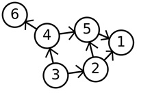
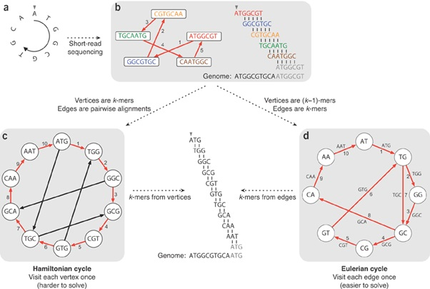
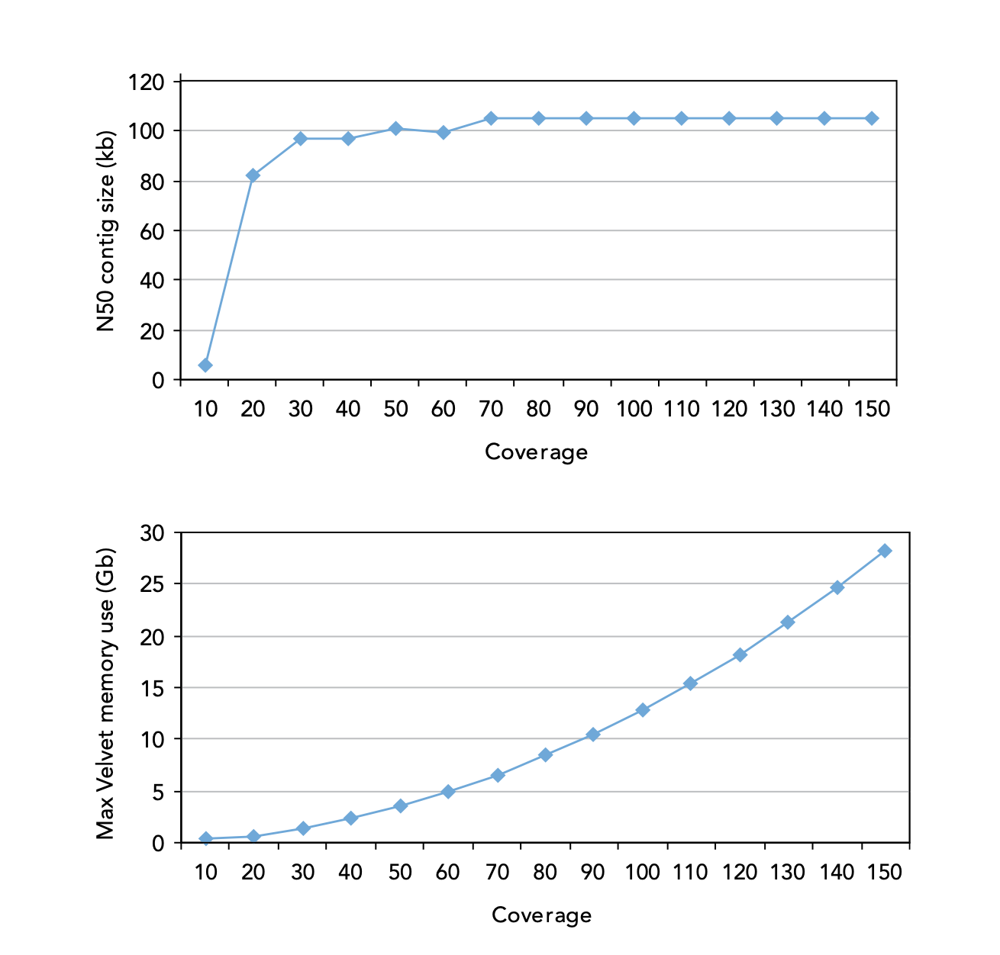
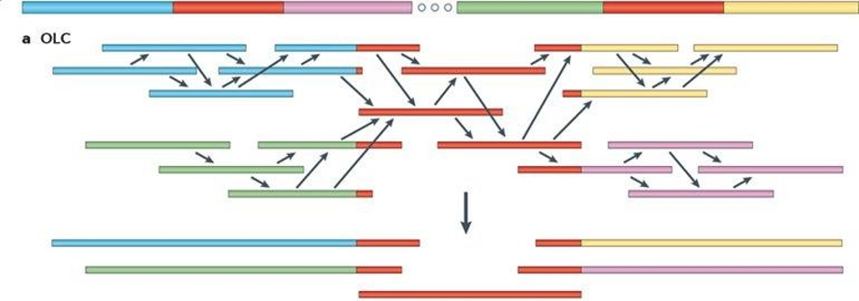
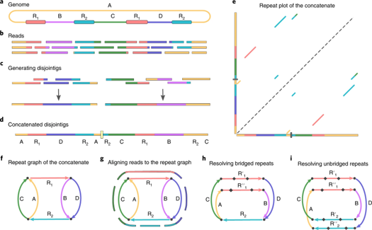
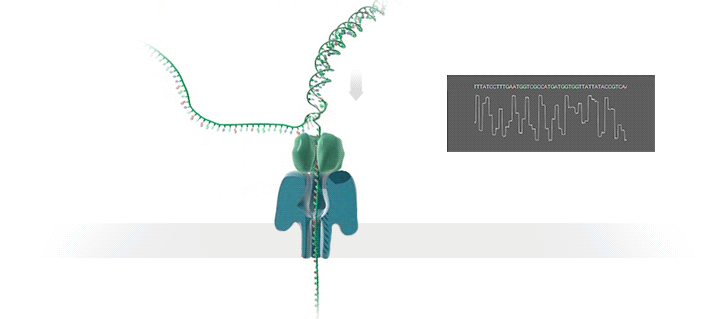
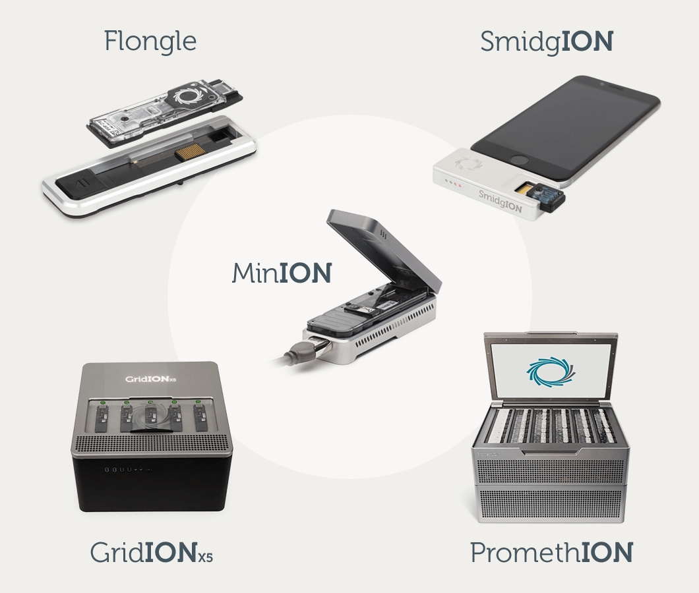
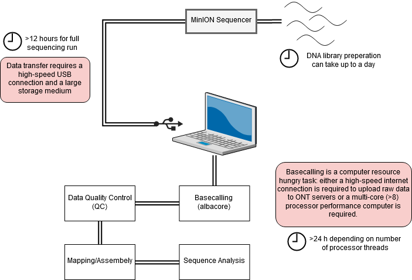
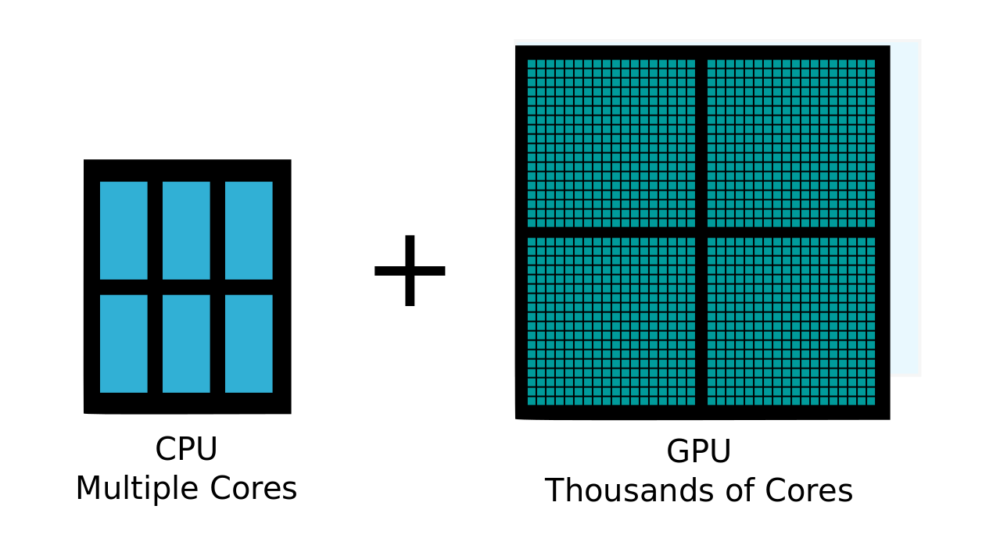

# Genome Assembly

## Introduction

We have already explored mapping, where the sequence data is aligned to a known reference genome. A complementary technique, where no reference is used or available, is called de novo assembly.

De novo assembly is the process of reconstruction of the sample genome sequence without comparison to other genomes. It follows a bottom-up strategy by which reads are overlapped and grouped into contigs. Contigs are joined into scaffolds covering, ideally, the whole of each chromosome in the organism. However de novo assembly from next generation sequence (NGS) data faces several challenges. Read lengths are short and therefore detectable overlap between reads is lower and repeat regions harder to resolve. Longer read lengths will overcome these limitations but this is technology limited. These issues can also be overcome by increasing the coverage depth, i.e. the number of reads over each part of the genome. The higher the coverage then the greater the chance of observing overlaps among reads to create larger contigs and being able to span short repeat regions. 

There are three different ways to assemble a genome depending on the data you have. Short-read assembly for short illumina data, long read assembly for pacbio or oxford nanopore data, and hybrid assemblies, for using the short or long read to map and using the opposite data to polish and fill the gaps. Each method uses its own graph theory to construct the genome.

Graph theory is a branch of discrete mathematics that studies problems of graphs. Graphs are sets of points called ‘vertices’ or ‘nodes’ joined by lines called ‘edges’. In the graph to the left there are 6 nodes and 7 edges. The edges are unidirectional which means that they can only be traversed in the direction of the arrow. For example paths in this graph include 3-2-5-1, 3-4-6 and 3-2-1.




Current genome assemblers employ graph theory to represent sequences and their relationships as nodes and edges. Traditional methods are typically classified into three main groups:

- De Bruijn graph assemblers, effective for short-read data, where reads are broken into k-mers and assembled based on shared subsequences.

- Overlap/Layout/Consensus (OLC) assemblers, suited for long-read data, where assemblies are built based on all-vs-all read overlaps.

- Repeat graph assemblers, which are designed to handle long reads and repetitive regions by collapsing repeats into single nodes, improving assembly contiguity in complex genomes.
 
Modern assemblers also use variations and hybrids of these approaches, string graphs, and minimizer-based graphs, to improve performance on complex genomes and high-throughput sequencing data.



De Bruijn graph assemblers work by breaking DNA reads into small overlapping pieces called k-mers. These k-mers are used to build a graph where each edge represents a k-mer, and each node represents the beginning or end of that k-mer. Instead of comparing every read to every other read, the assembler finds paths through the graph that represent how the DNA pieces fit together.

For example, the sequence ATGGCGTGCA can be broken into 3-letter chunks (3-mers), where each chunk overlaps the next by 2 letters. These overlaps form a path through the graph that helps rebuild the original sequence.

This method is very efficient for handling millions of short DNA reads, since each k-mer is stored only once no matter how many times it appears. Several programs implement de Bruijn graph algorithms, including Euler (Pevzner, Tang, & Waterman, 2001), Velvet (Zerbino & Birney, 2008), ABySS (Simpson et al., 2009), AllPaths (Butler et al., 2008) and SOAPdenovo (Li et al., 2010).



Overlap-Layout-Consensus (OLC) assemblers build genomes by first finding overlaps between all pairs of DNA reads. Instead of breaking the reads into smaller pieces like in de Bruijn graphs, OLC compares entire reads to each other to see where they match up.

Once overlaps are found, the assembler creates a layout — a map showing how the reads connect based on those overlaps. Finally, it builds a consensus sequence by merging the overlapping reads into a single, most likely DNA sequence.

This method works well for long DNA reads, like those produced by Oxford Nanopore or PacBio sequencing, because the overlaps are easier to detect and more reliable. However, finding overlaps between all pairs of reads takes a lot of computing power, especially with large datasets.

Popular OLC assemblers include Canu, Celera Assembler, and Miniasm.



Repeat graph assemblers are designed to tackle the challenge of repetitive DNA, especially with long reads. Instead of breaking DNA into tiny pieces like de Bruijn graphs, they work with longer chunks.

They build a map (a "repeat graph") where different sections of the genome (unique and repeating) are connected based on how the long reads overlap. Repeating parts are shown as special loops in this map.

Because long reads can span across these repeats, the assembler can use the map to figure out the correct order of the unique sections even when there are many similar repeats. This helps in building more complete genomes, especially when dealing with complex, repetitive DNA. Flye is a popular tool that uses this method.



In conclusion, the de Bruijn graph assemblers are more appropriate for large amounts of data from high-coverage sequencing and have become the programs of choice when processing short reads produced by Illumina and other established platforms (>100bp). OLC and repeat graphs are ideal for assembling longer reads, such as those generated by PacBio and Oxford Nanopore technologies, particularly for resolving complex and repetitive regions of genomes where the longer span of reads provides crucial linking information.

## Exercise 1: _De novo_ Comparing different assemblies

_De novo_ assembly is one the most computationally demanding processes in bioinformatics. Large genomes require many hours or days of processing. A small bacterial genome may take up to several hours to assemble. Here we will assemble M. tuberculosis genomes using Spades (Bankevich et al, 2012). We will compute assembly statistics to check the quality, and review how resulting contigs can be aligned, ordered and orientated along the reference genome using Abacas (Assefa, Keane, Otto, Newbold, & Berriman, 2009).

### Quick start and data checks

Activate the relevant `conda` environment

```
conda activate assembly
```

Change to the data directory:

```
cd ~/data/assembly/
```

And list the files there:

```
ls
```

Using knowledge of Data QC from previous practicals, run some quality checks on this data set to see if you need to trim or not and proceed from there.

### Estimating genome size

If you are creating a novel genome, you might not know what is the genome size you're looking for when assembling, fortunately there are ways to discover this pre assembly.

Jellyfish is a tool that can estimate the genome size by analysing the frequency of short sequences (K-mers) within a set of unassembled sequencing reads. Jellyfish can provide an estimate of the total number of unique sequences present, which directly correlates with the genome size (Genome size = total number of K-mers/average K-mer coverage). Higher frequency k-mers often represent repetitive regions, while the peak frequency of k-mers found in lower copy numbers can be used to infer the overall genome size. Tools like GenomeScope can then take the output from Jellyfish to provide a more refined estimate and insights into genome characteristics like heterozygosity and repeat content, all before a full genome assembly is even attempted.

Lets run jellyfish

```
jellyfish count -C -m 21 -s 100M -t 10 -o reads.jf <(zcat tb_ILL/*.fastq.gz)

jellyfish histo reads.jf > reads.histo
```

Now we have create our reads.histo, we can use it to plot a k-mer frequency distribution plot.

If you have familiar abilities with a programming language, you can plot these yourself, and calculate the genome size yourself using the above formula. Although, GenomeScope is widely used to plot this and will also tell you your estimated genome size. Load up GenomeScope and take a look http://genomescope.org/genomescope2.0/.


!!! question
    === "Question 1"
        What do you notice from GenomeScope, what is our estimated genome size?
    === "Answer 1"
        The estimated genome size given to us will be around 4.1mb, which is slightly shorter than the actual 4.4mb size that is MTB, but it wont be perfect and this just gives us a good guidance of what to expect.

### Running Spades

Spades is implemented in a single program that performs several steps in the assembly pipeline with a single command. The options are explained by running the command with no parameters (spades.py):

You will see that there are many options and the pipeline can be customised extensively. However, for most purposes we can run the tool with the default settings. You only need to supply the reads and an output directory.

An example invocation that takes the fastq formatted paired end files (sample1_1.fastq.gz and sample1_2.fastq.gz) and performs assembly.

```
spades.py -1  tb_ILL/sample1_1.fastq.gz -2  tb_ILL/sample1_2.fastq.gz -o short/ -k 55 --isolate
```
Employing paired-end reads (rather than single-end) increases the assembly quality. In general, libraries with smaller insert size produce more fragmented and shorter assemblies, whilst the genome coverage does not increase that much. The combination of libraries with different insert size always gives the best results.

De novo assembly gives much better results if reads are aggressively pre-filtered before passing them to the assembler. This is the same as we have seen for mapping and variant detection earlier in the course.

Although anecdotal recommendations for the k-mer length range from lower than half of the read length up to 80% of read length, the parameter is difficult to determine in advance since it depends on coverage, read length, error rates and the sample properties (repeat regions, etc). Therefore, it is advisable to perform several assemblies using different values of k-mer length to decide a value.

Spades automatically chooses a range of k-mer lengths to test and chooses the best one. The pipeline also performs reads correction, which aims to correct random errors in reads which will have a knock on effect on the k-mers used in the assembly. For time purposes we have selected a kmer of 55 insted of spades' automatic test of multiple.

Eventually, after spades finishes running there will be several files will be obtained in the directory the most important for our purposes are:

- A fasta file (contigs.fasta) containing all assembled contigs

- A fasta file (scaffolds.fasta) containing all assembled scaffolds

Scaffolds are contigs that have been chained together into larger sequences using information such from [mate pair libraries](https://emea.illumina.com/science/technology/next-generation-sequencing/mate-pair-sequencing.html)] and reference sequences. The scaffolds can give a better result depending on the insert size of the illumima sequence (ours is quite large), therefore we can use the scaffolds for further analysis.

## Exercise 2: Assembly Quality

The outcome of de novo assembly is a set of contigs and a scaffolded sequence. In a perfect assembly each contig covers exactly one chromosome in its entirety. In practice many contigs are created and the assembly quality is measured by examining their length; individually and in combination. An assembly is considered to be of good quality if relatively few long contigs are obtained covering the majority of the original or expected genome. There are different metrics used to assess the quality of assemblies:

- N50. The length of the contig that contains the middle nucleotide when the contigs are ordered by size. Note, N80 or N60 may also be used.

- Genome coverage. If a genome reference exists then the genome coverage can be computed as the percentage of bases in the reference covered by the assembled contigs.

- Maximum/median/average contig size. Usually computed after removing the smallest contigs (e.g. discarding all contigs shorter than 150 bp).

We can compute these statistics with the help of a tool called quast (made by the same developers as spades). To get the statistics first navigate to the assembly directory and run `quast`

```
cd sample1
quast -r ../tb.fasta -o quast short/scaffolds.fasta 
```

After it has finished you can examine the outputs. To view the result, open up the html in the browser of your choice.

!!! question
    See if you can spot the statistics we mentioned above. Compare the size of the reference with the size of the assembly. Are they different?

!!! question
    === "Question 2"
        See if you can spot the statistics we mentioned above. Compare the size of the reference with the size of the assembly. Are they different?
    === "Answer 2"
        Quast report includes information on statistics N50, Genome fraction and Maximum contig size that were mentioned before as well as additional metrics worth exploring. Average contig size can be additionally calculated by dividing values from fields `Total length (>= 0 bp)` and `# contigs (>= 0 bp)` or directly from FASTA file with external tools for example `seqmagick`. It is advised to look at a variety of metrics and supporting analyses to determine quality of assembly. 

High depth of coverage is essential to obtain high quality assembled genomes. It is always the case that contig sizes drop when coverage decreases under a certain value, generally considered to be 50x, although such threshold will depend on the size and repeat content of the sequenced genome. A coverage limit is reached above which no improvement on assembly metrics is observed. As shown to the left, coverage greater that 50x does not significantly improve N50 in an assembly, although such thresholds will not necessarily be the same for other genomes, the principles apply for all.


More data requires more memory too, as the lower graph demonstrates. Again the figures are genome specific but it is easy to see how large computers can quickly become necessary as coverage and genome size increase. (Illumina, 2009).

You can also assess genome assembly quality using BUSCO (Benchmarking Universal Single-Copy Orthologs). BUSCO evaluates how complete your genome, gene set, or transcriptome is by checking for the presence of conserved genes that are expected to appear as single copies in nearly all organisms within a given lineage. It provides a detailed breakdown of complete, fragmented, and missing orthologs, helping you identify potential gaps or redundancies in your assembly. This makes BUSCO a widely trusted tool for validating both the accuracy and biological completeness of genomic data.


Lets run BUSCO now

```
busco -i scaffolds.fasta -l bacteria_odb10 -o busco_output -m genome -c 8
```
The `-l` parameter lets you select a specific lineage database to use for BUSCO analysis, and there are many different options available. For example, when assembling the tick genome in previous work, the Arthropoda database was used. To choose the most appropriate database for your genome, visit the NCBI taxonomy page for your organism, find the relevant lineage information, and then select the closest BUSCO database based on that lineage from the busco database [list](https://busco-data.ezlab.org/v5/data/lineages/).

The `-m` parameter in BUSCO specifies the mode of analysis, which determines the type of input data being assessed. It can take three main values: genome, transcriptome, and proteins. The genome mode is used for genome assemblies, the transcriptome mode is for RNA-seq data, and the proteins mode is for analysing protein sequences. Choosing the correct mode ensures that BUSCO searches for the appropriate set of single-copy orthologs based on the type of data you're analysing.

!!! question
    === "Question 3"
        Check out the busco summary txt file for how many single copy orthologs it found, is it a good assembly?
    === "Answer 3"
        We get a good result from busco, with ~97% of busco groups found
    === "Question 4"
        Using the -m information above, can you find a more specific database we can search against to get a better busco score relative to our genome.
    === "Answer 4"
        Yes, following the lineage tree that ncbi provides we can see that mycobacteriaceae_odb12 exists, so we can use that to check our busco score rather than the broad bacteria one.

## Exercise 3: Gap closing

Short read assemblies usually leave a lot of N's or unknown sequences between the scaffolds, especially between areas of repeat regions or difficult to map areas. Therefore there are tools we can use that closes these gaps as best as possible, using the paired end reads.

GapCloser uses paired-end reads where each pair has a known insert size (e.g. ~350 bp) to fill gaps between contigs. Even if one read in a pair maps to the end of one contig and its mate maps to the start of another contig, the tool can infer that those two contigs are connected, because the insert size tells it how far apart they are in the genome.

Then, GapCloser collects reads whose pairs span these gaps and tries to reconstruct the missing sequence by overlapping them in the gap region — replacing the Ns with real bases based on the consensus of those bridging reads.

Lets run gap closer to see if we can improve the asesmbly. First we need to create a config file, this has been provided for you but if you would like to check out how to make one you can look at the [manual](https://www.animalgenome.org/bioinfo/resources/manuals/SOAP.html). You would need to find your insert size if you were to make one, this is done by mapping the reads to a reference and using `picard CollectInsertSizeMetrics`.

```
GapCloser -a short/scaffolds.fasta -b gapclosing_config.txt -o short/scaffolds_gapClosed.fasta
```

!!! question
    === "Question 4"
        Run the same checks as above on this assembly and see if it improved, if not, why did it not improve?
    === "Answer 4"
        MTB has highly repetitive regions which makes gap closing challenging, even with high quality paired end reads, this is the limitation of short read assemblies. 


## Advanced Topics

**Annotation Transfer**

Once the contigs ordered are against the reference, it is useful to determine the position and function of possible genes. It is possible to implement ab initio gene finding, but an alternative approach is to use the annotation of the reference and adapt it to the new assembly. A tool called RATT (Otto et al., 2011 “Rapid annotation transfer tools”) has been developed to transfer the annotation from a reference to a new assembly. In the first step the similarity between the two sequences is determined and a synteny map is constructed. This map is used to align the annotation of the reference onto the new sequence. In a second step, the algorithm tries to correct gene models. One advantages of RATT is that the complete annotation is transferred, including descriptions. Thus careful manual annotation from the reference becomes available in the newly sequenced genome. Where no synteny exists, no transfer can be performed. An outputted combined “embl” format file with sequence and inferred annotation can be viewed in artemis to assess the quality of the transfer.

**Improving assemblies**

The quality of the assembly is determined by a number of factors, including the type of software used, the length of reads and the repetitive nature or complexity of the genome. For example, assembly of Plasmodium is more difficult than that of most bacteria (due to the high AT content and repeats). A good assembly of a bacterial genome will return 20-100 supercontigs. It is possible to manually / visually improve assemblies and annotation within Artemis. To improve the assembly in a more automated fashion, there is other software:

- **SSPACE**: 
   
    This tool can scaffold contigs. Although spades can also scaffold contigs, SSPACE generally performs better.

- **Abacas**:

    This tool has the option to design primers that can be used to generate a PCR product to span a possible gap. The resulting new sequence can then be included in the assembly. This process is called finishing.

- **Image**:
    
    This tool can close gaps in the assembly automatically. First the reads are mapped against the assembly. Using all reads that map close to a gap and with their mate pairs within the gap, it is possible to perform a local assembly. This process is repeated iteratively. This procedure can close up to 80% of the sequencing gaps (Tasi et al, 2010).

- **iCORN**:

    This tool can correct base errors in the sequence. Reads are mapped against the reference and differences are called. Those differences or variants that surpass a specified quality threshold are corrected. A correction is accepted if the amount of perfect mapping reads does not decrease. This algorithm also runs iteratively. Here, perfect mapping refers to the read and its mate pair mapping in the expected insert size without any difference to the iteratively derived reference.

All these programs are available through the [PAGIT suite (post assembly genome improvement toolkit)](http://www.sanger.ac.uk/resources/software/pagit/). However they are mostly deprecated and no longer used.


## Third generation sequencing and its applications with genome assembly

Before continuing we will showcase nanopore long read data, and then proceed to use the long reads to assemble genomes.


## Introduction

Briefly we are going to be looking at data generated by third-generation nanopore sequencing technology. Developed by Oxford Nanopore Technologies (ONT), these platforms, rather than the next-generation 'sequencing-by-synthesis approach', make use of an array of microscopic protein ‘pores’ set in in an electrically resistant membrane which guide strands of DNA or RNA through them. Each nanopore corresponds to its own electrode connected to a channel and sensor chip, which measures the electric current that flows through the nanopore. When a molecule passes through a nanopore, the current is disrupted to produce a characteristic ‘squiggle’. The squiggle is then decoded using basecalling algorithms to determine the DNA or RNA sequence in real time. Oxford Nanopore’s most popular platform is the MinION which is capable of generating single reads of over 4Mb.



The MinION is one of 5 scalable platforms developed by ONT. High-throughput applications such as the GridION and PromethION use an array of nanopore flowcells to produce between 5 to 48 times more data than the MinION alone – outputting up to 48 TB of data in one run. More downscaled solutions such as The Flongle and SmidgION use a smaller, single flowcell to generate data. The MinION is a highly portable sequencing platform, about the size of a large USB flash drive. This technology enables researchers to perform sequencing analyses almost anywhere, providing they have the correct equipment to prepare the DNA libraries and analyse the output data.



A complete sequencing run on the MinION platform can generate upwards to of 1TB of raw data, and downstream analyses require a significant amount of computing power, multicore high performance processors and large amounts of RAM. This poses a significant logistical challenge for researchers who want to take advantage of the platform’s portability aspect. Over recent years, the integration of GPUs (graphics processing units) has made it easier to analysis workflows.



The long reads that are generated from nanopore are perfect for De novo assembly purposes, due to the way that they span repetitive regions and structural variants, making it easier to reconstruct genomes with fewer gaps and higher contiguity compared to short-read sequencing. So now we will touch on how the dorado tool works, and then run through long read and hybrid assemblies to compare with our previous assemblies using just short reads.


## Basecalling

Basecalling is performed with a tool called `dorado`. This tool is used to convert the raw signal data generated by the MinION into a sequence of nucleotides. The basecaller uses a neural network to predict the sequence of bases from the raw signal data. The output of the basecaller is a fastq file, which contains the basecalled sequence, as well as other information about the read, such as the quality scores of the basecalls. 

Basecalling required the use of advanced machine learning models, and can be computationally intensive. For this reason, basecalling is often performed on a high-performance computing cluster with a graphics processing unit. In this activity, we will use a smaller dataset to allow for the basecaller to work on our machines, and run quickly, just to get an idea of how the basecaller works.

     

```
cd ~/data/nanopore/basecalling/pod5_pass/
```

!!! info
    Use the `ls` command to see what is inside this folder. This directory holds the POD5s that passed from the sequencing process that is done on the MinKNOW software provided with the sequencer. During a sequencing run, the MinKNOW software (or other ONT control software) records the raw electrical signals generated as DNA or RNA molecules pass through the nanopores. This raw signal data, along with metadata about the run, device, and reads, is then structured into Apache Arrow tables and packaged into the POD5 file format. The pod5_pass directory shows which of these signals passed the initial QC, but for basecalling we will use all the pod5s and further filter if needed later on.

## Basecalling: Dorado

We have our pod5's directly from the nanopore sequencer, now its time to basecall the data to get the fastq or bam files depending on the user input. To run dorado correctly, we need a few things

1. The actual sequencing data
2. The barcoding kit. Important to get right due to the signal interpretation from the model, and the specific barcoding sequences given to each model.
3. The basecalling model. The machine learning model to decode the nanopore sequencing data. You can learn more about the models here https://dorado-docs.readthedocs.io/en/latest/models/models/. But they essentially come in 3 different versions
- fast (the fastest and least accurate)
- hac (high accuracy)
- sup (super-accurate, the most accurate)
4. The sample sheet. Information about the samples you're running, must be in the correct format which you can see here https://dorado-docs.readthedocs.io/en/latest/barcoding/sample_sheet/

You will find all of these things in the dorado directory. 

First we move our pod5s into one directory

```
cd ..
mv */*.pod5 pod5s/
```

The basecaller also allows the option to provide a reference to do mapping using minimap2, but we will skip this for now and output a fastq using the `--emit-fastq` option.

Now, let's run Dorado on a small selection of our POD5 files for a quicker demonstration (expect around 5 minutes). Processing the full dataset would typically take approximately 20 minutes, as basecalling is computationally intensive.

```
dorado basecaller dna_r10.4.1_e8.2_400bps_fast@v4.1.0/ pod5s/ \
--min-qscore 7 \
--kit-name SQK-NBD114-24 \
--sample-sheet sample_sheet.csv \
--trim all \
--emit-fastq \
--output-dir dorado_out
```

Within our output directory we will have a fastq file, which we can then use to do further analysis. We will use other data for future projects due to the data here being subsetted for use on your computers.

## Basecalling: Quality Control

Before moving on to the analysis steps, it is important to gauge the quality of your sequencing output. There are numerous factors which dictate the quality of the output data, spanning between quality of the input material, library preparation to software and hardware failure. After assembly we will use three tools for quality control;

- pycoQC
    - A tool to output the quality of the sequencing run
- chopper/porechop
    - These tools trim the barcodes, adapters, and the low quality reads
- Kraken
    - Trims contaminent data in your sample


## Back to Assemblies


## Exercise 4 Long read assembly

As we have mentioned long reads are ideal for genome assembly, due to its ability to cover large repetitive regions. They significantly reduce the number of contigs in a final assembly, leading to more contiguous and complete genomes. Long reads also enable better resolution of structural variations, such as insertions, deletions, and inversions. Additionally, they improve the assembly of complex genomic regions like GC-rich areas and tandem repeats.

Here we will be using the same sample we used for the short reads, but that has been sequenced on the minion software as well, so we can compare directly between the two platforms. You fill find this data in the tb_ONT directory. We will be using flye, the most recent and newest long read assembler, that uses the repeat graph method, as well as canu, a slightly older assembler but still good, and we will compare which one performed better.

```
flye --nano-hq tb_ONT/sample1_ONT.fastq.gz --genome-size 4.1m --threads 8 --read-error 0.06 -o long/
```
Knowing the expected genome size is beneficial for Flye assembly. Ideally, this information would come from a closely related reference species. However, we can also use the genome size estimate we previously generated to guide Flye in producing an assembly of the appropriate length.

Now we have run flye we can check out our N50 using quast again.

```
quast -r tb.fasta -o quast_long long/scaffolds.fasta 
```

Dont forget to also run BUSCO to get the BUSCO score.

!!! question
    === "Question 5"
        Check out the N50 value, is it better or worse than the short reads assembly, why is this the case
    === "Answer 5"
        We should have got a much higher N50 value, with far fewer contigs, this is due to ONT being able to bridge the gap across the difficult to map areas. Flye specifically has an algorithm to map the repeats and find the ideal path from the repeats that short read assemblers cannot do

Now there are multiple steps after we can do to improve our assembly.

Scaffolding using long-read data only involves harnessing the long reads' ability to span large genomic distances, which helps connect contigs separated by gaps or repetitive regions. This method does not rely on short-read data and instead uses the length and continuity of long reads to form accurate, large-scale scaffolds, enhancing the overall structure and completeness of the genome assembly.

```
ntLink scaffold target=long/assembly.fasta reads=tb_ONT/S21_ONT.fastq.gz G=500 rounds=3 t=32
```

We can now close the gaps between the scaffolds using a tool called tgsgapcloser. Gap closing involves filling the sequence gaps left between contigs in an assembly. This process uses the overlap between neighbouring contigs or additional sequencing reads to infer and fill in missing genomic regions. The aim is to produce a more complete assembly by resolving ambiguities in regions that are difficult to sequence or span, improving both contiguity and accuracy.

```
tgsgapcloser --scaff long/assembly.fasta.k32.w100.z1000.stitch.abyss-scaffold.fa --reads tb_ONT/S21_ONT.fastq.gz --output long/gapcloser/tgs_gapcloser --ne
```
After every run, use quast to see how the assembly is improving. Although quast doesnt show much has changed, BUSCO highlights the percentage gaps and we can use it to see how many gaps we have reduced.

Polishing improves genome assembly accuracy by correcting sequencing errors using the original raw reads. The raw reads are first aligned back to the draft assembly to identify mismatches and indels. These alignments guide the correction process, where consensus sequences are recalculated. The result is a more accurate and reliable genome sequence, closer to the true biological reference.

First we have to change the name of our scaffolding sequences so minimap and racon understand what the sequence is.

```
cp long/gapcloser/tgs_gapcloser.scaff_seqs long/gapcloser/tgs_gapcloser.scaff_seqs.fa
```

Then we can map the original data to our currenct sequence, this gives us a racon file we can use to polish. By aligning the raw reads to our newly generated sequence, it allows us to identify regions with any gaps that could potentially be removed, this essentially tries to polish and make our genome as robust as possible.

```
minimap2 -t 4 -x map-ont long/gapcloser/tgs_gapcloser.scaff_seqs.fa tb_ONT/S21_ONT.fastq.gz > racon.paf
```

Finally we run racon to polish our genome

```
racon -u --no-trimming -t 4 tb_ONT/S21_ONT.fastq.gz racon.paf long/gapcloser/tgs_gapcloser.scaff_seqs.fa > final_assembly.fa
```
!!! question
    === "Question 6"
        Check out the final BUSCO and quast results, what are the differences between the previous results and this one, has it improved?
    === "Answer 6"
        Not much has improved if you used quast, apart from the the # N's per 100 kbp section, we have drastically reduced our assemblies misalignments or regions with unambiguaty by polishing.

Polishing can be run multiple times in order to get the final assembly to the highest quality, however its important not to over polish and introduce bias into the dataset. One polish can be enough, it is simply up to your dataset and what you feel is best.


## Excerise 5 Hybrid assembly

Hybrid assembly strategically combines the strengths of long and short sequencing reads. Long reads provide the crucial scaffolding framework, spanning repetitive and complex regions that often fragment assemblies based solely on shorter reads. This scaffolding information allows us to order and orient the highly accurate contigs generated from short-read data, effectively bridging gaps and creating more contiguous genomic sequences. Subsuquentally, the high base-level accuracy of the short reads is often used to polish the long-read-based scaffold, correcting sequencing errors and yielding a final assembly that is both structurally comprehensive and highly accurate at the nucleotide level.

There are multiple hybrid assemblers out there today, however it has become more common to use a hybrid approach by initially aligning using either short reads or long reads and then polishing with the opposite such as [unicycler](https://github.com/rrwick/Unicycler). Most hybrid assemblers in the past used short reads initially, and then used long reads to polish the assembly. This has changed over the years due to the quality of reads that nanopore and pacbio produces, and now its more preferrable to create an assembly using long reads, and then polish with the short reads. 

We will attempt the hybrid approach and see how much better the assembly is.

First we will once again use spades, however we will give spades the long read data as a third option. This allows spades to apply the BayesHammer approach with both sets of data rather than one, which improves error correction and assembly quality. The method enhances the accuracy of contig formation by taking advantage of long reads' structural information while refining it with the high base-level accuracy of short reads.

```
spades.py -1 tb_ILL/sample1_2.fastq.gz -2 tb_ILL/sample1_2.fastq.gz --nanopore tb_ONT/Sample1.fastq.gz -t 32 -o hybrid/spades/
```

Once again we need to check our assembly, at this point you should know how to do it.

!!! question
    === "Question 7"
        How is the N50 value, is it better than both the long and short read approaches?
    === "Answer 7"
        You will see that the result is an N50 less than what we hoped for. We have improved our assembly with a higher N50 than short reads, however the N50 is still lower than our long read only. This is because spades uses a short read primary approach and long reads to complement.

Now its time for another hybrid assembler to see if we get a better result. This tool is called MaSuRCA, a popular hybrid assembler due to its uniqueness of creating "super reads" by combining the data from short and long reads, which are then used to improve the assembly. These super reads enhance the error correction and assembly accuracy, leveraging the long reads for their structural information and the short reads for their higher base-level accuracy. This approach helps to generate a more complete and accurate assembly by correcting errors in long reads and scaffolding contigs. The tool uses these data in parallel, ensuring optimal use of both types of sequencing.

In order to run MaSuRCA we need to create a config file and edit it to where our data is. We have already created this for you but its recommended to take a look inside at the config file to understand it.


```
nano masurca_config
```
From the config we can see we have set the data and the PE insert size information, as well as many other parameters for our assembly, now its time to run it. (This can take a while so you can take a short break).


```
masurca masurca_config
bash assemble.sh
```

Finally we can check our results from masurca using, thats right you guessed it, quast and BUSCO again.

```
quast -o quast/hybrid/masurca CA.mr.55.17.15.0.02/primary.genome.scf.fasta
```

Run the polishing step to see if you can get an even better N50 score or less contigs, and then compare to the existing reference using quast.

From these results we can see we have an extremely good assembly, without even starting the full polishing process yet. Overall hybrid assembly is the best approach to building a genome assembly, however most tools now involve more complicated steps when it comes to the hybrid approach. One of the best tools out there is called [autocycler](https://github.com/rrwick/Autocycler), which runs multiple Kmers to utilise the best one, as well as subsetting the long read and using multiple long read assemblers in order to combine and cluster them together. In the interest of time and not making everyone wait 2 days, this is a quick overview of the tools we use to create a reference and can help guide you in the steps to take for your genome, as every genome will be different.

# Overview

This is a quick introduction to genome assembly, after there are still many steps to complete such as annotation (we will touch on that later), mitochonrion discovery, orthologs and more. There is also the step of repeat masking in highly repetitive genomes which we have not done in this case which can be beneficial. To get more insight into genome assemblies it is important to research these, or chat with one of us in the room or online and we can help.

**References**

Assefa, S., Keane, T. M., Otto, T. D., Newbold, C., & Berriman, M. (2009). ABACAS: algorithm-based automatic contiguation of assembled sequences. Bioinformatics (Oxford, England), 25(15), 1968-9. doi:10.1093/bioinformatics/btp347

Butler, J., MacCallum, I., Kleber, M., Shlyakhter, I. A, Belmonte, M. K., Lander, E. S., Nusbaum, C., et al. (2008). ALLPATHS: de novo assembly of whole-genome shotgun microreads. Genome research, 18(5), 810-20. doi:10.1101/gr.7337908

Carver, T. J., Rutherford, K. M., Berriman, M., Rajandream, M.-A., Barrell, B. G., & Parkhill, J. (2005). ACT: the Artemis Comparison Tool. Bioinformatics (Oxford, England), 21(16), 3422-3. doi:10.1093/bioinformatics/bti553

Compeau, P.E.C., Pevzner, P.A., Tesler, G. (2007) How to apply de Bruijn graphs to genome assembly. Nature Biotechnology 29(11) 987-991

Dohm, J. C., Lottaz, C., Borodina, T., & Himmelbauer, H. (2007). SHARCGS, a fast and highly accurate short-read assembly algorithm for de novo genomic sequencing. Genome research, 17(11), 1697-706. doi:10.1101/gr.6435207

Illumina, I. (2009). De Novo Assembly Using Illumina Reads. Analyzer. Retrieved from http://scholar.google.com/scholar?hl=en&btnG=Search&q=intitle:De+Novo+Assembly+Using+Illumina+Reads#0

Jeck, W. R., Reinhardt, J. a, Baltrus, D. a, Hickenbotham, M. T., Magrini, V., Mardis, E. R., Dangl, J. L., et al. (2007). Extending assembly of short DNA sequences to handle error. Bioinformatics (Oxford, England), 23(21), 2942-4. doi:10.1093/bioinformatics/btm451

Li, R., Zhu, H., Ruan, J., Qian, W., Fang, X., Shi, Z., Li, Y., et al. (2010). De novo assembly of human genomes with massively parallel short read sequencing. Genome research, 20(2), 265-72. doi:10.1101/gr.097261.109

Margulies, M., Egholm, M., Altman, W. E., Attiya, S., Bader, J. S., Bemben, L. a, Berka, J., et al. (2005). Genome sequencing in microfabricated high-density picolitre reactors. Nature, 437(7057), 376-80. doi:10.1038/nature03959

Miller, J. R., Koren, S., & Sutton, G. (2010). Assembly algorithms for next-generation sequencing data. Genomics, 95(6), 315-27. Elsevier Inc. doi:10.1016/j.ygeno.2010.03.001

Pevzner, P. a, Tang, H., & Waterman, M. S. (2001). An Eulerian path approach to DNA fragment assembly. Proceedings of the National Academy of Sciences of the United States of America, 98(17), 9748-53. doi:10.1073/pnas.171285098

Simpson, J. T., Wong, K., Jackman, S. D., Schein, J. E., Jones, S. J. M., & Birol, I. (2009). ABySS: a parallel assembler for short read sequence data. Genome research, 19(6), 1117-23. doi:10.1101/gr.089532.108

Warren, R. L., Sutton, G. G., Jones, S. J. M., & Holt, R. a. (2007). Assembling millions of short DNA sequences using SSAKE. Bioinformatics (Oxford, England), 23(4), 500-1. doi:10.1093/bioinformatics/btl629

Zerbino, D. R., & Birney, E. (2008). Velvet: algorithms for de novo short read assembly using de Bruijn graphs. Genome research, 18(5), 821-9. doi:10.1101/gr.074492.107

**Acknowledgements**: Thomas Otto and Wellcome Trust.