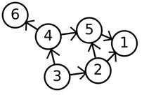
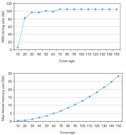
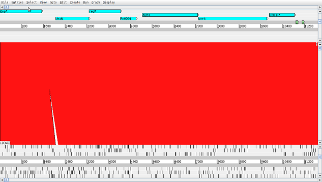
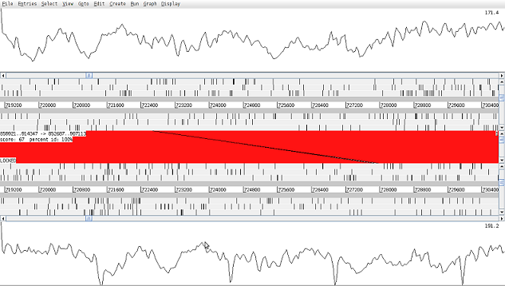

# Assembly

## Introduction

The main challenge of sequencing a genome is determining how to arrange reads into chromosomes. We have already explored mapping, where the sequence data is aligned to a known reference genome. A complementary technique, where no reference is used or available, is called de novo assembly.

De novo assembly is the process of reconstruction of the sample genome sequence without comparison to other genomes. It follows a bottom-up strategy by which reads are overlapped and grouped into contigs. Contigs are joined into scaffolds covering, ideally, the whole of each chromosome in the organism. However de novo assembly from next generation sequence (NGS) data faces several challenges. Read lengths are short and therefore detectable overlap between reads is lower and repeat regions harder to resolve. Longer read lengths will overcome these limitations but this is technology limited. These issues can also be overcome by increasing the coverage depth, i.e. the number of reads over each part of the genome. The higher the coverage then the greater the chance of observing overlaps among reads to create larger contigs and being able to span short repeat regions. In addition, the modern hardware commonly output paired-end reads. These are two reads that are separated by a gap of known size. They enable the resolution of repeats greater than the read length by employing their expected separation and orientation as location constraints. Sequencing errors add difficulty since algorithms must allow certain mismatches when overlapping reads and joining regions, possibly leading to discarding true overlaps and false positives (Miller, Koren, & Sutton, 2010)

Despite all mentioned limitations, the high coverage currently achieved, growing read lengths (e.g. 100 read depth, >150bp – Illumina HiSeq2500) and paired-end information make it feasible to obtain assemblies from small genomes (e.g. bacterial) with relatively low fragmentation. Current assemblers employ graph theory to represent sequences and their overlaps as a set of nodes and edges, being classified into three main groups: greedy, Overlap/Layout/Consensus (OLC) and de Bruijn graph assemblers


Graph theory is a branch of discrete mathematics that studies problems of graphs. Graphs are sets of points called ‘vertices’ or ‘nodes’ joined by lines called ‘edges’. In the graph to the left there are 6 nodes and 7 edges. The edges are unidirectional which means that they can only be traversed in the direction of the arrow. For example paths in this graph include 3-2-5-1, 3-4-6 and 3-2-1. 



The greedy algorithms consist of progressively adding single reads into contigs by end-to-end overlapping, starting with those reads with the highest overlap score and ending once no more joins can be found. Such scores are normally measured as the overlap length or the percentage of identity between reads along their joining region. SSAKE (Warren, Sutton, Jones, & Holt, 2007), the first short-read assembler, is based on this approach as well as its two descendants SHARCGS (Dohm, Lottaz, Borodina, & Himmelbauer, 2007) and VCAKE (Jeck et al., 2007).

OLC assemblers build an overlap graph, in which nodes represent the reads and edges the overlaps. It requires a very time-consuming first step, where all reads are compared against each other. Paths along the graph show likely contigs.

These two algorithms (greedy and OLC) are more suited to fewer, longer reads than those generated with NGS technologies. De Bruijn graph assemblers are the state-of-the-art approach for data sets composed of many thousands of short reads.


De Bruijn graph assemblers start by splitting the set of reads into k-mers, a set of overlapping sub-reads, and then use the latter to build the graph. Each edge represents an observed k-mer and its adjacent nodes the prefix and suffix of the original k-mer. Therefore, groups of overlapping reads are not actually computed but rather represented as paths in the graph. In the figure above the sequence ATGGCGTGCA with 3-mers and overlap of 2 base pairs (bp).

Since edges correspond to all k-mers existing in the sampled genome, the assembly is resolved by finding a path that visits every edge in the graph. This approach is especially suitable to handle the large number of reads because each k-mer is stored at most once regardless of how many times it occurs in the reads. Several programs implement de Bruijn graph algorithms, including Euler (Pevzner, Tang, & Waterman, 2001), Velvet (Zerbino & Birney, 2008), ABySS (Simpson et al., 2009), AllPaths (Butler et al., 2008) and SOAPdenovo (Li et al., 2010).

In conclusion, the de Bruijn graph assemblers are more appropriate for large amounts of data from high-coverage sequencing and have become the programs of choice when processing short reads produced by Illumina and other established platforms (>100bp).

## Exercise 1: De Novo Assembly using Spades

De novo assembly is one the most computationally demanding processes in bioinformatics. Large genomes require many hours or days of processing. A small bacterial genome may take up to several hours to assemble. Here we will assemble M. tuberculosis genomes using Spades (Bankevich et al, 2012). We will compute assembly statistics to check the quality, and review how resulting contigs can be aligned, ordered and orientated along the reference genome using Abacas (Assefa, Keane, Otto, Newbold, & Berriman, 2009).

### Quick start and data checks

Activate the relevant conda environment

```
conda activate assembly
```

Change to the data directory:

```
cd ~/data/tb
```

And list the files there:

```
ls
```

There are 6 fastq files in this directory; these are the input data for this practical. There are paired-end reads for three samples. To view the first 8 lines of a fastq file type:

```
zcat sample1_1.fastq.gz | head -8
```

!!! terminal "Terminal output"
    ```
    @HS3_5961:1:2207:17088:52965#1/1
    GCCGGTTGTTCGGCTGGAAGGTCCTTTTGCCCTTGGTCACGGGCGTCTCCTCGCTATGTCTGGCAACATCACCAT
    +
    GGGGGGEGFGFGGGFGDBEBF:AFDEFG?CFFDD:FBEE?EFEDFDEFEAEBFB8CCC?A@CD;ADDD86CCC><
    @HS3_5961:1:1208:19785:88067#1/1
    CTTAGGGTCGCCGTTAAGTTCGGAGACGACCGCGTTCCACACTGTGGTGAAGCCTGAACCGGGGTCATCGGTCAA
    +
    HHHHFFHBHHHHHHHEGDDDGGEGFHHHHHHGHHHDFFEFFFDD>DB@CDAEFF?FBFGDDCCC.=?5=<@@;DA
    ```

Each read consists of 4 lines, the first is the read name, the second are the bases read, the third line is ignored and the fourth is the encoded quality of each read (one character per base).

The number of lines in each file is reported by:

```
wc -l *
```

and therefore the number of reads can be calculated by dividing by 4. The length of the first read can be calculated by running:

```
zcat sample1_1.fastq.gz | head -2 | tail -1 | wc -c
```

This gives the number of characters in the line including the new line character, so it gives a number one greater than the first read length.

### Running Spades

Spades is implemented in a single program that performs several steps in the assembly pipeline with a single command. The options are explained by running the command with no parameters (spades.py):

You will see that there are many options and the pipeline can be customised extensively. However, for most purposes we can run the tool with the default settings. You only need to supply the reads and an output directory.

An example invocation that takes the fastq formatted paired end files (Mtb_sample1_1.fastq.gz and Mtb_sample1_2.fastq.gz) and performs assembly.

```
spades.py -1 ~/data/tb/sample1_1.fastq.gz -2  ~/data/tb/sample1_2.fastq.gz -o sample1_asm
```

Employing paired-end reads (rather than single-end) increases the assembly quality. In general, libraries with smaller insert size produce more fragmented and shorter assemblies, whilst the genome coverage does not increase that much. The combination of libraries with different insert size always gives the best results.

De novo assembly gives much better results if reads are aggressively pre-filtered before passing them to the assembler. This is the same as we have seen for mapping and variant detection earlier in the course.

Although anecdotal recommendations for the k-mer length range from lower than half of the read length up to 80% of read length, the parameter is difficult to determine in advance since it depends on coverage, read length, error rates and the sample properties (repeat regions, etc). Therefore, it is advisable to perform several assemblies using different values of k-mer length to decide a value.

Thankfully spades automatically chooses a range of k-mer lengths to test and chooses the best one. The pipeline also performs reads correction, which aims to correct random errors in reads which will have a knock on effect on the k-mers used in the assembly.

Eventually, after spades finishes running there will be several files will be obtained in the directory the most important for our purposes are:


* A fasta file (contigs.fasta) containing all assembled contigs
* A fasta file (scaffolds.fasta) containing all assembled scaffolds

Scaffolds are contigs that have been chained together into larger sequences using information such from mate pair libraries and reference sequences. The scaffolds should be very similar to the contigs in this assembly because the insert sizes of our library are relatively small. For the rest of this practical we will only be analysing the contigs. 

### Assembly quality

The outcome of de novo assembly is a set of contigs. In a perfect assembly each contig covers exactly one chromosome in its entirety. In practice many contigs are created and the assembly quality is measured by examining their length; individually and in combination. An assembly is considered to be of good quality if relatively few long contigs are obtained covering the majority of the original or expected genome. There are different metrics used to assess the quality of assemblies:


* N50. The length of the contig that contains the middle nucleotide when the contigs are ordered by size. Note, N80 or N60 may also be used.
* Genome coverage. If a genome reference exists then the genome coverage can be computed as the percentage of bases in the reference covered by the assembled contigs.
* Maximum/median/average contig size. Usually computed after removing the smallest contigs (e.g. discarding all contigs shorter than 150 bp).


We can compute these statistics with the help of a tool called quast (made by the same developers as spades). To get the statistics first navigate to the assembly directory and run quast 

```
cd sample1_asm
quast -r ../tb.fasta -o quast contigs.fasta 
```

 After it has finished you can examing the outputs. To view the report enter `cat quast/report.txt`. 

 !!! question
    === "Question 1"
        See if you can spot the statistics we mentioned above. Compare the size of the reference with the size of the assembly. Are they different? 
    === "Answer 1"
        Quast report includes information on statistics N50, Genome fraction and Maximum contig size that were mentioned before as well as additional metrics worth exploring. Average contig size can be additionally calculated by dividing values from fields Total length (>= 0 bp) and # contigs (>= 0 bp) or directly from FASTA file with external tools for example seqmagick. It is advised to look at a variety of metrics and supporting analyses to determine quality of assembly. The total size of reference genome (1000020 bp) and resulting genome assembly (1005736 bp) are comperable. 



High depth of coverage is essential to obtain high quality assembled genomes. It is always the case that contig sizes drop when coverage decreases under a certain value, generally considered to be 50x, although such threshold will depend on the size and repeat content of the sequenced genome. A coverage limit is reached above which no improvement on assembly metrics is observed. As shown to the left, coverage greater that 50x does not significantly improve N50 in an assembly of E. coli. Although such thresholds will not necessarily be the same for other genomes, the principles apply for all.

More data requires more memory too, as the lower graph demonstrates. Again the figures are genome specific but it is easy to see how large computers can quickly become necessary as coverage and genome size increase. (Illumina, 2009)

## Exercise 2: Contig Ordering

### Ordering with ABACAS

To align, order and orientate contigs along the reference genome we will be using ABACAS (Assefa et al., 2009). The output will be in the form of a pseudo molecule, where all of the contigs will be joined by N’s. To display the complete list of possible parameters by typing:

```
abacas.pl –h
```

The basic usage (for this exercise) is:

```
cp ~/data/tb/tb.fasta .
abacas.pl -r tb.fasta -q contigs.fasta -p nucmer -b -d -a -m -N -g sample1 -o sample1_asm
```


This will create a pseudomolecule (into sample1_asm.fasta) from the assembled contigs (in contigs.fa). The program creates a number of files with the same base filename for the other requested processing output, including gap information (-g, sample1_asm.gaps, sample1_asm.gaps.tab), a comparison file (sample1_asm.crunch), no padding version (-n, sample1_asm.NoNs.fasta), etc.

### Visualisation with ACT

Artemis Comparison Tools (ACT) (Carver et al., 2005) is a tool for displaying pair-wise comparison between two or more DNA sequences. It was developed to help identify and analyse regions of similarity and difference between genomes along their entire sequences and their annotation. ABACAS produces the required files to compare the original reference genome with the pseudo molecule resulting after ordering assembled contigs.

Launch ACT by running:

```
act
```

Click File > Open. Select the reference fasta file (tb.fasta) and the pseudomoelcule (sample1_asm.fasta) as the two sequence files with the associated comparison file (sample1_asm.crunch) – you will have to navigate the directories. Then press Apply. 


A map between the two sequences will be displayed. To load annotation click on File > tb.fasta > Read An Entry... and select the tb.gff file from the ~/data/tb/ directory. To make stop codons disappear (represented as black vertical lines) right-click on the reference and the pseudo molecule panels and deselect Stop Codons option in the right-click menu.

Right-click on one of the red ribbons linking the contigs and select View Selected Matches to find out the first and last position the contig maps to the reference and to the pseudo molecule. The percentage of identity between them is also shown.



## Exercise 3: Mapping back to the Reference

Contigs aligning with large internal gaps or low confidence indicate either structural variants or misassemblies, and should be carefully monitored. If paired-end reads are available then mapping them back onto the contigs (pseudo molecule) is another source of information. Large deviations in the mapping distance or read pairs in which only one read maps against the contigs may hint at misassemblies rather than structural variation

The following commands maps the raw reads against the pseudo molecules from the previous exercise. This is a similar process to those you have used in the previous classes.

```
cd ~/data/tb/sample1_asm
bwa index -a is sample1_asm.fasta
bwa mem -k 20 -c 100 -L 20 -U 20 -M -T 50 sample1_asm.fasta ~/data/tb/sample1_1.fastq.gz ~/data/tb/sample1_2.fastq.gz | samtools sort -o sample1_asm.bam
samtools index sample1_asm.bam
```

This process indexes, maps and stores the fastq paired-end reads against the ABACAS ordered pseudomolecule (sample1/sample1_asm.fasta) for sample1 created by spades. The output is a BAM file (sample1/sample1_asm.bam).

This script can be modified to create a BAM file for the sequence data mapped against any reference genome, just as you have done in the previous class.

These files can be visualised in ACT. File > sample1_asm.fasta > Read BAM/VCF... and choose the remapped.bam file (sample1_asm.bam). Do the same for tb.fasta and choose the originally mapped BAM file (sample1.bam). These BAM data are represented as pileup data – each read stacked up over the section of the reference that it has been mapped to. Extra information can be presented by right-clicking on the pileups and selecting Graph > Coverage or View > Inferred Size.

The graph shown gives a good insight into the quality and depth of the assembly and is very useful for finding regions that have been misaligned (i.e. joined in error) as their coverage should be very low or very high.



!!! question
    === "Question 2"
        In ACT inspect the region between 76,000 and 89,000. How does the coverage vary across the pseudo molecule? 
    === "Answer 2"
        Coverage across the pseudo molecule is sufficient across most regions. There are few visible fragmentations for which coverage is not existent that should be expected from the nature of the assembly.

!!! question 
    === "Question 3"
        How does this compare to the coverage across the matching regions mapped against the reference? 
    === "Answer 3"
        Overall coverage trends in comparison to original mapping assembly are similar. In the region of interest, we can notice pseudo molecule having uniform coverage whilst in mapping assembly the lack of supporting reads spanning between 795000-83000.

!!! question
    === "Question 4"
        Is there any kind of structural variant involved? 
    === "Answer 4"
        A few regions based on the coverage distribution might indicate the existence of structural variants that should be investigated further.

## Exercise 4: Structural Variant Validation

Structural variant (SV) software aims to detect signatures left by changes in chromosome material and chromosome rearrangements. However, reads mapping to repetitive or highly polymorphic regions may mimic the same signatures (false positives).

Here we describe a de novo assembly approach that we call targeted assembly of candidate SV regions. It consists of obtaining the reads from the predicted SV region, performing de novo assembly and mapping the resulting contig back to the reference. The nature of the contig alignment can reveal the SV.

We have previously identified a deletion in sample1 in the region 79570-83050 using delly. This region has been investigated above, in the context of a large assembly, and interesting mapping and assembly results have been found.

The reads are extracted from the BAM file using samtools. Extracting a wider range (by at least 400bp) than the candidate region enables spades to construct good contigs either side of the possible SV.

```
cd ~/data/tb
samtools view -b sample1.bam Chromosome:79000-84000  | samtools fastq - > region.fastq
```

The next step is to perform de novo assembly of the extracted reads. 

```
spades.py -s region.fastq -o region_assembly
```

We map the output contigs back to the reference with BLAST. This powerful alignment algorithm is available online or for download as a command line tool. Go to the web address [http://blast.ncbi.nlm.nih.gov/Blast.cgi](http://blast.ncbi.nlm.nih.gov/Blast.cgi) and navigate to the Nucleotide BLAST page. Check the “Align two or more sequences” box. Upload the contigs file (~/data/tb/region_assembly/contigs.fasta) as the subject and the tb reference (~/data/tb/tb.fasta) as the query. Enter an appropriate region of the reference to blast against as there is little point in searching the entire genome when we are only interested in a small range (79100-83900).

See screenshots below showing the blast Alignment input screen. Choose the appropriate reference and sample sequences, enter the range of interest and click BLAST.


Once the server has blasted your data, it will create a web page for the results with graphical and textual information on how well the sequences aligned.


!!! question
    === "Question 5"
        Is it a deletion? Or was it a false positive? Using the output from delly in the variant detection practical have a look at other SVs as well. 
    === "Answer 5"
        BLAST Graphic Summary of the resulting query contains a few rectangles (size correlates with alignment length) that represent regions of the sequence that maps to the reference. Rectangles joined by a thin line show that the contig sequence was split during alignment. It is indicating that the reads assembled into this single contig needed to be separated by a gap when aligning to the reference – therefore we can conclude a deletion compared to the reference. In order to validate in-depth deletion additional information could be extracted from long-read sequencing to prove or disprove the hypothesis.

        Shorter rectangles are matches coming from other smaller assembled contigs that may potentially reveal alternative areas of similarity or small repetitive sequences.

## Advanced Topics

### Annotation Transfer

Once the contigs ordered are against the reference, it is useful to determine the position and function of possible genes. It is possible to implement ab initio gene finding, but an alternative approach is to use the annotation of the reference and adapt it to the new assembly. A tool called RATT (Otto et al., 2011 “Rapid annotation transfer tools”) has been developed to transfer the annotation from a reference to a new assembly. In the first step the similarity between the two sequences is determined and a synteny map is constructed. This map is used to align the annotation of the reference onto the new sequence. In a second step, the algorithm tries to correct gene models. One advantages of RATT is that the complete annotation is transferred, including descriptions. Thus careful manual annotation from the reference becomes available in the newly sequenced genome. Where no synteny exists, no transfer can be performed. An outputted combined “embl” format file with sequence and inferred annotation can be viewed in artemis to assess the quality of the transfer.

### Improving assemblies

The quality of the assembly is determined by a number of factors, including the type of software used, the length of reads and the repetitive nature or complexity of the genome. For example, assembly of Plasmodium is more difficult than that of most bacteria (due to the high AT content and repeats). A good assembly of a bacterial genome will return 20-100 supercontigs. It is possible to manually / visually improve assemblies and annotation within Artemis. To improve the assembly in a more automated fashion, there is other software:

**SSPACE**: This tool can scaffold contigs. Although spades can also scaffold contigs, SSPACE generally performs better.

**Abacas**: has the option to design primers that can be used to generate a PCR product to span a possible gap. The resulting new sequence can then be included in the assembly. This process is called finishing.

**Image**: is a tool that can close gaps in the assembly automatically. First the reads are mapped against the assembly. Using all reads that map close to a gap and with their mate pairs within the gap, it is possible to perform a local assembly. This process is repeated iteratively. This procedure can close up to 80% of the sequencing gaps (Tasi et al, 2010).

**iCORN** (Otto et al, 2010) can correct base errors in the sequence. Reads are mapped against the reference and differences are called. Those differences or variants that surpass a specified quality threshold are corrected. A correction is accepted if the amount of perfect mapping reads does not decrease. This algorithm also runs iteratively. Here, perfect mapping refers to the read and its mate pair mapping in the expected insert size without any difference to the iteratively derived reference.

All these programs are available through the PAGIT suite (post assembly genome improvement toolkit, http://www.sanger.ac.uk/resources/software/pagit/).

## References

Assefa, S., Keane, T. M., Otto, T. D., Newbold, C., & Berriman, M. (2009). ABACAS: algorithm-based automatic contiguation of assembled sequences. Bioinformatics (Oxford, England), 25(15), 1968-9. doi:10.1093/bioinformatics/btp347

Butler, J., MacCallum, I., Kleber, M., Shlyakhter, I. A, Belmonte, M. K., Lander, E. S., Nusbaum, C., et al. (2008). ALLPATHS: de novo assembly of whole-genome shotgun microreads. Genome research, 18(5), 810-20. doi:10.1101/gr.7337908

Carver, T. J., Rutherford, K. M., Berriman, M., Rajandream, M.-A., Barrell, B. G., & Parkhill, J. (2005). ACT: the Artemis Comparison Tool. Bioinformatics (Oxford, England), 21(16), 3422-3. doi:10.1093/bioinformatics/bti553

Compeau, P.E.C., Pevzner, P.A., Tesler, G. (2007) How to apply de Bruijn graphs to genome assembly. Nature Biotechnology 29(11) 987-991

Dohm, J. C., Lottaz, C., Borodina, T., & Himmelbauer, H. (2007). SHARCGS, a fast and highly accurate short-read assembly algorithm for de novo genomic sequencing. Genome research, 17(11), 1697-706. doi:10.1101/gr.6435207

Illumina, I. (2009). De Novo Assembly Using Illumina Reads. Analyzer. Retrieved from http://scholar.google.com/scholar?hl=en&btnG=Search&q=intitle:De+Novo+Assembly+Using+Illumina+Reads#0

Jeck, W. R., Reinhardt, J. a, Baltrus, D. a, Hickenbotham, M. T., Magrini, V., Mardis, E. R., Dangl, J. L., et al. (2007). Extending assembly of short DNA sequences to handle error. Bioinformatics (Oxford, England), 23(21), 2942-4. doi:10.1093/bioinformatics/btm451

Li, R., Zhu, H., Ruan, J., Qian, W., Fang, X., Shi, Z., Li, Y., et al. (2010). De novo assembly of human genomes with massively parallel short read sequencing. Genome research, 20(2), 265-72. doi:10.1101/gr.097261.109

Margulies, M., Egholm, M., Altman, W. E., Attiya, S., Bader, J. S., Bemben, L. a, Berka, J., et al. (2005). Genome sequencing in microfabricated high-density picolitre reactors. Nature, 437(7057), 376-80. doi:10.1038/nature03959

Miller, J. R., Koren, S., & Sutton, G. (2010). Assembly algorithms for next-generation sequencing data. Genomics, 95(6), 315-27. Elsevier Inc. doi:10.1016/j.ygeno.2010.03.001

Pevzner, P. a, Tang, H., & Waterman, M. S. (2001). An Eulerian path approach to DNA fragment assembly. Proceedings of the National Academy of Sciences of the United States of America, 98(17), 9748-53. doi:10.1073/pnas.171285098

Simpson, J. T., Wong, K., Jackman, S. D., Schein, J. E., Jones, S. J. M., & Birol, I. (2009). ABySS: a parallel assembler for short read sequence data. Genome research, 19(6), 1117-23. doi:10.1101/gr.089532.108

Warren, R. L., Sutton, G. G., Jones, S. J. M., & Holt, R. a. (2007). Assembling millions of short DNA sequences using SSAKE. Bioinformatics (Oxford, England), 23(4), 500-1. doi:10.1093/bioinformatics/btl629

Zerbino, D. R., & Birney, E. (2008). Velvet: algorithms for de novo short read assembly using de Bruijn graphs. Genome research, 18(5), 821-9. doi:10.1101/gr.074492.107

Acknowledgements: Thomas Otto and Wellcome Trust.