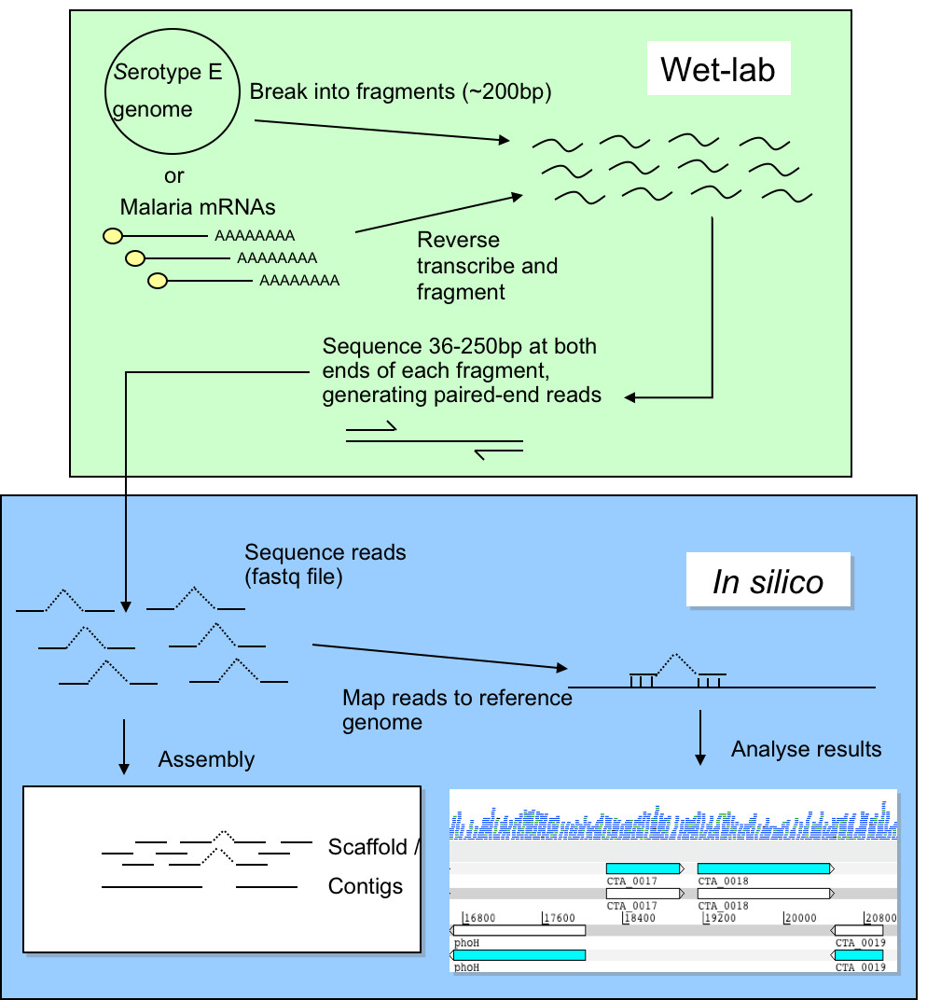
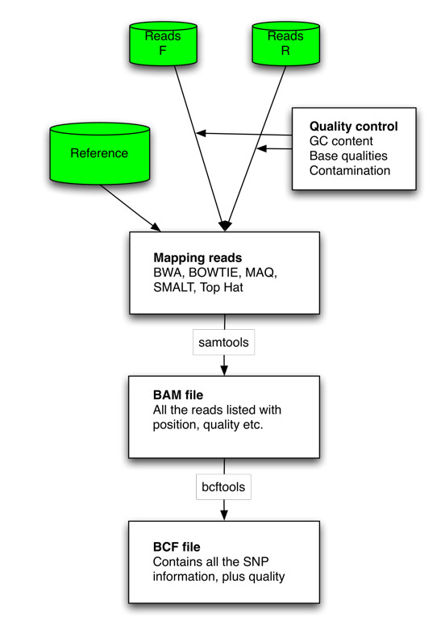
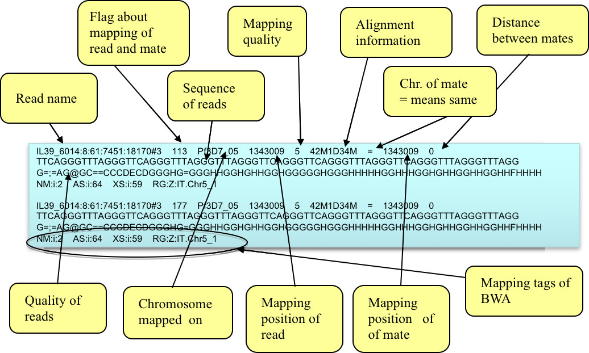

# Mapping

Next-generation sequencing data is being produced at an ever-increasing rate. The raw data is not meaningful by itself and needs to be processed using various bioinformatic software. This practical will focus on genomic resequencing data where the raw data is aligned to a reference genome.

## Introduction
Improvements in DNA sequencing technology have led to new opportunities for studying organisms at the genomic and transcriptomic levels. Applications include studies of genomic variation within species and gene identification. In this module we will concentrate on data generated using the Illumina Genome Analyzer II technology, although the techniques you will learn are applicable to other technologies (e. g. 454 GS FLX and ABI SOLiD). A single machine can produce around 20 Gigabases of sequence data in a week. This is the equivalent to over 6 human genomes. The data from the Illumina machine comes as relatively short stretches of 35 - 250 base pairs (bp) of DNA - around 300 million of them. These individual sequences are called <strong>reads</strong>. The older capillary sequencing technology generates longer reads of ~500 bp, but the approach is much slower and more expensive.

One of the greatest challenges of sequencing a genome is determining how to arrange sequencing reads into chromosomes. This process of determining how the reads fit together by looking for overlaps between them is called genome assembly. Capillary sequencing reads (~500bp) are considered a good length for genome assembly. Genome assembly using sequence reads of &lt;100bp is more complicated due to the high frequency of repeats longer than the read length. Assemblies for bacterial genomes can comprise of at least 50 pieces (called “contigs”), whilst for Eukaryotes more than 1000 pieces is common. Therefore new sequencing technologies are applied predominantly where a reference genome already exists. A reference genome is a well assembled genome from the same or a similar organism that is undergoing sequencing. Sequencing a genome with new technology when there is an existing reference is called resequencing.

In this practical, we will focus on mapping reads to a reference genome and visualising the resulting alignments using <a href="https://ics.hutton.ac.uk/tablet/">Tablet</a>.

## Sequencing/Mapping workflow

The diagram below describes the workflows for genomic resequencing and RNA sequencing. We will cover the in silico (computational) aspects of these workflows.



When resequencing, instead of assembling the reads to produce a new genome sequence and then comparing the two genome sequences, we map the new sequence data to the reference genome. We can then identify Single Nucleotide Polymorphisms (SNPs), insertions and deletions (indels) and Copy Number Variants (CNVs) between two similar organisms.

The first example we use here is a reference genome for <i>Plasmodium falciparum</i> (3D7 clone, size 23Mb, 81% AT content) (Gardener et al., 2002). This parasite is the causative agent of malaria. Malaria is widespread in tropical and subtropical regions, including parts of the Americas, Asia, and Africa. Each year, there are approximately 350–500 million cases of malaria, killing between one and three million people, the majority of whom are young children in sub-Saharan Africa. Recently we sequenced two laboratory strains, IT and DD2, using 76 bp paired end read technology. The second example is using the reference genome for <i>Mycobacterium tuberculosis</i> (H37Rv, size 4.4Mb, GC content 65.6%) (Cole et al, 1998). This bacterium causes tuberculosis disease.

Rather than attempting to assemble these very short reads into a whole new genome, we will map them against the existing genome assembly of <i>P. falcipraum</i> (3D7) or <i>M. tuberculosis</i> (H37Rv). Furthermore, we will identify differences between the genomes of the three clones, find mutations and CNVs associated to drug resistance, whilst determining how the reads fit together.

Here is the general workflow of mapping:
1. The paired end reads (F=forward; R=reverse) are mapped against the reference. Different tools can be used for that. The results can be transformed with <a href="https://github.com/samtools/samtools">samtools</a> to an ordered and indexed bam file.
2. Those bam files can be read into programs like Artemis to visualize the alignments of the short sequences.
3. From the bam file it is possible to call variants. The output format is BCF or VCF. VCF can be loaded easily into excel like tools.



Quality control of the reads is always important, to correct for any GC content biases, possible contamination, and read quality.

!!! important
    Before doing anything, we need to first activate the conda environment for this practical by typing the following: `conda activate mapping`. This environment contains most of the software we need for this practical. This command needs to be run each time we open up a new terminal or switch from a different environment. 

## File formats

You have the P. falciparum 3D7 clone reference file (Pf3D7_05.fasta). This contains the assembled sequence of the 3D7 genome. You also have two files of sequence reads from the IT clone (IT.Chr5_1.fastq.gz and IT.Chr5_2.fastq.gz). Look in both the reference file and the read files. 

### FASTA format

In the terminal navigate to the data/malaria directory, by typing:

```
cd ~/data/malaria/
head -n 5 Pf3D7_05.fasta
```


!!! output
    ```
    >Pf3D7_05
    ctaaaccctgaaccctaaaccctgaaccctaaaccctaaaccctgaaccctaaaccctga
    accctaaaccctgaaccccctaaaccctaaaccctgaaccctaaaccctaaaaccctgaa
    ccctaaaccctgaaccctaaaccctgaaccctgaaccctaaaccctgaaccctaaaccct
    gaaccctaaaccctaaaccctaaaccctaaaccctaaaccctaaaccctaaaccctgaac
    ```

The line starting with ">" defines the header and all subsequent lines define the sequence.

### FASTQ format

Now type the commands below to see what FASTQ format looks like.

```
zcat IT.Chr5_1.fastq.gz | head -n 12
```

!!! output
    ```
    @HS3_5961:1:2207:17088:52965#1/1
    GCCGGTTGTTCGGCTGGAAGGTCCTTTTGCCCTTGGTCACGGGCGTCTCCTCGCTATGTCTGGCAACATCACCAT
    +
    GGGGGGEGFGFGGGFGDBEBF:AFDEFG?CFFDD:FBEE?EFEDFDEFEAEBFB8CCC?A@CD;ADDD86CCC><
    ```

Each read is represented by four lines:

1. The read name and additional info from the sequencing platform
2. The sequence of the read
3. A row in which comments can be added (rarely used anymore)
4. Sequence quality. There is one character for each nucleotide. The characters relate to a sequence quality score e.g. how likely is the nucleotide correct? ‘>’ is higher quality than ‘6’. Sequence reads tend to have more errors at the end than the start


!!! Question

    === "Question"

        Which format allows the storage of base quality data?

    === "Answer"

        Fastq: the 4th line for each read in fastq format represents the sequence quality

## Quality Control

Prior to the analysis of these sequences, it is highly advisable to perform quality control checks and filtering in order to minimise artefacts like base calling errors, poor quality reads or primer contamination. The difference in passing filtered data to downstream programs can be night-and-day for processes like de novo assembly or SNP calling. 

FastQC is a tool written in Java to perform quality control checks on raw sequence data. It computes several statistics and shows the results on summary graphs and tables. We will analyse several datasets in order to check whether the samples look good or, on the contrary, they require further filtering. 

First we will activate the software environment using: 

```
conda activate mapping
```

Open up a new terminal window and then type: `fastqc`
Once the program is running, select `File > Open` to open one or more Sequence files (see below). Browse to `~/data/tb/` to choose `sample1_1.fastq` and click  `OK`. 

FastQC supports FASTQ files (all quality encoding variants), GZip compressed FastQ and alignment files (SAM and BAM formats) 

Newly opened files will be immediately processed. Because of the size of FASTQ files it can sometimes take a couple of minutes to open them. 

FastQC performs several analyses, described in modules on left hand side of the main window (see below). Note that these results should be taken as guidance in the context of our library and never as pass/fail results. Nevertheless, they will highlight major problematic aspects. Let us now interpret the output of some of the modules.

Normal results are marked with green ticks, slightly abnormal with orange exclamation marks and very unusual with red crosses

!!! Information

    === "Basic sequence statistics"

        The Basic Statistics module provides overall information such as the total number of reads, read length and %GC content.

    === "Per Base Sequence Quality"

        This view shows the quality values (y-axis) along the read at each nucleotide position (x-axis). The greater this value, the lower the probability that the corresponding base call is incorrect. At each position a Box-Whisker plot is drawn where the central red line is the median; the yellow box represents the inter-quartile range (25-75%); the upper and lower whiskers the 10% and 90% points; and the blue line correspond to the mean quality. This analysis computes the mean quality of each read and then displays for all observed values the number of reads having such quality. It is expected that a small subset will have universally poor quality. FastQC outputs a warning if the most frequently observed mean is below 27 (corresponding to a 0.2% error rate) and a failure if is below 20 (1% error rate).

    === "Per Tile Sequence Quality"

        This graph will only appear in your analysis results if you're using an Illumina library which retains its original sequence identifiers. Encoded in these is the flowcell tile from which each read came. The graph allows you to look at the quality scores from each tile across all of your bases to see if there was a loss in quality associated with only one part of the flowcell.

        The plot shows the deviation from the average quality for each tile. The colours are on a cold to hot scale, with cold colours being positions where the quality was at or above the average for that base in the run, and hotter colours indicate that a tile had worse qualities than other tiles for that base. In the example below you can see that certain tiles show consistently poor quality. A good plot should be blue all over.

    === "Per base N content"

        This module outputs the percentage of N base calls at each position. N is usually called when the sequencer is not confident enough to call a base (A, T, C or G). Small proportion of Ns may appear especially towards the last positions.

    === "Sequence length distribution"

        Current sequencers frequently produce reads of uniform length. Nevertheless, if reads are trimmed due to quality issues we will observe variable read lengths.

    === "Sequence duplication levels"

        This module computes the degree of duplication of every read in the file by looking for exact matches over the whole length of the rest of reads. A dataset with high depth of coverage, namely an over-represented target genome, will report higher duplication levels than one would expect since multiple reads starting at the same position will be found by chance.

    === "Overrepresented sequences"

        In a normal library, every individual sequence will make up a tiny fraction of the whole set. Therefore, overrepresented reads may be indicators of biologically significant sequences or contaminants. All reads representing more than 0.1% of the total amount will be listed. Primers and adaptors are the most common sources of contamination.

!!! Question

    === "Question"

        At this point you should be able to open sequence files with FastQC and interpret the quality plots described. First, open sample IT.Chr5_1.fastq.gz in ~/data/malaria/. Second, open sample1_1.fastq.gz, sample2_1.fastq.gz and sample3_1.fastq.gz in ~/data/tb/.

        Questions:

        Can you spot any quality issue with the reads we should be worried about?
        If so, what may be their source?

    === "Answer"
    
        All of the fastq files look ok except sample3_1.fastq.gz. If you look at the 'Per base sequence quality' graph, you will see that many bases fall into the low quality zone (Q<20).

### Saving a report

We can keep a record of the FastQC results. To create a report simply select File > Save Report from the main menu. This will create a folder containing the images from the analyses, an HTML version of module results and text files containing results numeric data. 

You may find useful the information in the following links:

1. http://www.bioinformatics.babraham.ac.uk/projects/fastqc/
2. http://bioinfo-core.org/index.php/9th_Discussion-28_October_2010
3. http://www.youtube.com/watch?v=bz93ReOv87Y (FastQC video tutorial)

We have used the FastQC tool to identify problems in raw sequence data. Nevertheless, bad quality issues in our data are not a death sentence for the experiment; it can still be useful for downstream analyses if we applied the right filtering before processing. In general, the problem in the sequence files is the degradation in quality of bases at end of the reads, leading to the need to hard clip or trim them. 

## Trimming reads using Trimmomatic

 The quality of the last few bases of the read can be substantially lower than the rest of the sequence read. In general, QC tools are unable to filter these reads out due to their overall high quality. Besides, it is not advisable to discard the whole read just because of few low-quality bases at the ends. Therefore, it is crucial to trim such bases before any further analysis. Trimmomatic (Lohse et al., 2012) is a fast command line tool that can be used to trim and crop Illumina data as well as to remove adapters (see Table below). We will be using the paired-end mode which will process both forward and reverse reads simultaneously, keeping the correspondence of read pairs intact. 

 | Parameter     | Description  |
|---------------|---------------|
| ILLUMINACLIP  | Cut adapter and other Illumina-specific sequences from the read     |
| SLIDINGWINDOW | Performs a sliding window trimming approach. It starts scanning at the 5'   end and clips the read once the average quality within the window falls below   a threshold |
| MAXINFO       | An adaptive quality trimmer which balances read length and error rate to   maximise the value of each read         |
| LEADING       | Cut bases off the start of a read, if below a threshold quality  |
| TRAILING      | Cut bases off the end of a read, if below a threshold quality    |
| CROP          | Cut the read to a specified length by removing bases from the end     |
| HEADCROP      | Cut the specified number of bases from the start of the read      |
| MINLEN        | Drop the read if it is below a specified length     |
| AVGQUAL       | Drop the read if the average quality is below the specified level       |
| TOPHRED33     | Convert quality scores to Phred-33         |
| TOPHRED64     | Convert quality scores to Phred-64           |

Try to understand what the following command line specifies by looking at the Trimmomatic parameters in the previous table, and run it for sample1. 

```
cd ~/data/tb/
trimmomatic PE sample1_1.fastq.gz sample1_2.fastq.gz -baseout sample1.fastq LEADING:3 TRAILING:3 SLIDINGWINDOW:4:20 MINLEN:36
```

## Alignment of short reads

A major step in most sequence analysis pipelines involves the alignment of reads against a reference genome, a requisite stage for downstream analyses. Traditional alignment software have become obsolete when dealing with the large amounts of short reads (millions) produced by NGS platforms and, during the last few years, software particularly designed to map short queries onto a long reference sequence have been produced. 

Currently popular alignment tools are summarised in Li & Homer (2010). As shown in column 5 in the Table below, most of them allow gaps in alignments. Effective gapped aligners avoid calling false SNPs predicted due to the presence of insertions and deletions (indels). Furthermore, software including paired-end information are capable of mapping repeat reads with uniquely mapped mates; they also correct alignment errors that are inconsistent with the constraints imposed by mate pairs in terms of distance and orientation. Base quality in reads has also been exploited by programs like MAQ improving alignment accuracy. 

All aforementioned programs output both aligned and unaligned reads in Sequence Alignment/Map (SAM) format (H. Li et al. 2009), a standardised format widely supported by downstream bioinformatic tools (e.g. variant callers, alignment viewers). The development and improvement of efficient short-read alignment algorithms has made the fast processing of data produced by current sequencing platforms feasible which, initially, entailed a bottleneck in the analysis of such high-coverage sequence datasets. 

### Sequence alignment Exercise 1

In this exercise we will be running the Burrows-Wheeler Aligner (BWA), an efficient program that aligns relatively short nucleotide sequences (i.e. short reads) against a long reference sequence. It implements two algorithms, bwa-short and BWA-SW. The former works for query sequences shorter than ~200bp with low error rate (<3%) (e.g. reads produced by Illumina technology). It performs gapped global alignment, supports paired-end reads, and is one the fastest short read alignment algorithms currently available. BWA-SW is designed for longer sequences (e.g. 454 reads) with more errors. 

Open up a new terminal window and type `bwa`

All available BWA commands will appear on the terminal screen as shown below.

!!! Output
    ```
    Program: bwa (alignment via Burrows-Wheeler transformation)
    Version: 0.7.17-r1188
    Contact: Heng Li 

    Usage:   bwa  [options]

    Command: index         index sequences in the FASTA format
            mem           BWA-MEM algorithm
            fastmap       identify super-maximal exact matches
            pemerge       merge overlapping paired ends (EXPERIMENTAL)
            aln           gapped/ungapped alignment
            samse         generate alignment (single ended)
            sampe         generate alignment (paired ended)
            bwasw         BWA-SW for long queries

            shm           manage indices in shared memory
            fa2pac        convert FASTA to PAC format
            pac2bwt       generate BWT from PAC
            pac2bwtgen    alternative algorithm for generating BWT
            bwtupdate     update .bwt to the new format
            bwt2sa        generate SA from BWT and Occ
    ```

n order to map our paired-end reads, we will use ‘index’ and ‘mem’ commands. The ‘index’ command takes the reference genome (i.e. the database) in FASTA format as input and indexes it, which typically will take a few hours. This command only needs to be executed once for a particular reference genome.

To see all options for the *index* command type: `bwa index`

Most options will be set automatically according to the data we are running it on. Thus, we do not have to worry about setting them.

Type the following line:

```
bwa index ~/data/tb/tb.fasta
```

Several alignment algorithms are implemented in BWA. We will be using the BWA-MEM, which is the latest and generally recommended for high-quality queries as it is faster and more accurate. To see which parameters can be tuned for the ‘mem’ command type: `bwa mem`

We will be using the trimmed files output (from applying trimmomatic) as input for BWA:

```
bwa mem -R "@RG\tID:sample1\tSM:sample1\tPL:Illumina" ~/data/tb/tb.fasta sample1_1P.fastq sample1_2P.fastq | samtools view -b - | samtools sort -o sample1.bam -
```

Then we can index the bam file using:

```
samtools index sample1.bam
```

The previous commands transformed SAM files into binary format, sorted the reads by occurrence against the reference, and then indexed the bam files. At this point, we can use the ‘flagstat’ samtools command to print summary statistics from indexed bam files:

```
samtools flagstat sample1.bam
```
The 'flagstat' output should look like this:

!!! output
    ```
    1345146 + 0 in total (QC-passed reads + QC-failed reads)
    0 + 0 secondary
    0 + 0 supplementary
    0 + 0 duplicates
    1330984 + 0 mapped (98.95% : N/A)
    1345146 + 0 paired in sequencing
    672573 + 0 read1
    672573 + 0 read2
    1312598 + 0 properly paired (97.58% : N/A)
    1318846 + 0 with itself and mate mapped
    12138 + 0 singletons (0.90% : N/A)
    0 + 0 with mate mapped to a different chr
    0 + 0 with mate mapped to a different chr (mapQ>=5)
    ```

Where each line specifies:

1. Total number of reads
2. Duplicates
3. Number of mapped reads
4. Paired reads in sequencing
5. Number of forward reads
6. Number of reverse reads
7. Number of properly mapped reads (same chromosome, opposite orientation, and within few deviations from the expected insert size)
8. Number of reads mapped along with their mates (7 is a subset of 8)
9. Singletons: number of reads mapped alone, i.e. mate not mapped (8+9=3)
10. Reads whose mates are mapped to a different chromosome
11. Reads whose mates are mapped to a different chromosome with mapping quality greater than 5; note that (11) is a subset of (10)

Finally, let's also remove some temporary files we no longer need. Trimming has produced some files which are unzipped and take up a lot of space. Let's remove these using: 

```
rm sample1_1P.fastq sample1_1U.fastq sample1_2P.fastq sample1_2U.fastq
```

!!! Exercise

    === "Task"

        Execute all previous commands for to get a bam file for sample 2

    === "Hints"

        You need to run through the following steps:
        
        1. Trim the reads with trimmomatic
        2. Use bwa to align the reads and samtools to store as bam

    === "Cheats"

        Here is the code you need to use:

        ```
        cd ~/data/tb
        trimmomatic PE sample1_1.fastq.gz sample1_2.fastq.gz -baseout sample1.fastq LEADING:3 TRAILING:3 SLIDINGWINDOW:4:20 MINLEN:36
        bwa mem -R "@RG\tID:sample2\tSM:sample2\tPL:Illumina" ~/data/tb/tb.fasta sample2_1P.fastq sample2_2P.fastq | samtools view -b - | samtools sort -o sample2.bam -
        ```

## Viewing in IGV

Launch IGV by running the command `igv` on a New Terminal. We first need to load the reference genome. To do this click on `Genomes -> Load Genome from File...`. Navigate to `~/data/tb` and select the `tb.fasta` file. You can also load the genes by clicking on `File -> Load from File...`, then selecting the `tb.gff` file. Finally you can load the bam file by clicking `File -> Load from File...` and selecting the bam file you wish to load, in our case it will be `sample1.bam`. 

There are three main boxes that represent the genomic data. 

The top box shows which region you are viewing.

The middle box shows the bam files you have loaded. For each bam file you load there will be two tracks which show the coverage and the actual read data. Nucleotides in the reads that differ from the reference will be coloured and every nucleotide on the reads should be grey. If you hover over the reads a popup will show some detials including the name of the read and where it aligns to on the reference. Hover over the coverage track a popup will show which position you are viewing as well as the count of each nucleotide at that position. Some reads will be a different colour and by defaul this represents reads which are outliers due to their insert size or orientation. You can change this by right clicking on the read track and selecting "Color alignment by" followed by one of the choices. If you have paired data and would like to visualise the paired information you can right click on the reads and select "View as pairs". You should then see the read pairs connected by a thin grey line.

The bottom box shows a representation of the reference sequence as well as the location of the genes. If you zoom in, you will eventually see the individual nucleotides of the reference sequence. You can also expand the gene view to see the translated protein sequence. To do this, right click on the gene trakc and select "expanded".

### Navigation in IGV

#### Zooming in and out

Now you will be able to view the alignment of the reads to the reference. By default, IGV will only display the alignments when viewing a region of the genome less than 30kb. To view the alignment you can zoom in using the "+" button on the top right side of the window. You can zoom out using the "-" button.

#### Viewing a region

You can zoom in to a specific region using the search bar. You can do this by entering your region using the specific format: *chromosome_name:start-end*. For example if you want to go zoom in on positions 1000-2000 on the Mtb chromosome you can type in "Chromosome:1000-2000" and hit ++enter++. 

In most cases you#ll probably be searching for a certain gene. You can also enter the gene name into the search bar and it will automatically center the view on this gene. Try this with the *rpoB* gene for example. Type in "rpoB" into the search bar and hit ++enter++.

## Exercise: Mapping the P. falciparum IT reads with BWA

!!! info 
    Now we will map the IT clone reads to the 3D7 reference, again using the short reads mapping program BWA

The files for this exercise are in the `~/data/malaria` directory:

```
cd ~/data/malaria/
```

First we need to index the reference (the algorithm needs to access specific positions in the reference in an efficient way). 

```
bwa index ~/data/malaria/Pf3D7_05.fasta
```

Next, read files (both forward/reverse) are mapped against the reference 

```
bwa mem ~/data/malaria/Pf3D7_05.fasta ~/data/malaria/IT.Chr5_1.fastq.gz ~/data/malaria/IT.Chr5_2.fastq.gz | samtools view -b - | samtools sort -o IT.Chr5.bam -
```

The details of where each IT clone read has been mapped is now stored in the file IT.Chr5.bam. We are going to view the mapped reads in Artemis using Artemis BAM view. Before we can proceed, however, we must index the BAM file to allow programs suchh as Artemis quick access to different sections of the file. 

```
samtools index IT.Chr5.bam
```

Before we visualize the alignment of the reads in IGV, let us have a look at the sam/bam format. Samtools was developed to have a standard format to store reads. It contains information about the reference sequence, where a read is mapped, quality of mapping, and where it’s mate is mapped. Files ending with .sam, are normally plain text, but as they might take too much space, the file is compressed into a bam file. All visualization tools will need the bam file. It has to be sorted (by chromosome and position) and indexed. Indexing enables the fast processing of alignments. 

```
samtools view IT.Chr5.bam | grep "IL39_6014:8:61:7451:18170"
```



### Viewing the mapped reads in Artemis

We will now examine the read mapping in Artemis using the BAM view feature.

Launch IGV by running the command `igv` on a New Terminal. We first need to load the reference genome. To do this click on `Genomes -> Load Genome from File...`. Navigate to `~/data/malaria` and select the `Pf3D7_05.fasta` file. You can also load the genes by clicking on `File -> Load from File...`, then selecting the `Pf3D7_05.gff` file. Finally you can load the bam file by clicking `File -> Load from File...` and selecting the bam file you wish to load, in our case it will be `IT.Chr5.bam`. 

!!! question
    === "Question"
         Scroll through the genome. Describe the coverage. Are there regions that are not covered? 
    === "Answer"
        In general there is good coverage across the genome. This can be said by the fact that most of the positions have many reads overlapping them. There are a few positions with few or no reads aligning. This could be due to poor sequencing of those regions or a deletion.

Let's go to the region around the PF3D7_0504700 gene by typing it into the search bar and hitting ++enter++.

Zoom in and position the mouse over a read until a window pops up. This window provides information on the mapping of the reads, as it is stored in the bam file. Notice the Mapping quality (MAPQ). The maximum value for this is 60. The mapping quality depends on the accuracy of the sequence read and the number of mismatches with the reference. A value of 0 means that the read maps equally well to at least one other location and therefore is unreliably mapped. 

### Differences in read coverage 

It is thought that a duplication in the mdr1 gene of P. falciparum is associated with drug resistance against the antimalarial mefloquine and that it may also modulate susceptibility to chloroquine, another antimalarial drug. For more information have a look in PubMed, e.g. at Borges et al. (2011) [PMID: 21709099] or at Mungthin et al. (2010) [PMID: 20449753] 

Once Artemis has started running on your screen navigate to the mdr1 gene locus using the search bar.

!!! question
    === "Question"
        It looks like that those two clones have a copy number variation (assuming the reference was assembled correctly). Is the duplication the same in both clones? 
    === "Answer"
        The region with elevated coverage is slightly different and so we can conclude that the duplication is different between the strains.

### Identifying Single Nucleotide Polymorphisms

Let us have a look at SNPs now. To do so, zoom in on the mdr1 gene and make sure you are in Strand Stack view and have Show SNP marks selected. As mentioned before, in addition to true SNPs some differences between the reference sequence and the mapped reads are due to sequencing errors. On average, 1 in every 100 bases in the reads is expected to be incorrect. In particular, some sequencing errors may be due to a systematic problem as illustrated below. 

Differently coloured nucleotides appear on the stacked reads highlighting every base in a read which does not match to the reference. If you zoom in you can distinguish real SNPs as vertical coloured lines, while the random sequencing errors are more disperse. 

!!! question
    === "Question"
        When you zoom in on position 958145 as far as you can go, you can see a SNP: here, both strain IT and Dd2 have a thymine where the reference (3D7) has an adenine. What is the consequence of this SNP? Can we tell what effect it will have for the clones? Is this the mutation N86Y (or also simply referred to as Y86) that may modulate the degree of resistance to chloroquine? (See e.g. Mula et al. (2011) [PMID: 21810256]) 
    === "Answer"
        To answer the question, right-click on the gene track and make sure "expanded" is selected. You can see which amino acids are normally coded for around amino acid position 86. Note also that AAT codes for Asn (N) and TAT codes for Tyr (Y). This SNP modulates resistance to chloroquine.


!!! question
    === "Question"
         Now consider the neighbouring position 958146. What could this be? Is it from IT or Dd2? 
    === "Answer"
        To answer this question, clone the window and display the reads of only one or the other parasite strain in each window, as demonstrated below. It looks like the SNP onle appears in reads from IT


!!! information
    # Important aspects of the mapping procedure

    ## Non-unique/repeat regions
    A sequence read may map equally well to multiple locations in the reference genome. In such cases it is unclear where the read should be placed. Different mapping algorithms have alternative strategies for this problem. Maq will randomly report only one of the mapping locations and give the read a score of 0.

    ## GC content
    Some organisms have genomes with extreme GC content. The Plasmodium genome, for instance, is 19% GC, meaning 81% of bases are A or T. The result of this is that reads are more likely to map by chance to multiple locations in the genome, when compared to a genome with neutral GC content (e.g. 40-60% GC).

    ## Insert size
    When mapping paired reads, the mapping algorithm (e.g. bwa) takes the expected insert (e.g. sequenced DNA fragment) size into account. If the fragments are expected to be, on average 400bp and the sequence reads are 150bp, then the paired reads should be ~100bp apart. If the paired reads are significantly further apart then we can say that the reads do not map reliably and discard them. This information can assist with improving the reliability of mapping.

    ## Tips
    It is always a good idea to try different programs for any particular problem in computational biology. If they all produce the same answer you can be more certain it is correct. Alternative short read mappers include SOAP (Li et al., 2008b), Ssaha (Ning et al., 2001), MAQ (Li et al., 2008), Bowtie(2) (Langmead et al, 2009, 2012) and SMALT. As seen, TopHat (Trapnell et al., 2009) is particularly useful for RNAseq mapping as it supports spliced mapping. New tools for mapping sequence reads are continually being developed. This reflects improvements in mapping technology but it is also due to changes in the sequence data to be mapped. The sequencing machines we are using now (e.g. Illumina Genome Analyzer II, HiSeq2000/2500, 454 GS FLX etc) will not be the ones we are using in a few years time and the data the new machines produce are likely to be sub-optimally mapped with current tools.

This concludes the Mapping practical. You should now be able to:

1. Assess the quality of raw sequence data
2. Perform read trimming to remove low quality bases
3. Map reads to a reference genome using BWA

Next up you will learn how to use the alignment you have generated to call variants. 