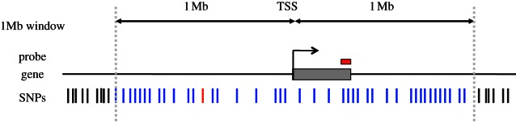

# EQTL

## Introduction

An eQTL or expression Quantitative Trait Loci analysis is a statistical analysis through which the association of genomic DNA sequence variants and gene expression levels can be explored. An eQTL is therefore considered a locus that explains a fraction of the gene expression variance found in a phenotype through direct association tests between genetic markers and gene expression levels (Nika & Dermitzakis, 2013).

In the picture below a typical eQTL analysis is represented. Different SNPs within a 1Mb window on a determined genomic location (represented as blue lines) are tested with the expression levels of a given gene in different samples (harbouring and not harbouring the SNPs).



In the diagram below we can see ploted the expression levels of the samples with the different SNPs and the frequency of appearance of these SNPs. Therefore, both polymorphisms (AG and AA alleles) will be associated with the underexpression of the gene studied compared to the reference allele (GG). Thereby, these SNPs could be considered as eQTLs.


The eQTLs can be considered as cis-eQTLs or trans-eQTLs depending on the physical distance from the gene they regulate. The cis-eQTLs are in the adjacent regions of the gene they regulate while trans-eQTLs can be located in a distant genomic region.  


## Exercise 1: eQTL linked with SNPs

To perform an expression quantitative trait loci (eQTL) study linked with SNPs we are going to need two datasets: one with the SNPs we are going to test and the other one with the normalised expression for each gene in each sample. We are going to try to associate SNPs with differential expression, and, to do so, a statistical analysis will be carried out. In this case, we will perform a linear regression. But there are other statistical tests that can be run to study associations, such as ANOVA or Wilcoxon rank-sum test.

### Preparing the data

All the materials necessary for this exercise are located in the eqtl directory. You will find there a table with all the SNPs present in the genomic interval 2420631:2920631 (Rv2159c-Rv2590) of M. tuberculosis, and another table with the normalised expression data of the corresponding genes located in that genomic region. We are going to use the same 6 samples previously used for the differential expression analysis in the transcriptomics session, plus 9 additional lineage 1 and lineage 4 samples we have added to the dataset in order to increase the power of the statistical analysis. In total we will be analysing 15 strains, 7 from lineage 1 and 8 from lineage 4.

We can take a look at the tables in the terminal. Just go to the directory and with the "less" command you can view the tables. From the home directory, type:

```
cd ~/data/eqtl
less snps_eqtl_table.txt
```

To exit the view of the tables just type "q".

!!! terminal "Terminal output"
    ```
    POS     REF     ALT     L1_1    L4_2    L1_3    L1_4    L4_5    L4_6    L1_7   gene
    2421619 C       A       0       0       1       0       0       0       0       Rv2159c
    2421816 A       G       1       0       1       1       0       0       1       Rv2160A
    2423386 C       T       0       0       0       0       0       0       0       Rv2162c
    2423785 C       T       1       0       1       1       0       0       1       Rv2162c
    2423819 C       G       0       0       0       0       0       0       0       Rv2162c
    2423822 A       G       0       0       0       0       0       0       0       Rv2162c
    2423993 G       C       0       0       0       0       0       0       0       Rv2162c
    2424008 G       T       0       1       0       0       0       1       0       Rv2162c
    2424864 A       G       1       0       1       1       0       0       1       -
    2424908 G       T       0       1       0       0       0       1       0       -
    2424925 A       G       1       1       1       1       1       1       1       -
    2425023 G       A       0       0       0       0       0       0       0       -
    2425097 A       C       1       0       1       1       0       0       1       Rv2163c
    2425471 T       C       1       0       1       1       0       0       1       Rv2163c
    2426385 C       G       0       0       0       0       0       0       0       Rv2163c
    ```

In the SNPs table, each row represents one SNP across all the samples (columns). The first column indicates the genomic position of the SNP. The second and third ones refer to the reference and alternative nucleotide. The last one indicates whether the SNP falls within a gene (i.e. Rv2159c) or an intergenic region (-). The number 1 in the sample columns represents the presence of the SNP and the number 0 the absence.

The expression table shows the normalised expression levels of each sample (columns) for each gene (rows).

```
less expression_eqtl_table.txt
```

!!! terminal "Terminal output"
    ```    
    gene    L1_1    L4_2    L1_3    L1_4    L4_5    L4_6    L1_7    L1_8    L4_9    L1_10
    Rv2158c 5.3592  6.5914  5.3647  5.0135  7.282   7.4848  3.6513  5.2832  7.4075  6.2946
    Rv2159c 0.9657  6.0428  0.0975  1.2378  7.2741  7.706   1.0288  3.2491  7.0289  1.6385
    Rv2160A -0.6193 5.8577  -0.8708 0.8018  6.5427  6.8666  0.2404  2.482   6.0652  -0.5727
    Rv2161c 2.683   9.4069  3.2019  3.0181  8.8226  9.4403  4.2647  4.9166  9.3021  2.7425
    Rv2162c 4.7906  9.045   5.1631  5.4924  8.4655  9.7019  5.1945  5.6268  9.089   5.1375
    Rv2163c 7.5358  7.5722  8.1996  7.4225  7.06    7.3848  8.5059  8.0789  7.5526  7.481
    Rv2164c 5.5294  5.6485  6.6888  5.4251  5.5513  5.748   5.9732  6.5069  5.8695  5.8241
    Rv2165c 7.3794  7.7184  8.3536  6.9752  6.9572  7.2733  8.1759  7.9825  7.9506  7.2009
    Rv2166c 8.452   8.18    9.0769  7.7743  7.3996  7.6419  9.3086  8.7389  7.7578  7.9759
    Rv2169c 6.7328  6.5983  7.1653  7.4208  7.6903  7.6155  5.6544  7.3472  7.1758  6.6482
    Rv2170  3.0691  2.558   3.4853  3.4285  3.9117  3.7295  2.2728  3.8404  3.7938  3.8026
    Rv2171  6.6739  5.8042  6.4029  5.9551  6.0585  6.0265  5.8921  6.1924  6.7047  6.7438
    ```

You should see similar tables to the ones showed above but with the 15 samples.

### Running a cis-eQTL analysis

We are going to run the analysis in R. So, after activating this practical's conda environment with conda activate eqtl, let's open R in the terminal, just typing:

```
R
```

And then we will load the packages we will need for the analysis. We will use a package called MatrixEQTL for the analysis and a package called ggplot2 for plotting some results.

```
library(MatrixEQTL)
library(ggplot2)
```

Firstly, we are going to set up the directories where we have the tables we are going to use. These are going to be the same we just saw above but formatted for using with the R package. The folder where you can find them is called "tables", which is in the eqtl directory. Now you should type:

```
base.dir = "~/data/eqtl/tables/"
snp_file_name = paste(base.dir, "snps_table.txt", sep="")
expression_file_name = paste(base.dir, "expression_table.txt", sep="")
output_file_name = "~/data/eqtl/results_eqtl.txt"
output_file_name.cis = "~/data/eqtl/results_eqtl_cis.txt"
```

Now we can load the tables for the analysis. We will use the following script:

```
expr = read.table(expression_file_name, sep="\t", header=T, row.names=1)
snp = read.table(snp_file_name, sep="\t", header=T, row.names=1)
```

And to see the first 6 rows of the tables we just need to type:

```
head(expr)
head(snp)
```

You should get something like this:

!!! terminal "Terminal output"
    ```
    > head(expr)
           L1_1   L4_2    L1_3   L1_4   L4_5   L4_6   L1_7   L1_8   L4_9
    Rv2158c  5.3592 6.5914  5.3647 5.0135 7.2820 7.4848 3.6513 5.2832 7.4075
    Rv2159c  0.9657 6.0428  0.0975 1.2378 7.2741 7.7060 1.0288 3.2491 7.0289
    Rv2160A -0.6193 5.8577 -0.8708 0.8018 6.5427 6.8666 0.2404 2.4820 6.0652
    Rv2161c  2.6830 9.4069  3.2019 3.0181 8.8226 9.4403 4.2647 4.9166 9.3021
    Rv2162c  4.7906 9.0450  5.1631 5.4924 8.4655 9.7019 5.1945 5.6268 9.0890
    Rv2163c  7.5358 7.5722  8.1996 7.4225 7.0600 7.3848 8.5059 8.0789 7.5526
            L1_10  L1_11  L4_12   L4_13  L4_14  L4_15
    Rv2158c  6.2946 5.7084 7.7072  8.4239 7.1863 7.7056
    Rv2159c  1.6385 1.3116 7.7639  8.8317 7.1415 7.7607
    Rv2160A -0.5727 0.2881 6.9682  7.5626 6.3030 6.8682
    Rv2161c  2.7425 3.0210 9.4097 10.1360 9.1882 9.5215
    Rv2162c  5.1375 4.8047 8.6629  9.3841 8.7615 9.4024
    Rv2163c  7.4810 7.7594 7.7636  7.6428 7.6123 8.1138
    ```

    ```
    > head(snp)
            L1_1 L4_2 L1_3 L1_4 L4_5 L4_6 L1_7 L1_8 L4_9 L1_10 L1_11 L4_12 L4_13
    2421619    0    0    1    0    0    0    0    0    0     1     0     0     0
    2421816    1    0    1    1    0    0    1    1    0     1     1     0     0
    2423386    0    0    0    0    0    0    0    0    0     0     1     0     0
    2423785    1    0    1    1    0    0    1    1    0     1     1     0     0
    2423819    0    0    0    0    0    0    0    0    0     0     0     0     0
    2423822    0    0    0    0    0    0    0    0    0     0     0     0     0
            L4_14 L4_15
    2421619     0     0
    2421816     0     0
    2423386     0     0
    2423785     0     0
    2423819     0     0
    2423822     0     0
    ```

We already have the tables ready so now we need to set up the parameters for the analysis.

We are going to run a cis-eQTL analysis, which means we are going to test those SNPs that are located within a distance up to 200 bp from the beginning and end of each gene.

The first step is to establish the threshold p-value. The program runs at the same time a trans and a cis eQTL analysis. As we are only interested now in a cis study, we will establish the threshold for the trans p-value in 0, and for the cis p-value in 1 (this means that the output file will contain all the associations up to a p-value of 1).

```
pvOutputThreshold_cis = 1
pvOutputThreshold_tra = 0
```

Now we are going to select the statistical model we want to use. In this case we will use linear regression:

```
useModel = modelLINEAR
```

The last thing is to load two more tables: one with the positions of the SNPs and other with the positions of the genes, which we will call snpspos and genepos. These two tables are in the directory 'tables', so to load them in our workspace we just need to type:

```
snpspos <- read.table(paste(base.dir, "snpspos.txt", sep=""), sep="\t", header=T)
genepos <- read.table(paste(base.dir, "genepos.txt", sep=""), sep="\t", header=T)
```

We can take a look at the tables typing:

```
head(snpspos)
head(genepos)
```

The last thing to do is to set up a few more parameters, we are not going to go into too much details for the purpose of this practical. Basically they prepare the matrix used for running the analysis and store our analysis and the results. To set this up, just copy the following script:

```
errorCovariance = numeric()
snp = SlicedData$new()
snp$fileDelimiter = "\t"
snp$fileOmitCharacters = "NA"
snp$fileSkipRows = 1
snp$fileSkipColumns = 1
snp$fileSliceSize = 2000
snp$LoadFile(snp_file_name)
gene = SlicedData$new()
gene$fileDelimiter = "\t"
gene$fileOmitCharacters = "NA"
gene$fileSkipRows = 1
gene$fileSkipColumns = 1
gene$fileSliceSize = 2000
gene$LoadFile(expression_file_name)
cvrt = SlicedData$new()
```

And finally, we will run the analysis:

```
me = Matrix_eQTL_main(
	snps = snp,
	gene = gene,
	cvrt = cvrt,
	output_file_name = output_file_name,
	pvOutputThreshold = pvOutputThreshold_tra,
	useModel = useModel,
	errorCovariance = errorCovariance,
	verbose = TRUE,
	output_file_name.cis = output_file_name.cis,
	pvOutputThreshold.cis = 1,
	snpspos = snpspos,
	genepos = genepos,
	cisDist = 200,
	pvalue.hist = TRUE,
	min.pv.by.genesnp = FALSE,
	noFDRsaveMemory = FALSE)
```

!!! terminal "Terminal output"
    ```
    Matching data files and location files
    439of444 genes matched
    847of847 SNPs matched

    Task finished in 0.00199999999949796 seconds
    Reordering genes

    Task finished in 0.231999999999971 seconds
    Processing covariates
    Task finished in 0 seconds
    Processing gene expression data (imputation, residualization)
    Task finished in 0.00100000000020373 seconds
    Creating output file(s)
    Task finished in 0.00399999999990541 seconds
    Performing eQTL analysis
    100.00% done, 1,055 cis-eQTLs
    Task finished in 0.0150000000003274 seconds
    ```

Now let's take a look at the results table. To do it, type the following:

```
res <- me$cis$eqtls
head(res)
```

Here we have the table with the 6 top associations found by the analysis just carried out.

!!! terminal "Terminal output"
    ```
         snps    gene statistic       pvalue          FDR      beta
    1 2423785 Rv2162c -20.05509 3.668713e-11 1.935246e-08 -3.891237
    2 2424864 Rv2162c -20.05509 3.668713e-11 1.935246e-08 -3.891237
    3 2421816 Rv2160A -13.98178 3.275455e-09 1.151868e-06 -6.379346
    4 2421816 Rv2159c -13.41609 5.424159e-09 1.430622e-06 -6.082414
    5 2450045 Rv2188c -10.62618 8.853633e-08 1.556764e-05 -3.081468
    6 2451081 Rv2188c -10.62618 8.853633e-08 1.556764e-05 -3.081468
    ```

!!! question
    Which is the gene differentially expressed with the highest statistical association? Which is the p-value? And the corresponding adjusted p-value (or FDR)?

!!! question
    With how many SNPs is it associated the variable expression of Rv2162c?

To summarise, we ran a statistical analysis in order to see whether the SNPs present in our samples are associated with differential gene expression. We therefore got a table where we can see the SNP (its position, in snps column) associated with the differential expression of the gene (gene column). A high p-value association is established when a determined SNP is present in all the samples that have a determined gene under- or over-expressed.

However, not all the associations found will be real. cis-eQTLs are more likely to be located within the promoter region of a gene, which is the upstream region where the transcription starts. For instance, a SNP in this promoter region might change the recognition patterns for transcriptional regulators and therefore alter gene expression.

### Further exploring the results

We will now check one of the resulting genes in the analysis to corroborate if it is a real eQTL association. We are going to take the first gene, Rv2162c. This gene has been associated with 2 SNPs. Let's take a look at the 2 SNPs. To do it, we will load again the SNPs table and look at the rows corresponding to those 2 SNPs:

```
snps_table <- read.table("~/data/eqtl/snps_eqtl_table.txt", sep="\t", header=T)
snps_table[snps_table$POS==2423785 | snps_table$POS==2424864,]
```

!!! termainl "Terminal output"
    ```
          POS REF ALT L1_1 L4_2 L1_3 L1_4 L4_5 L4_6 L1_7 L1_8 L4_9 L1_10 L1_11
    4 2423785   C   T    1    0    1    1    0    0    1    1    0     1     1
    9 2424864   A   G    1    0    1    1    0    0    1    1    0     1     1
    L4_12 L4_13 L4_14 L4_15    gene
    4     0     0     0     0 Rv2162c
    9     0     0     0     0       -
    ```

!!! question 
    
    Which samples carry the SNPs?

    Are all of them from the same lineage? Which one?

    Are these SNPs located within the coding region or intergenic regions?

We can see that all the lineage 1 samples harbour the two SNPs. One of them is located in an intergenic region, whilst the other is within the coding region of Rv2162c. As we mentioned before, it is more likely that a SNP present in an upstream or promoter region will affect transcription.

If we go to the website https://mycobrowser.epfl.ch we will find a genomic database for different species of Mycobacterium. We are going to look for our gene of interest: write Rv2162c in the top right white box and select search.

[](../img/eqtl_4.png)

[](../img/eqtl_5.png)

[](../img/eqtl_6.png)

!!! question
    
    Is the gene located in the forward or the reverse strand?

    Which is the functional category it belongs to?

We can see the Rv2162c gene (or PE_PGRS38) represented in purple in the Mycobrowser.

!!! question
    Is the SNP (A2424864G) in the downstream or upstream region?

The SNP (A2424864G) is located in the promoter region of the Rv2162c, therefore it is a good candiate for being an eQTL. As the association showed a high p-value, we can expect that in all the samples carrying the SNP (in this case the lineage 1 samples) the Rv2162c gene would be under- or over-expressed. Looking at the expression table we could see this difference in expression, but a more visual way to do it is through a boxplot.

To plot it we need to load a table with the expression of the Rv2162c:

```
rv2162 <- read.table("~/data/eqtl/rv2162c.txt", sep="\t", header=T)
rv2162
```

!!! terminal "Terminal output"
    ```
            expg    gene lineage
    L1_1  4.7906 Rv2162c       1
    L4_2  9.0450 Rv2162c       4
    L1_3  5.1631 Rv2162c       1
    L1_4  5.4924 Rv2162c       1
    L4_5  8.4655 Rv2162c       4
    L4_6  9.7019 Rv2162c       4
    L1_7  5.1945 Rv2162c       1
    L1_8  5.6268 Rv2162c       1
    L4_9  9.0890 Rv2162c       4
    L1_10 5.1375 Rv2162c       1
    L1_11 4.8047 Rv2162c       1
    L4_12 8.6629 Rv2162c       4
    L4_13 9.3841 Rv2162c       4
    L4_14 8.7615 Rv2162c       4
    L4_15 9.4024 Rv2162c       4
    ```

And now let's do the plot copying the following script:

```
rv2162$lineage <- as.factor(rv2162$lineage)
bp <- ggplot(rv2162, aes(x=gene, y=expg, fill=lineage)) +
geom_boxplot() + geom_point(position=position_jitterdodge())
show(bp)
```

You should get a boxplot like this, where the y axis represents the normalised expression data and the two boxplots are representing the lineage 1 and lineage 4 samples respectively:

[](../img/eqtl_7.png)

!!! question
    
    Is Rv2162c differentially expressed between lineage 1 and 4 according to the boxplot?

    In which lineage is it less expressed?

    Can you think about any possible explanation for the underexpression in the lineage 1 samples carrying the SNP?

## Further exploration

### trans-eQTL analysis

We have carried out a cis-eQTL analysis, which means that we have only looked at those SNPs close to the genes differentially expressed. However, as we mentioned before, there are also trans-eQTLs. These trans-eQTLs would be, for instance, SNPs located in transcriptional regulators that might alter their function. Hence, transcription of those genes regulated by the altered transcriptional factors could be affected.

### eQTL linked with methylation

Methylation is also a mechanism of gene expression control (Casadesus & Low., 2006) and therefore another approach we can take with eQTL analysis is to associate methylation with gene expression. Given the position of the motifs and methylated bases we could treat them as if they were SNPs and perform the same analysis.

### References

Nica AC and Dermitzakis ET. (2013). Expression quantitative trait loci: present and future. Philos Trans R Soc Lond B BIol Sci 368(1620):20120362. doi: 10.1098/rstb.2012.0362

Casadesus J and Low D. (2006). Epigenetic gene regulation in the bacterial world. Micobiol Mol Biol Rev 70:830-56.
