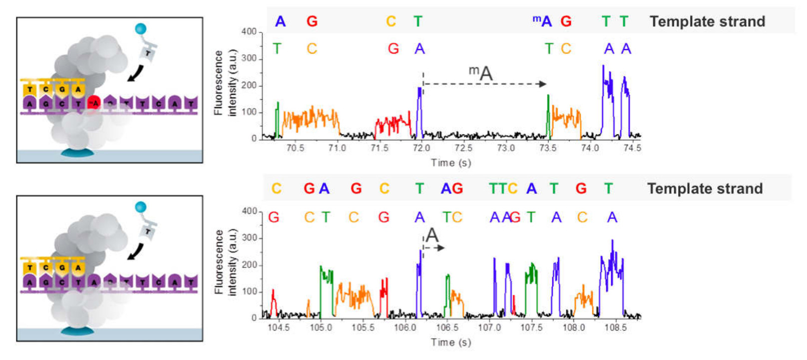
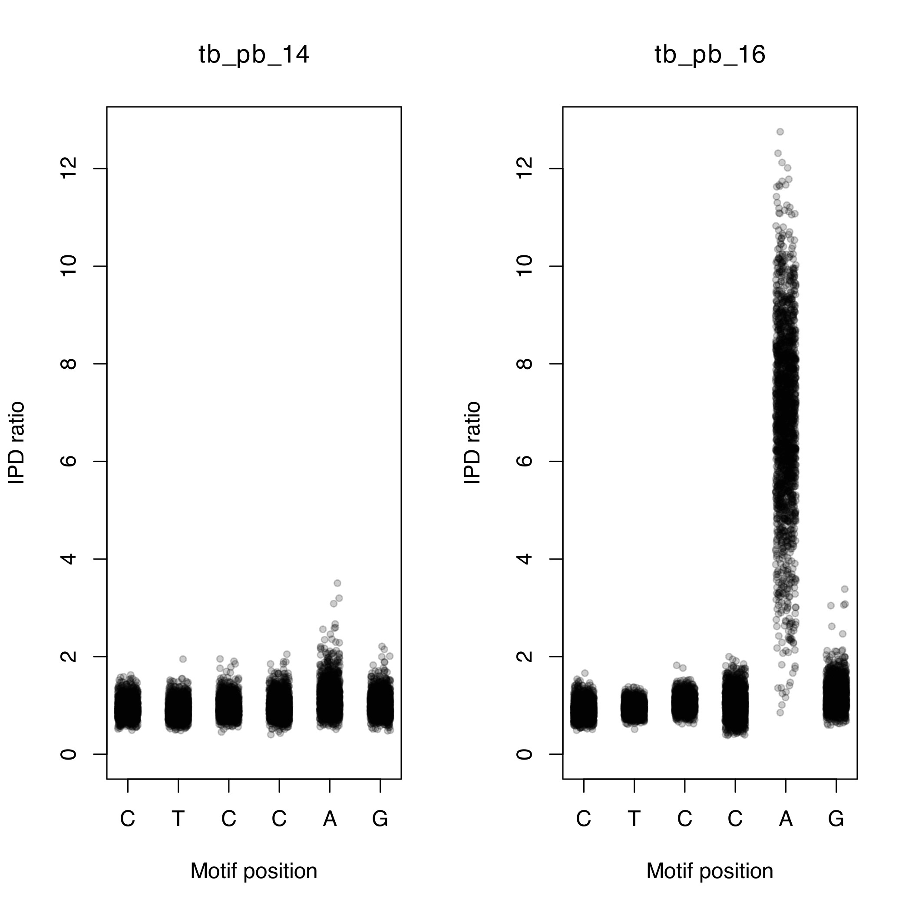

# Methylation

## Objectives

By the end of this practical you should: 

* Understand the file formats used to represent methylation data from PacBio technology
* Know how to merge and perform quality control
* Visualise methylation data
* Analyse multi sample BCF files

## Introduction

Over the last few practicals we have dealt with Illlumina and MinION data. Now we are going to have a look at another platform called **Pacific Biosciences Single Molecule Real Time Sequencing** (PacBio SMRT sequencing). This is another third-generation platform which produces long reads, similar to Oxford Nanopore. Like other long-read platforms the error rate is much higher than short-read platforms such as Illumina. As a consequence, the methods required to analyse the data also differ. 

PacBio technology has many applications, but is particularly useful for: 

* Genome assembly
* Analysing methylation

## Genome assembly

In the previous practical we looked at using Illumina data to assemble the genome of several M. tuberculosis isolates. Although this helped with reconstructing some of the regions for which mapping doesn't work, it is not perfect. Genome reconstructions are often broken up into many contigs using short read data and are subject to errors in highly repetitive regions. Ultimately, the completeness of the assembly is limited by the length of the read. If the read is shorter than the length of the repeat there is no way of resolving how many copies of the repeat are present. This is where the read length of PacBio comes in handy. 

PacBio produces read lengths averaging 15Kb, with some reads greater than 100Kb in size. For most microbial genomes the read lengths will be much larger than any repeat sequence and therefore this often results in assemblies producing a complete chromosome in one contig. 

With complete genome assemblies, it is possible to identify:

* SNPs
* Small indels
* Large structural variants
* Novel insertions

## Methylation

Methylation refers to the mechanism by which methyl groups (CH3) are added to DNA. This is often referred to as epigenetic modification. Methylation of DNA is facilitated by DNA methyltransferases (MTase), which mostly are part of restriction-modification systems. Restriction enzymes cut unmethylated DNA at a specific motifs (recognition sites), while the paired methyltransferase methylates the same motif. Traditionally, DNA methylation in bacteria has been seen as a primitive immune mechanism to fight against invading phages. When a bacterium is invaded by foreign DNA, its restriction enzyme will cut it if the recognition site is present on the DNA, thus neutralising the threat. There is one problem however. The restriction enzyme is not specific to foreign DNA and will also cut its own genome. The solution comes from the MTase. The MTase will methylate the same motif on the bacterium's genome, preventing the restriction enzyme from cutting. 

Although this is an important function of methylation, it is also thought to modulate the binding of other DNA-binding proteins and play a role in gene expression which is important in the interaction of a pathogen with its environment. 

PacBio technology works by recording light signals emitted as a DNA polymerase incorporates fluorescently labelled nucleotides while replicating input DNA. The data from the PacBio platform is stored in a h5 format. This contains information on the base calls and the time it takes to incorporate each base (inter pulse duration). The polymerase takes longer to incorporate nucleotides on methylated input DNA than non-methylated. By comparing the time spent between each incorporation event and comparing it to an in-silico control it is possible to calculate the inter pulse duration ratio (IPD ratio). This makes it possible to detect DNA modification to a single base precision. 

After the location of all methylation sites have been found, the context of these sites are analysed to look for enrichment of particular sequence motifs. If a particular motif is found more than expected by chance, then it is likely a recognition site for an MTase. 



## Exercise 1: Analysing motif summary reports

Activate the conda environment, navigate to the methylation practical directory, and take a look at the contents: 

```
conda activate methylation
cd ~/data/methylation
ls
```

There are several files present. We will first take a look at the files ending with **.motif_summary.csv**. We can open these files using excel or a similar program. Linux has an open source package that is quite similar to Excel called **gnumeric**. Let's use it to view the contents of **tb_pb_1.motif_summary.csv**. 

```
gnumeric tb_pb_1.motif_summary.csv
```

You should now see a spreadsheet containing a number of different columns: 


* **motifString**: Detected motif sequence for this site such as “GATC”.
* **centerPos**: Position in motif of modification (0-based).
* **modificationType**: Modification type – a generic tag "modified_base" is used for unidentified bases. For identified bases, m6A, m4C, and m5C are used.
* **fraction**: The percent of time this motif is detected as modified in the genome. (Fraction of instances of this motif with modification QV or identification QV above the QV threshold.)
* **nDetected**: Number of instances of this motif that are detected as modified. (Number of instances of this motif with modification QV or identification QV above threshold.)
* **nGenome**: Number of occurrences of this motif in the reference sequence genome.
* **groupTag**: A name identifying the complete double-strand recognition motif. For paired motifs this is “/”, for example “GAGA/TCTC”. For palindromic or unpaired motifs this is the same as motifString.
* **partnerMotifString**: motifString of paired motif (motif with reverse-complementary motifString).
* **meanScore**: Mean Modification QV of instances of this motif that are detected as modified.
* **meanIpdRatio**: Mean IPD ratio of instances of this motif that are detected as modified.
* **meanCoverage**: Mean coverage of instances of this motif that are detected as modified.
* **objectiveScore**: Score of this motif in the motif finder algorithm. The algorithm considers higher objective scores to be more confidently identified motifs in the genome based on several factors.

We can see that three unique motifs have been detected (CACGCAG, CTGGAG and CTCCAG). If you look at the second and third motifs you may have noticed that the '**groupTag**' is the same. These sequences are actually palindromic sequences, i.e. the reverse complement of 'CTGGAG' is 'CTCCAG' and vice versa. At these motifs, methylation occurs on both strands of DNA on the same motifs at the A nucleotide. The 'CACGCAG' motif, on the other hand, is only methylated at one position. 

!!! question
    Take a look at the fraction column. Is the motif always methylated?
    Is there any relationship between the size of the motif and the number of times it was detected? Why do you think this is? 

Using the same method as described above, open up '**tb_pb_3.motif_summary.csv**'. Can you see any new motifs? This isolate has many more motifs that have been reported. You may notice that some motifs use symbols other than the standard nucleotides. The motifs are represented using the IUPAC standard nomenclature for representing nucleotides. For example, in the 'GATNNNNRTAC' motif the **N** represents any nucleotide and the R represents either an A or a G. This means that the MTase which methylates this motif will ignore the 4th-7th positions. 

!!! question
    === "Question 1"
        An MTase recognises the motif 'GATNNNNRTAC'. Which of these sequences will it methylate?
        
        A: CATGTCAATAC
        
        B: GATGTCAATAC
        
        C: GATGTCACTAC
    === "Answer 1"
        B: GATGTCAATAC

There are several motifs with very low '**fraction**'. If an MTase is active it would be expected to methylate most of the sites in the genome. Motifs with low fraction can potentially represent a false motif. As in variant detection, with these noisy datasets false motifs can be introduced. 

!!! question
    Take a look at the '**meanScore**' column. Are they all similar values? Do you see any relationship between '**fraction**' and '**meanScore**'? 

We can use the '**meanScore**' column to filter out false motifs. Take a look at a few more **.motif_summary.csv** files and see if you can find any overlaps between the motifs found. 

We can visualise the methylation by plotting the IPD ratio against the motif position. To do this we must: 

1. Find the locations of the motif in the genome
2. Extract the IPD ratio for each motif base in the genome
3. Plot the IPD ratio against the position in the motif

The modifications and motifs pipeline also provides a CSV file containing all the positions in the genome as rows and several columns of information for each position (including the IPD ratio). Take a look at an example: 

```
zcat tb_pb_14.ipd.csv | head
```

This is a very large file, so we can't open it with `gnumeric`. The first few lines should look like the example below. 

!!! terminal "Terminal output"
    ```
    refName,tpl,strand,base,score,tMean,tErr,modelPrediction,ipdRatio,coverage,frac,fracLow,fracUp
    "WBB445_ARS7496|quiver",1,0,T,2,0.644,0.189,0.696,0.926,7,,,
    "WBB445_ARS7496|quiver",1,1,A,0,0.576,0.204,0.882,0.653,8,,,
    "WBB445_ARS7496|quiver",2,0,T,6,0.766,0.264,0.597,1.283,8,,,
    "WBB445_ARS7496|quiver",2,1,A,5,0.927,0.237,0.804,1.153,8,,,
    "WBB445_ARS7496|quiver",3,0,G,7,1.231,0.589,0.689,1.788,9,,,
    "WBB445_ARS7496|quiver",3,1,C,1,0.425,0.169,0.554,0.768,8,,,
    "WBB445_ARS7496|quiver",4,0,A,1,0.919,0.260,1.275,0.720,9,,,
    "WBB445_ARS7496|quiver",4,1,T,1,0.428,0.192,0.696,0.615,9,,,
    "WBB445_ARS7496|quiver",5,0,C,6,0.936,0.277,0.722,1.296,9,,,
    ```

We will use the `analyse_motif_ipd.py` script to extract the IPD ratios from this file. We need to provide 1) the ipd.csv file, 2) the motif you would like to analyse and 3) the genome assembly for the sample (to find the motif locations). Let's analyse the 'CTCCAG' motif for tb_pb_14 and tb_pb_16: 

```
python analyse_motif_ipd.py tb_pb_14.ipd.csv.gz CTCCAG tb_pb_14.assembly.fa
python analyse_motif_ipd.py tb_pb_16.ipd.csv.gz CTCCAG tb_pb_16.assembly.fa 
```

!!! question
    The script will output the number of times the motif was found in the genome. Why do you think there are differences? 

Now we can visualise this with the `plot_ipd.R` script. We need to provide 1) the sample names, 2) the motif we are analysing and 3) the output file. The output will be in PDF format. 

```
Rscript plot_ipd.R tb_pb_14,tb_pb_16 CTCCAG CTCCAG.pdf
```

Using the file browser, locate the PDF file ~/data/methylation/. Double click on the CTCCAG.pdf file and it should open in a PDF viewer program. You should be able to see a figure similar to the one below. 



You should be able to see that tb_pb_16 has elevated IPD ratios (indicating methylation) on the 5th position of the motif while tb_pb_14 does not. Check to see if this is concordant with the motif_summary CSV files for these samples. 

We will now create the same plot for the 'GTAYNNNNATC' motif for samples tb_pb_1 and tb_pb_4. 

```
python analyse_motif_ipd.py tb_pb_2.ipd.csv.gz GTAYNNNNATC tb_pb_2.assembly.fa
python analyse_motif_ipd.py tb_pb_16.ipd.csv.gz GTAYNNNNATC tb_pb_16.assembly.fa
Rscript plot_ipd.R tb_pb_16,tb_pb_2 GTAYNNNNATC GTAYNNNNATC.pdf
```

!!! question 
    === "Question 2"
        Which sample has evidence for methylation at the 'GATNNNNRTAC' motif.
    === "Answer 2"
        Sample tb_pb_16. There are elevated IPD ratios on the third position (A).

**Finally try to follow to same commands to visualise the methylation at 'CACGCAG' for samples tb_pb_16 and tb_pb_2.**

Let's try and combine all the individual datasets into a merged dataset. We have created a script to take the CSV files and create a matrix where the rows represent samples, the columns represent motifs and the cells represents the fraction that the motif is methylated in a particular sample. It takes an input file with the names of all the CSV files which we must first create. 

To do this we can run the following command: 

```
ls *.motif_summary.csv > files.txt
```

Take a look at the file you just created by running `head files.txt`.

It should look something like this: 

!!! terminal "Terminal output"
    ```
    tb_pb_1.motif_summary.csv
    tb_pb_10.motif_summary.csv
    tb_pb_11.motif_summary.csv
    tb_pb_12.motif_summary.csv
    tb_pb_13.motif_summary.csv
    tb_pb_14.motif_summary.csv
    tb_pb_15.motif_summary.csv
    tb_pb_16.motif_summary.csv
    tb_pb_17.motif_summary.csv
    tb_pb_2.motif_summary.csv
    ```

We can now pass this file to the `combine_motifs.py` script: 

```
python combine_motifs.py files.txt unfiltered_motifs.csv
```

Take a look at the '**unfiltered_motifs.csv**' file using **gnumeric**. There are many motifs which are present in only one sample. These likely represent noise in the data and should be filtered out. Rerun the command with a quality filter: 

```
python combine_motifs.py files.txt filtered_motifs.csv --min_qual 60
```

We have specified the minimum QV of the motif to be 60. Take a look at the filtered_motifs.csv file using gnumeric and look at the difference. You should now have 5 motifs. This will serve as our final high-quality list of motifs.

It is evident that some samples have methylation on certain motifs while others do not. We will now try to understand if there is a particular pattern to the methylation seen in the data. The methylation pattern can either be random or specific to a certain strain. To do this we will reconstruct the phylogeny and overlay the methylation information.

Using the same raw data and the SMRT portal analysis suite we have generated whole genome assemblies for the samples. These were then aligned to the reference and variants were called. The variants from all the samples were merged to a single FASTA formatted file. We can use this file to create the phylogenetic tree. Try to remember the command to create the tree and run it in the terminal using 'pacbio.fasta' as the input fasta and 'pacbio.ML' as the output name. If you need the solution click on the button below. 

!!! question
    === "Task 1"
        Create a phylogenetic free using the pacbio.fasta file as input.
    === "Solution 1"
        ```
        iqtree -m GTR+G -s pacbio.fasta -bb 1000
        ```

Open up the tree by launching `figtree`. Open the tree by clicking on **Open...** and selecting the 'RAxML_bestTree.pacbio.ML' tree. Midpoint root the tree by selecting **Midpoint Root** from the **Tree** menu. Finally, we will load annotations allowing figtree to display which samples do or don't have methylation. Select **Import annotations...** from the **File** menu and select the '**filtered_motifs.tsv**' file. This file was created during the merging step and is simply a tab-separated file with the rows being samples and the columns being motifs. The values in the file are either **0** (representing absence of methylation) or **1** (representing presence of methylation). 

Once the file has been loaded, we can colour the tips by selecting a motif sequence from the 'Colour by' dropdown on the 'Tip labels' panel (shown below). Samples for which methylation is absent will be coloured red. 

[](../img/methylation_3.jpg)

!!! question
    Look at the different methylation patterns by colouring the tips. Is it random? 

## Methylation and mutations

Methylation in the five motifs has been linked to the following genes: 

| Motif | Genes |
|-------|-------|
| CTCCAG/CTGGAG | mamA |
| GTAYNNNNATC/GATNNNNRTAC | hdsS.1, hsdM and hsdS |
| CACGCAG | mamB |

Loss of function mutations in MTases can lead to the absence of methylation. We are going to take a look at the CTCCAG/CTGGAG motif which is methylated by the mamA MTase. This protein is encoded by the Rv3263 gene. The methylation pattern it shown on the tree below: 

[](../img/methylation_4.jpg)

The 'filtered_motifs.csv' file and the phylogenetic tree indicates that three of the samples have no methylation on the motif (tb_pb_10, tb_pb_11 and tb_pb_14). There are a few scenarios which may be possible: 

1. The isolates all have the same variant which has evolved convergently (where the same mutation has appeared multiple times independently on the tree).
2. The isolates all have different mutations
3. Some isolates share a common mutation

The variants found by aligning the whole genome assemblies to the reference are stored in the multi-sample VCF file 'pacbio.vcf.gz'. We will use bcftools to process this file and extract the relevant information we need . 

### 1. Extracting sample-specific mutations

The first thing we need to do is extract variants which are only present in the three samples. We can do this using the bcftools view command. First let find out how many variants are present in the VCF file: 

```
bcftools view pacbio.vcf.gz -H | wc -l
```

The command can be broken down into several parts: 


* `bcftools view pacbio.vcf.gz`: allows to view contents of the VCF file
* `-H`: This flag prevents header lines present in the file to be output
* `|`: The pipe passes the output from whatever command was written before it and passes it to the next.
* `wc -l`: This command counts the number of lines which are passed to it

After running the command we should see an output of 9229, i.e. 9229 variants are present across all samples. We will now add two more parameters to the command. We select only variants present in a select number of samples using the -s flag. We can also restrict our analysis to variants which are present exclusively in our samples using the -x flag. The command will be the following: 

```
bcftools view pacbio.vcf.gz -H  -s tb_pb_10,tb_pb_14,tb_pb_11 -x | wc -l
```

The command will now count 780 variants. 

### 2. Annotating the variants

In order to narrow down the number of variants we need to narrow down out search to only variants in the Rv3263 gene. The VCF file currently only contains information on the position of the variants on the chromosome but no information about genes. We can use `snpEff` to perform the annotation: 

```
bcftools view pacbio.vcf.gz -s tb_pb_10,tb_pb_14,tb_pb_11 -x | snpEff ann Mycobacterium_tuberculosis_h37rv  -no-upstream -no-downstream | grep Rv3263
```

We have dropped the -H as we are no longer counting lines and the header is needed by the next command. The following new parts have been added:

* `snpEff ann`: This snpEff function annotates a VCF file
* `Mycobacterium_tuberculosis_h37rv`: Provides the database with annotations. There are many different databases available for different organisms. The full list can be seen by running `snpEff databases`
* `-no-upstream -no-downstream`: This flag prevents the annotation of variants which are upstream or downstream of a gene
* `grep Rv3263`: Looks for lines containing 'Rv3263' and prints them

We can see this command prints out a number of lines. The last two lines represent two variants in VCF format:

!!! terminal "Terminal output"
    ```
    Chromosome      3643985 .       A       C       225.0   PASS    VDB=0.702241;SGB=-0.693147;MQSB=0.911099;MQ0F=0;MQ=57;DP=308;DP4=0,0,150,158;MinDP=28;AN=6;AC=4;ANN=C|missense_variant|MODERATE|Rv3263|Rv3263|transcript|CCP46082|protein_coding|1/1|c.809A>C|p.Glu270Ala|809/1662|809/1662|270/553||      GT:DP:PL:AD     1/1:144:255,255,0:0,144    1/1:164:255,255,0:0,164 0/0:117:.:.
    Chromosome      3644554 .       G       A       225.0   PASS    VDB=0.847222;SGB=-0.693147;MQSB=0.91807;MQ0F=0;MQ=57;DP=145;DP4=0,0,75,70;MinDP=14;AN=6;AC=2;ANN=A|missense_variant|MODERATE|Rv3263|Rv3263|transcript|CCP46082|protein_coding|1/1|c.1378G>A|p.Ala460Thr|1378/1662|1378/1662|460/553||      GT:DP:PL:AD     0/0:14:.:.0/0:121:.:.      1/1:145:255,255,0:0,145
    ```

### 3. Customising output format

This format can be a little difficult to understand so the last part we will add to this command will translate this to a more readable format:

```
bcftools view pacbio.vcf.gz -s tb_pb_10,tb_pb_14,tb_pb_11 -x | snpEff ann Mycobacterium_tuberculosis_h37rv  -no-upstream -no-downstream | bcftools query -f '[%POS\t%SAMPLE\t%ANN\n]' | grep Rv3263
```

We have moved the grep command to the end and added in the following parameters:

* `bcftools query`: This command allows conversion of VCF into custom formats
* `-f '[%POS\t%SAMPLE\t%ANN\n]'`: This specifies the format we want (Position, Sample name and annotations)

!!! terminal "Terminal output"
    ```
    3643985 tb_pb_10        1/1     C|missense_variant|MODERATE|Rv3263|Rv3263|transcript|CCP46082|protein_coding|1/1|c.809A>C|p.Glu270Ala|809/1662|809/1662|270/553||
    3643985 tb_pb_14        1/1     C|missense_variant|MODERATE|Rv3263|Rv3263|transcript|CCP46082|protein_coding|1/1|c.809A>C|p.Glu270Ala|809/1662|809/1662|270/553||
    3643985 tb_pb_11        0/0     C|missense_variant|MODERATE|Rv3263|Rv3263|transcript|CCP46082|protein_coding|1/1|c.809A>C|p.Glu270Ala|809/1662|809/1662|270/553||
    3644554 tb_pb_10        0/0     A|missense_variant|MODERATE|Rv3263|Rv3263|transcript|CCP46082|protein_coding|1/1|c.1378G>A|p.Ala460Thr|1378/1662|1378/1662|460/553||
    3644554 tb_pb_14        0/0     A|missense_variant|MODERATE|Rv3263|Rv3263|transcript|CCP46082|protein_coding|1/1|c.1378G>A|p.Ala460Thr|1378/1662|1378/1662|460/553||
    3644554 tb_pb_11        1/1     A|missense_variant|MODERATE|Rv3263|Rv3263|transcript|CCP46082|protein_coding|1/1|c.1378G>A|p.Ala460Thr|1378/1662|1378/1662|460/553||

    ```

!!! tip "Tip"
    The 3rd column is the genotype of the sample. Each sample will have a genotype entry for each variant. A value of 0/0 means  reference, and 1/1 means alternate. We can select only samples with an alternate genotype by using the command. Try adding `| awk '$3=="1/1"'` to the end of the command.


From the output (above) we can see that tb_pb_10 and tb_pb_14 both have the same mutation (270E>270A) while tb_pb_11 has a different mutation (460A>460T). These mutations are good candidates to take towards functional studies to validate the loss of function effect on the MTase.

You should now know how to analyse and interpret data from the PacBio platform and take it all the way to discovering interesting mutations using BCFtools. This is the end of the practical, but if you want more practice you can try find candidate mutations for the other motifs. Good luck! 