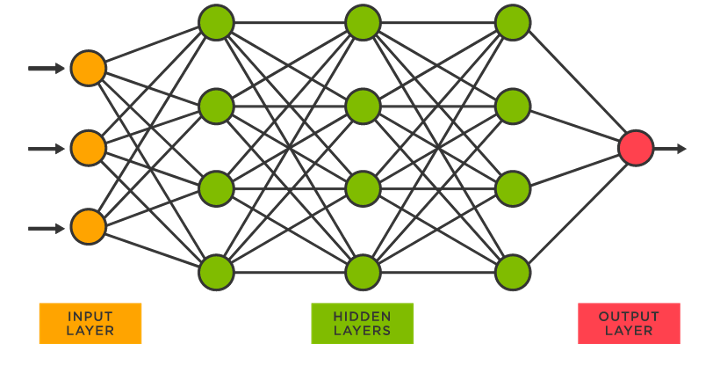
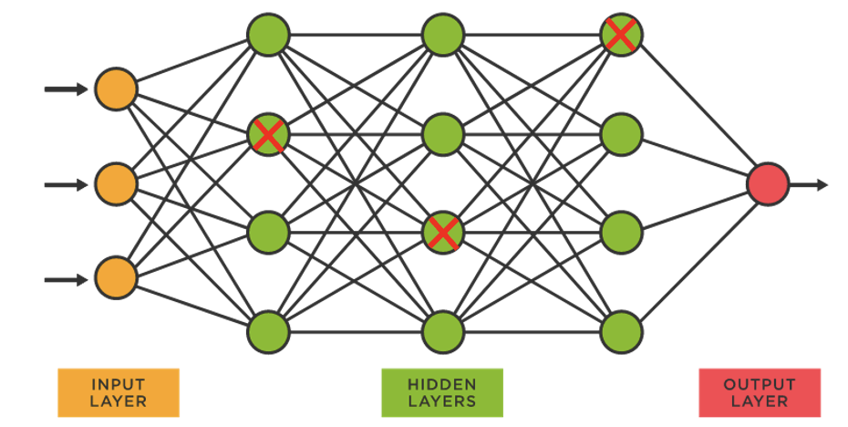
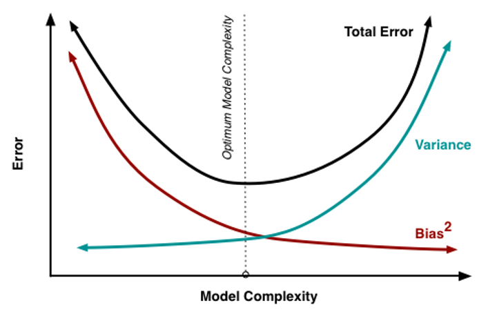
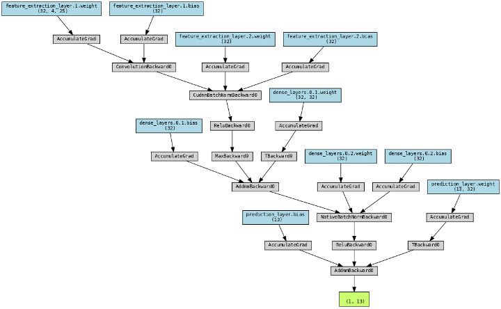

# Deep learning (Neural Network)

Next-generation sequencing data is being produced at an ever-increasing rate. The raw data is not meaningful by itself and needs to be processed using various bioinformatic software. This practical will focus on genomic resequencing data where the raw data is aligned to a reference genome.

## Introduction
Deep learning neural networks have revolutionized the field of predictive modelling, especially in bioinformatics and genomics. By utilizing multiple layers of artificial neurons to extract and process data, deep learning networks have shown impressive performance in tasks such as image classification, natural language processing, and speech recognition. The same principles can be applied to infectious disease genomic DNA data for drug resistance prediction. By leveraging the inherent complexity and high-dimensional nature of genomic data, deep learning networks can learn to identify subtle patterns and relationships that may be missed by traditional statistical methods. Additionally, deep learning networks can be optimized to handle missing data, noisy data, and varying data types, which are common challenges in genomic data analysis.



!!! Knowledge
    A neural network is a type of machine learning model that consists of layers of interconnected nodes, also known as neurons. Each neuron takes in input values, multiplies them by weights, and applies an activation function to produce an output. The output from one layer becomes the input to the next layer until the final layer produces the model's prediction. During training, the model adjusts the weights to minimize the difference between its prediction and the actual output. This process is repeated multiple times until the model's predictions become accurate enough for the desired task.


To predict drug resistance from infectious disease genomic DNA data, deep learning networks are trained on large and diverse datasets containing information on various aspects of the DNA, such as nucleotide sequences, structural variants, and gene expression levels. By analyzing these features, deep learning networks can learn to predict drug resistance with high accuracy, potentially leading to the development of more effective drugs and treatment strategies. The process of training these networks involves splitting the data into training, validation, and testing sets, and optimizing the network architecture and parameters to minimize the prediction error.

In summary, deep learning neural networks offer a promising approach for predicting drug resistance from infectious disease genomic DNA data. By leveraging the complex and high-dimensional nature of genomic data, these networks can identify subtle patterns and relationships that are difficult to detect using traditional statistical methods. With the growing threat of drug-resistant infectious diseases.


In this practical, we will focus on training a deep learning model to predict the resistance for isoniazid.


!!! Important
    Before doing anything, we need to first activate the conda environment for this practical by typing the following: `conda activate ml`. This environment contains most of the software we need for this practical. This command needs to be run each time we open up a new terminal or switch from a different environment. You can list all installed environments with `cond env list`.


## Exercise 1: Running the neural network for predicting Isoniazid resistance 

Here we train a model using <i>katG</i> sequence data from <i>M. tuberculosis</i> genome. katG is a gene on which SNPs resposible isoniazid resistance are commonly found.


In the terminal navigate to the `ml_workshop/inh_model` directory, by typing:

```
cd ~/data/ml_workshop/inh_model
```

Now type the commands below to train the model with default parameters.

```
python inh_model.py -lr 0.001 -dr 0.2
```

!!! Important
    It is important to specify </strong> python </strong> before the script to complie (run the script) using python.

Two graphs are produced in the same folder:

```
INH-model_LR:0.001-DR:0.2-ACC.png
INH-model_LR:0.001-DR:0.2-LOSS.png
```

!!! Information
    The script is adapted for CPU running (estimated running time of 2.5 minutes). Hence compromises in model accuracy is taken. 

    Waiting for model to run/train and dealing with these fragmented times is also essential in our lives here are some ground rules:

    - If a model takes < 5 minutes to train, I like to check Instagram to give my brain a break.
    
    - If a model takes 5–30 min to train, I’ll usually spend time reading or writing documentation. Sometimes debugging too.
    
    - Upwards of that, and I’ll continue my day as usual and work on another project in the meanwhile.
    
    In this case you perhaps read on as well. There are some interesting info near at the end.

When the run finishes, you can open the current folder using command ```open . ``` in terminal.
Double click on the picture files to view them. 

***Or*** use ```xdg-open <file name>``` in the terminal

### ACC-accuracy
Accuracy is a common performance metric used in deep learning to **evaluate the effectiveness of a model** at predicting the correct output. It measures the proportion of correct predictions made by the model out of the total number of predictions. 

!!! Intuition
    Imagine you are playing a game of darts and aiming for a bullseye. Your accuracy is determined by the number of times you hit the bullseye compared to the total number of attempts. 

Similarly, in deep learning, accuracy measures **how often the model's predictions match the true labels** for a given set of inputs. 

For example, if a model predicts that an image contains a cat and the true label is also cat, then that prediction is counted as correct. 

**The higher the accuracy, the better the model** is at making correct predictions. However, accuracy can be influenced by factors such as class imbalance (***data problems***) or various different types of errors the model makes (***model problems***). Therefore, it is important to consider other performance metrics in addition to accuracy when evaluating the performance of a deep learning model.

### LOSS-loss
In deep learning, the goal of the model is to accurately predict the outcome of a given task, such as image recognition or natural language processing and also in this case sequence processing. 

**Loss** is a term used to quantify the difference between the predicted output and the actual output. 

!!! Intuition
    Think of it like a student taking a test - the score they receive is a measure of how well they performed relative to the expected outcome. 

Similarly, the loss function in deep learning measures how well the model is performing by comparing its predictions to the actual results. The lower the loss, the better the model is at predicting the outcome. 

The goal of training a deep learning model is to **minimize the loss** over the course of multiple iterations, or epochs, of training. **Different types of loss functions** can be used depending on the task and the type of output being predicted. Ultimately, the goal is to choose a loss function that encourages the model to learn the desired features and make accurate predictions.
###Epoch
In deep learning, an epoch refers to a complete pass through the entire training dataset during the model training process. 

!!!Intuition
    Think of it like a chef preparing a recipe - each time they go through the entire recipe from start to finish, that's one epoch. 

During each epoch, the model is shown a batch of input data and the corresponding output labels, and it updates its parameters based on the difference between the predicted output and the actual output. 

The number of epochs that a model is trained for is an important hyperparameter that can impact the performance of the model. **Training for too few epochs** may result in a model that **underfits** or fails to learn the underlying patterns in the data. On the other hand, training for **too many epochs** may result in a model that **overfits** or becomes too specialized to the training data and fails to generalize well to new data. Therefore, the number of epochs should be chosen carefully to balance between underfitting and overfitting and achieve the best performance for the task at hand.


## Exercise 2 :Try different values of dropout and learning rate

When working with python script that required input, you can also View the explanation for each input parameter using ```python inh_model.py -h ```.

```
usage: inh_model.py [-h] [-lr LEARNING_RATE] [-dr DROPOUT_RATE]

Isoniazid prediction model using katG sequences as input.

optional arguments:
  -h, --help            show this help message and exit
  -lr LEARNING_RATE, --learning_rate LEARNING_RATE
                        Learning rate for the model(between 10e-6 and 1) (default: 0.001)
  -dr DROPOUT_RATE, --dropout_rate DROPOUT_RATE
                        Dropout rate for hte model layers (between 0 and 1) (default: 0.2)
```

###lr: learning rate
Learning rate is a **key parameter** in many machine learning algorithms. 

It is the step size that a model takes when trying to find the best set of weights to make accurate predictions. 

!!!Intuition
    Imagine you are climbing a hill to reach the top. Your learning rate is how big of a step you take with each stride. If your steps are too small, it will take a long time to reach the top, but if your steps are too big, you might overshoot and miss the peak. 

Similarly, in machine learning, a **small learning rate** will cause the algorithm to take longer to converge, while a **large learning rate** can cause the algorithm to overshoot and make inaccurate predictions **(underfitting)**. Therefore, choosing the right learning rate is important to achieve optimal results in machine learning models.


###dr: dropout rate
Dropout is a technique used in machine learning to **prevent overfitting**, which is when a model becomes too specialized to the training data and fails to generalize well to new data. 

Dropout works by **randomly dropping out**, or "turning off", some of the neurons in a neural network during training. 

!!! Intuition
    Again the chef intuition - if they only rely on a few key ingredients, the dish may taste great in the kitchen but won't necessarily appeal to a wider audience. 

By randomly "turning off" some of the neurons, the **model is forced to learn more robust and diverse features**, leading to better generalization to new data. The dropout rate is the percentage of neurons that are randomly dropped out during each training epoch, and it is another important hyperparameter that can be tuned to optimize the performance of the model.




| Learning Rate  |  Dropout Rate  |  Consequences |
|:--------------:|:--------------:|:-------------:|
| High  |  High  |  Fast learning, high regularization, risk of underfitting |
| High  |  Low  |  Fast learning, low regularization, risk of overfitting |
| Low  |  High  |  Slow learning, high regularization, good generalization |
| Low  |  Low  |  Slow learning, low regularization, risk of overfitting |



A **high learning rate** means the model will make larger updates to its weights during training, while a **low learning rate** means the updates will be smaller. 

A **high dropout rate** means more neurons will be dropped out during training, while a** low dropout rate** means fewer neurons will be dropped out.

If **both the learning rate and dropout rate are high**, the model will learn quickly but may not generalize well to new data due to excessive regularization. If **both the learning rate and dropout rate are low**, the model will learn slowly and may overfit to the training data. 

If the learning rate is low and the dropout rate is high, the model will learn slowly but regularize effectively, leading to good generalization. Finally, if the learning rate is high and the dropout rate is low, the model will learn quickly but may overfit due to insufficient regularization.


!!! Question

    === "Question"

        Is the parameters used in exercise1 (learning rate, dropout rate) the best suited? Try different value combinations according to above intuitions. Observe the relationship between the two curves to adjust the hyperparameters

        * Optimal: Low validation loss
        * Overfitting: High training loss, low validation loss
        * Underfitting: Low validation loss

    === "Answer"

        Not necessarily the optimal, but here are some guiding values to try out:

        * Balanced
            * lr = 0.0005
            * dr = 0.2
        * Underfitting
            * lr = 0.2
            * dr = 0.2
        * Overfitting
            * lr = 0.0005
            * dr = 0.0

Type the commands below to train the model with different parameters.

```
python inh_model.py -lr <Pick a learning rate > -dr <Pick a dropout rate>
```
- learning rate range: between 10e-6 and 1

- Dropout rate range:  between 0 and 1


##Exercise 3: Converting Fastq to onehot encoding
In machine learning, one-hot encoding is a way to represent categorical data in a numerical format that can be easily understood by algorithms.

 In the case of DNA data, each nucleotide (**A, T, C, G**) can be considered as a category, and one-hot encoding is used to represent each nucleotide as a unique binary value. 
 
 This is necessary because **machine learning algorithms require numerical inputs to make predictions**, and simply representing DNA sequences as strings of characters would not be suitable for most machine learning tasks. 
 
 By using **one-hot encoding**, we can represent each DNA sequence as a series of binary values that capture the presence or absence of each nucleotide at each position in the sequence. This allows us to use a wide range of machine learning algorithms to analyse and make predictions based on DNA data, such as predicting the likelihood of a genetic disorder or identifying regions of the genome that are associated with certain traits or diseases.


First change the directory to the script folder using hte below command:

```
cd ../full_model
```

Now type the commands below to view the first few lines of the original fastq file:

```
less ERR6634978_1.fastq.gz | head
```

!!! Reminder
    FASTQ is a text-based file format commonly used in bioinformatics to store and exchange sequences and their corresponding quality scores. 

    It consists of four lines per sequence: 
     - The first line starts with "@" followed by a unique identifier for the sequence.
     - The second line contains the actual nucleotide sequence.
     - The third line starts with "+" followed by the same unique identifier as in the first line
     - The fourth line contains the quality scores corresponding to each nucleotide in the sequence. The quality scores represent the confidence level of each nucleotide call and are represented as ASCII characters. 

    The FASTQ format is widely used in sequencing technologies such as Illumina, Ion Torrent, and PacBio.

!!! output
    ```
    @A00386:50:HGY3TDRXY:1:2101:11496:1016 1:N:0:ATTACTCG+TAAGATTA
    GNCGTTGGCGATGCGCACGGTGTTGGAGAGCGTGCCACCCGTGACGGTGCCGTCCGAGATCGTCCGGCTGCAAGAGCAGCTGGCCCAGGTGGCAAAGGGTGAGGCTTTCCTGCTGCAGGGCGGCGACTGCGCTGAGACATTCATGGACAAC
    +
    F#FFFFFFFFFFFFFFFFFFFF:FFFFFFFFFFFFFFFFFFFFFFFFFFFFFFFFFFFFFFFFFFFFFFFFFFFFFFFFFFFFFFFFFFFFFFFFFFFFFFFFFFF:FFFFFFFFFFFFFFFFFFFFF:FFFFFFFFFFFFFFFFFFFF,F
    @A00386:50:HGY3TDRXY:1:2101:12382:1016 1:N:0:ATTACTCG+TAAGATTA
    GNCGGACGTGTCGAACTTGGGGCCTACGACGCCGAACATGACCTGATCCTGGAGAACGACCGCGGCTTCGTGCAGGTCGCCGGTGTCAACCAGGTCGGGGTGCTGCTCGC
    +
    F#FFFFFFFFFFFFFFFFFFFFFFFFFFFFFFFFFFFFFFFFFFFFFFFFFFFFFFFFFFFFFFFFFFFFFFFFFFFFFFFFFFFFFFFFFFFFFFFFFFFFFFFFFFFF
    @A00386:50:HGY3TDRXY:1:2101:21386:1016 1:N:0:ATTACTCG+TAAGATTA
    ATTCCACCGCCTCGGCGACCACGACCAGCACGATCAATGTCCGGGCACTATCCCCGGCGCTGGTGGTGACATAGATCGGGTAATACCCCGACGGCACCGATCGAGCTACGGTGATCGCGACC
    ```

!!! Reminder
    ```less``` show a scrollable content of the file, ```head``` allow the terminal to only show the first few lines from less output.

One hot encoding can be created from alignment files (.bam). As a refresher let's generate that .bam file from raw fastq sequence.

```
bwa index MTB-h37rv_asm19595v2-eg18.fa
bwa mem MTB-h37rv_asm19595v2-eg18.fa ERR6634978_1.subset.fastq.gz ERR6634978_2.subset.fastq.gz | samtools sort - -o ERR6634978.bam
samtools index ERR6634978.bam
``` 

Now type the commands below generate onehot in coded sequences:
```
python bam2oh.py  ERR6634978.bam --regions gene.csv --output ERR6634978_oh.csv
```

-    --regions: gene region
-    --output: output file name
-    two input files are followed

The above take a while to run
Now type the commands below to view generate onehot encoded sequences:
```
less  ERR6634978_oh.csv | head
```
!!! output
    ```
    A,C,G,T
    1,0,0,0
    0,1,0,0
    1,0,0,0
    0,1,0,0
    0,0,1,0
    0,0,0,1
    0,1,0,0
    0,0,1,0
    1,0,0,0
    ```

##Exercise 4: Running full model that predicts for all 13 drug resistances

Now try to use a fully trained model to predict all 13 different types of drug resistance.

Check if you are in the right directory using ```ls``` and ```pwd``` containing ```full_model.py```.

Now type the below commands to train the model with different parameters, show output in terminal and saving output into ```drug_predictions.csv``` file:

```
python full_model.py -i ../fastq2oh/ERR6634978_oh.csv -v -o drug_predictions.csv
```
**Or** Use the below code if you didn't let the one hot encoding step finish running
```
python full_model.py -i ../fastq2oh/oh.csv -v -o drug_predictions.csv
```

-    -i: one hot encoded input file
-    -o: output file name
-    -v: verbose (show output in the terminal)

You can also view the output file using ```less drug_predictions.csv```. Feel free to scroll around and press `Q` to exit. 

The output is in binary format (1=positive, 0=negative). What is the drug resistance profile of the sample?


## Additional information
In case you'd like a more hands on and visualised example of how a neural networks functions.
<a href=https://playground.tensorflow.org/#activation=tanh&batchSize=10&dataset=circle&regDataset=reg-plane&learningRate=0.03&regularizationRate=0&noise=0&networkShape=4,2&seed=0.58442&showTestData=false&discretize=false&percTrainData=50&x=true&y=true&xTimesY=false&xSquared=false&ySquared=false&cosX=false&sinX=false&cosY=false&sinY=false&collectStats=false&problem=classification&initZero=false&hideText=false>Neural network Playground</a>

### More on regularisation
Regularization is a technique used in deep learning to prevent overfitting and improve the generalization performance of a model. There are several ways to regularize a deep learning model, including:

1. L1 and L2 Regularization: These are the most common types of regularization used in deep learning. L1 regularization adds a penalty term to the loss function that is proportional to the absolute values of the model parameters, while L2 regularization adds a penalty term that is proportional to the squared values of the model parameters. Both types of regularization encourage the model to learn simpler, more interpretable features by shrinking the magnitude of the parameters.
2. **Dropout (The one we have applied)**: Dropout is a technique that randomly drops out (i.e., sets to zero) a proportion of the neurons in a layer during training. This helps prevent overfitting by forcing the network to learn more robust features that do not rely on the activation of specific neurons.
2. Data Augmentation: Data augmentation is a technique that artificially increases the size of the training dataset by creating new examples from the existing ones. This can be done by applying transformations such as rotations, flips, and crops to the original images, or by adding noise to the input data.
3. Early Stopping: Early stopping is a technique that stops the training process before the model starts to overfit. This is done by monitoring the validation error during training and stopping the training process when the validation error stops improving.
4. Batch Normalization: Batch normalization is a technique that normalizes the activations of a layer by subtracting the mean and dividing by the standard deviation of the activations in a batch of data. This helps to reduce the internal covariate shift, which can improve the training speed and stability of the model.
5. Max-Norm Regularization: Max-Norm regularization constrains the magnitude of the weight vector for each neuron to a fixed value. This helps to prevent large weight updates during training, which can lead to overfitting
6. Label Smoothing: In label smoothing, instead of assigning a one-hot vector to the target labels, a smoothed label distribution is used. This helps prevent overfitting by introducing a small amount of noise into the training targets, which can encourage the model to learn more robust decision boundaries.
7. Cutout: Cutout is a form of data augmentation that randomly masks out square regions of the input images during training. This helps prevent overfitting by forcing the model to learn more robust features and by increasing the amount of training data.
8. Mixup: Mixup is a form of data augmentation that involves linearly interpolating pairs of training examples and their corresponding labels. This creates new training examples and encourages the model to learn more generalizable features.
9.  Shake-Shake Regularization: Shake-Shake regularization is a form of regularization for residual networks that introduces stochastic depth into the network. This helps prevent overfitting by randomly dropping out entire residual blocks during training.
10. Stochastic Depth: Stochastic Depth is a variant of the Shake-Shake regularization that drops out entire residual blocks with a certain probability. This technique helps prevent overfitting by randomly removing some parts of the network during training.
11. Focal Loss: Focal loss is a variant of cross-entropy loss that gives more weight to hard-to-classify examples. This can help prevent overfitting by reducing the impact of easy-to-classify examples on the training process.


### All parameters that affects the model
The learning rate and dropout rate and two of the most important hyperparameters that affect the model's learning.
-   Learning Rate: The learning rate determines the step size of the optimization algorithm during training. A high learning rate can lead to unstable training, while a low learning rate can lead to slow convergence.

-   Batch Size: The batch size determines the number of samples that are used to compute each update during training. A larger batch size can lead to faster training, but it can also require more memory and may result in lower generalization performance.

-   Dropout Rate: Dropout is a regularization technique that randomly drops out some neurons during training to prevent overfitting. The dropout rate determines the fraction of neurons that are dropped out during training.

-   Weight Initialization: The initial values of the weights in the neural network can affect the model's ability to learn and generalize to new data. Common weight initialization techniques include random initialization and Xavier initialization.

-   Optimizer: The optimizer is the algorithm used to update the weights of the neural network during training. Common optimizers include stochastic gradient descent (SGD), Adam, and RMSprop. The choice of optimizer can affect the speed and stability of training, as well as the generalization performance of the model.

-   Number of Hidden Layers: This parameter determines the depth of the neural network, and it can greatly affect the complexity and capacity of the model. Adding more layers can allow the model to learn more complex features, but it can also increase the risk of overfitting.

-   Number of Neurons per Layer: This parameter determines the width of the neural network, and it can also affect the model's capacity. Increasing the number of neurons per layer can increase the model's ability to capture complex relationships in the data, but it can also increase the risk of overfitting.

-   Activation Function: The activation function is applied to each neuron in the neural network, and it determines the output of the neuron. Common activation functions include sigmoid, ReLU, and tanh. The choice of activation function can affect the model's ability to learn and generalize to new data.


### Full model structure
In case if you are curious of how the structure of the full model looks like

