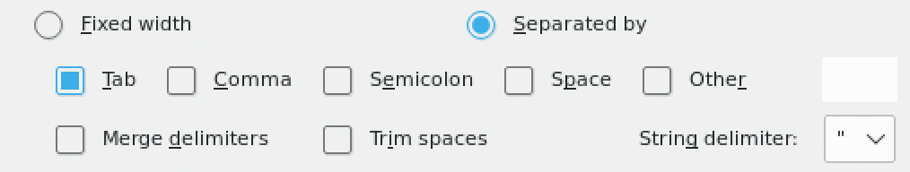

# TB resistance prediction


We will now look at using **TB-Profiler** to predict drug resistance patterns. The pipeline searches for small variants and large deletions associated with drug resistance. It will also report the lineage. By default, it uses trimmomatic to trim the reads, BWA (or minimap2 for nanopore) to align to the reference genome and freebayes to call variants.

conda is a package manager that you can use to install bioinformatics software. We have installed a faster version of conda, which is called mamba. You can install almost all bioinfromatics software with mamba and it will be your best friend as you continue on in your journey as a bioinformatician. Run the following command to create a conda "environment" with the latest version of tb-profiler installed. We also want to use IGV and a tool called curl later, so we need to add that to the install command.

```
mamba create -y -n tb-profiler -c bioconda -c conda-forge tb-profiler=5 igv freebayes=1.3.6
```

Before you can use tb-profiler, you should activate the environment using the following command (remembter that you'll have to run this every time you open up a new terminal window):

```
conda activate tb-profiler
```

You can now run the pipeline and get the help message by running the following command:

## tb-profiler

You should be able to see that there are many options which you can use. The main function for analysing new data is the profile command. Try getting the help options by running tb-profiler profile -h. Can you identify the required inputs? The pipeline was designed to be very flexible in terms of the inputs it can take. You can give it FASTQ, BAM, CRAM, VCF, or assembled FASTA files and it will produce the same output file.

Let's try running it on sample1 with the BAM file as input. First, change into the tb directory and then run the pipeline using the following commands:

```
cd ~/data/tb/
tb-profiler profile --bam sample1.bam --prefix sample1 --txt
```

The --prefix argument allows you to specify a prefix for the output files. After running it you should see a folder called results which contains the output files. By default the tool produes a .json formatted file but since we specified --txt it also produced a text file. You can view this file by opening it up in a text editor or by using less on the terminal. The first section gives a general summary with the drug resistance type, the lineage and the median depth. The second section section gives a summary of the resistance patterns found in the sample along with the relevant resistance mutations. The third section gives a summary of the drug-resistance variants found in the sample together with information such as the frequency at which they occur in the raw data. The fourth section gives a summary of candidate mutations found in genes generally associated with resistance (i.e. mutations that have not been linked to resistance themselves but that occurred in resistance-associated genes).

!!! question
    Have a look at the report. What lineage is this sample? Do we see any drug resistance? Does the report flag any quality control issues?

Now try running tb-profiler on sample2 using the bam file as input. After it finishes, look at the report. Do you see any differences?

Often you want to combine the results from many runs into a single report. This helps with comparing resistance and lineage data from different isolates. A single report can be generated with the collate function. Run the follwing command and it will generate a text file containing key metrics from both samples. 


```
tb-profiler collate
```

You can open this in LibreOffice Calc (a free alternative to excel). Open libreoffice by running the following on the terminal:

```
libreoffice --calc 
```

Then choose file -> open and select the tbprofiler.txt file in the ~/data/tb directory. Just make sure you have only "tab" checked as the seperator (see image below).



## Bedaquiline resistance: a case study

Now that you know how to run tb-profiler, we will look into using it to compare the results with phenotypic tests. For this, we have selected five samples that were publishes in [this study](https://elifesciences.org/articles/75046) by Fowler et al. We will be looking at resistance to bedaquiline and the variants that cause resistance. Bedaquiline is one of the new drugs that have been intruduced in the last decade. Sadly, resistance has already been observed, and it is imperative that this is limited to maintain global effectiveness of the drug. Two genes implicated in resistance against bedaquiline are the drug target atpE and a transcriptional regulator (mmpR5) which represses expression of an efflux pump that can pump bedaquiline out of the cell. Mutations in atpE prevent binding of the drug, while mutations in mmpR5 cause loss of function and as a result increased expression of the efflux pump (and resistance!). The phenotypic results are shown below. First let's download the relevant data and change into the new directory. 

```
cd ~/data/tb/bedaquiline
```

| Sample |	DST |
|-----|------|
| ERR4829977 |	Resistant|
| ERR8975807 |	Resistant|
| ERR4796447 |	Resistant|
| ERR8975920 |	Resistant|
| ERR5917992 |	Resistant|

As you can see they are all resistant according to phenotypic methods. Let's see if WGS agrees with this. Run tb-profiler for all samples using the VCF files. Remember that VCF format contains variants detected in the genome. We have created these VCF files for you so that the analysis won't take too long. Here is the command for the first sample. You can adapt it for the rest. 

```
tb-profiler profile --vcf ERR4829977.vcf.gz --prefix ERR4829977 --txt
```

After you have generated the result files, run the collate function and open using LibreOffice Calc. 

```
tb-profiler collate
```

Open the tbprofiler.txt file in ~/data/tb/bedaquiline using libreoffice similar to as you have done before.

!!! question
    Do the results from tb-profiler agree with the phenotypic results? 

It seems like there are two samples which are sensitive to bedaquiline according to WGS. Have a look at the individual text format result files for these samples and go to the "Other variants" section. Resistance can often occur due to novel variants that haven't been observed before. 

!!! question
    Can you identify any variants that could explain the discrepant results? Hint: look for variants in the atpE and mmpR5 genes. 

## Answers!

Let's first have a look at ERR8975807. It looks like the there are no known resistant mutations, however the "Other variants" section reveals that there are two variants in the mmpR5 gene. Remember that loss of function in this gene can cause resistance. One of these mutations is a small indel that causes a frameshift, and as a result – loss of function. Interestingly you might notice that the mutations are not fixed in the sample, with both occuring at close to 0.5 fraction of the reads. This indicates that there are two sub-populations in the host with different resistance mutations. Have a look at the bam file for this sample in IGV and see if you agree.

Second, lets look at ERR4796447. This sample also does not present any known variants. However, the "Other variants" section reveals that there is a variant in the atpE gene which codes for the drug target. Because this is a SNP causing less of a functional impact than the frameshift variant mentioned above, this will be more difficult to evaluate. However, there are some tools which can help. When assesing the functional impact of SNPs on proteins, researchers often turn to in silico methods. These predict the effect on characteristics such as protein stability and ligand binding affinity using a protein model. One such tool already exists for bedaquiline resistance called SUSPECT-BDQ. It allows you to upload a mutation and will predict whether it will confer resistance. Click the link and input the mutation you have found and have a look at the output. You'll have to convert the amino acids to one letter code (E.g. E61D). 

!!! question
    After studying the other mutations, do you wish to manually reclassify your samples? 

## Summary

You have seen how tb-profiler automates a lot of the steps you have performed so far. It does mapping, variant calling, annotation, and formats the results into a human-readable report. This is just one tool of many that can be used to predict resistance and, more generally, perform automated analyses. For other organisms, such as E. coli, you should use a tool which can also analyse resistance genes on plasmids. 