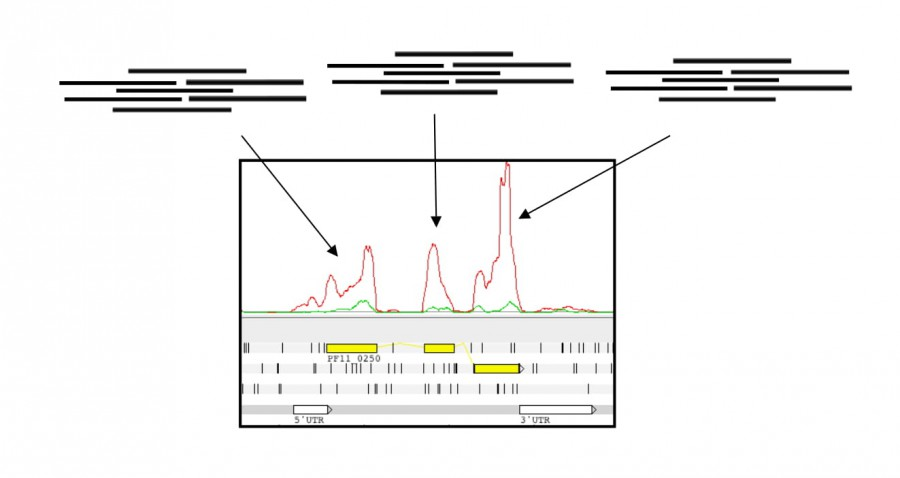

# Transcriptomics

## Introduction

An application of next-generation sequencing is RNA sequencing (Mortazavi et al., 2008; Wang et al., 2009). In particular we will discuss transcriptome (messenger RNA) sequencing. Transcriptome sequencing is a very useful addition to genome sequencing projects as it helps to identify genes and thus aids in genome annotation. In this sense, it is similar to earlier transcriptome sequencing using capillary methods (EST sequencing), but provides much higher coverage of the transcriptome.

Reads from RNA sequencing can be treated in much the same way as those from DNA sequencing. The exception is in eukaryotes when there is splicing, where a single gene can code for multiple proteins through transcription of determined exons.

Due to the vast number of reads produced by next generation sequencing technology, the transcriptome is also sequenced very deeply. Each gene is sequenced in proportion to its abundance and the large number of reads means that even low abundance genes are sequenced to some extent. This means that expression levels of genes can be compared. One can visualise the "pile up" of reads in a particular region by looking at coverage plots. The higher the signals in the plot, the more expressed a transcript is. It is important to note that the sequences originate from transcriptome samples (mRNA) and therefore only contains information about the exons and untranslated regions (UTRs).

Imagine the following transcript is present in the sample:


Reads belonging to the transcript are produced by the sequencing process. When the reads come out as raw data, there is no information about where they belong in the reference genome. Furthermore, all reads from several different transcripts come out together. An alignment algorithm localises them in the reference genome based on similarity matches.



In the plot, the coverage line represents the number of reads that align to the genome at each base position. This allows us to identify coding regions, here, the 3 exons (in yellow) that comprise the transcript above.

In this module we will use a similar approach used to map DNA sequencing data to map RNA sequencing data from Mycobacterium tuberculosis.

Understanding an organism's genome goes beyond cataloging the genes that are present in the genome. Insight into the biological stages in which each gene is expressed (potentially used) helps us to identify how organisms develop and respond to a particular external stimuli. The first layer of such complex patterns involves the understanding of how the genome is being used is the transcriptome. This is also the most accessible type of information because, like the genome, the transcriptome is made of nucleic acids and can be sequenced relatively easily. Arguably the proteome is of greater relevance to understand cellular biology, but it is chemically heterogenous making it much more difficult to assay.

Over the past two decades, microarray technology has been applied extensively for addressing the question of which genes are expressed and when, enabling the performance of differential expression analysis. Despite its success, this technology is limited in that it requires prior knowledge of the gene sequences for an organism and has a limited dynamic range in detecting the level of expression, e.g. how many copies of a transcript are made. RNA sequencing technology using, for instance Illumina HiSeq machines, can sequence all the genes that are transcribed, and the results have a more linear relationship to the real number of transcripts generated.

The aim of differential expression analysis is to determine which genes are more or less expressed in different situations. We could ask, for instance, whether a bacterium uses its genome differentially when exposed to stress, such as heat or challenged by a drug. Alternatively, we could ask which genes make human livers different from kidneys.

In these exercises, we will try to gain some understanding of differences between M. tuberculosis lineages. The genome of M. tuberculosis was published in 1998 (Cole et al., 1998). It has 4.4 Mb and a high GC content (~65%), comprising 4,111 genes. Although the variability of the M. tuberculosis genome has been considered limited, it has been demonstrated a higher diversity than it was previously thought. Currently, M. tuberculosis is classified in 7 different lineages with a different geographical distribution, and also virulence or spreading capacity has been seen to vary between lineages. Strains from different lineages have shown differences in virulence or in acquisition of drug resistance (Parwati et al., 2010), and these differences might be caused by variable expression of determined genes.

Therefore, the aim of this session is to become familiar with the steps carried out in transcriptomics studies, from mapping RNA-seq reads to the performance of differential expression analysis.

## Exercise 1: Mapping RNA-seq with BWA

First, we will map RNA sequence reads from a M. tuberculosis lineage 1 strain to the reference genome, in this case, the H37Rv M. tuberculosis strain.

You can find the M. tuberculosis H37Rv reference genome (called H37Rv.fa) as well as the two files of RNA-seq reads from a lineage 1 strain (Mtb_L1_1.fastq and Mtb_L1_2.fastq) in the transcriptomics directory.

### Running BWA

To work with the command line of Linux, you will first need to open a terminal, activate the rnaseq conda environment, go to the data and transcriptomics directory:

```
conda activate rnaseq
```

```
cd ~/data/transcriptomics
```

And list the files there:

```
ls
```

You will find there the 4 fastq files, 2 of them from the lineage 1 sample, and the reference genome fasta file; these are the input data for this practical.

For the mapping, first an index of the reference genome must be constructed with bwa index. On the command line, you should type:

```
bwa index H37Rv.fa
```

This will generate 5 files which are needed for BWA. We will then align the RNA-seq reads to the reference genome with bwa mem. We will therefore use the reference genome (in fasta format) and the two fastq files that contain the RNA-seq reads, saving the output to a SAM file. To start you should type:

```
bwa mem H37Rv.fa Mtb_L1_1.fastq.gz Mtb_L1_2.fastq.gz | samtools sort - -o Mapping_Mtb/Mtb_L1.bam
samtools index Mapping_Mtb/Mtb_L1.bam
```
The output will be located in the Mapping_Mtb folder, which is in the transcriptomics directory.

!!! question
    === "Question 1"
         We also need to index our bam file. Can you remember how to do this?
    === "Answer 1"
        We can do this with the following code:

        ```
        samtools index Mapping_Mtb/Mtb_L1.bam
        ```


## Exercise 2: Visualising alignments

Now we will examine the reads mapping in IGV. Follow the steps as before:

Launch IGV by running the command `igv` on a New Terminal and perform the following steps:

1. We first need to load the reference genome. To do this click on **Genomes -> Load Genome from File...**. Navigate to **~/data/transcriptomics/** and select the **H37Rv.fa** file.
2. You can also load the genes by clicking on **File -> Load from File...**, then selecting the **Mtb.gtf** file. 
3. Finally you can load the bam file by clicking **File -> Load from File...** and selecting the bam file you wish to load.


### Interpreting the mapping

This exercise is similar to the one performed before in the Visualisation module. Scroll along the genome and examine the read coverage (the part of the genome mapped goes from position 2420631 to 2920631. To view that part select 'Goto', 'Navigator' and write in 'Goto Base' 2420631). Notice how different genes have different depths of coverage.


!!! question
    === "Question 2"
        Why do some genes have little or no coverage?
    === "Answer 2"
        They are not being expressed in the given sample.

!!! question
    === "Question 3"
        Why do some reads map where there are no genes?
    === "Answer 3"
        This could be due to:
        * Genome annotation incompleteness
        * Novel transcripts and isoforms
        * Non-coding RNAs


### Including more lineages

One interesting feature of the IGV viewer is the possibility to see more than one BAM file at the same time, which enables to comapre coverage from different samples. Hence, next we want to include more lineages, in this case we will add another sample belonging to the lineage 4 of Mtb.

To do it, we will need first to follow the previous steps in order to get the sorted and index bam files. Therefore, map it with BWA as before, the fastq files are in the directory ~/data/transcriptomics and are called Mtb_L4_1.fastq.gz and Mtb_L4_2.fastq.gz.

Once we have the bam files, we can add it to the IGV viewer using **File -> Load from File...** and selecting the bam file you wish to load.


In the BAM view of the reads, it might be difficult to distinguish the differences between the BAM files. However, in the coverage plot, one can see the differences in coverage.

One reason to perform RNA-seq under different conditions or in different samples (in this case different lineages of Mtb), is to see genes that are differentially expressed. For example, one gene may be more highly expressed in one lineage that in the other.


!!! question
    === "Question 4"
        Can you find any genes that have differential expression?


Now go to gene Rv2161c (position 2422271).


!!! question
    === "Question 5"
        Would you think that this gene is differentially expressed?


## Exercse 3: Differential expression

There are tools that calculate the differential expression, like the R packages DESeq or EdgeR. They take the reads mapped to each gene, normalize the resulting quantities of mapped reads (coverage), and then estimate if any genes are differentially expressed. In general, the results are more credible and significant if biological replicates are included.

###  Counting reads with HTSeq-count 

In order to perform a differential expression analysis, the first step is to count the reads mapped to each of the genes so that we can make comparisons between the different samples.

**HTSeq-count** is part of the HTSeq package which will quantify the number of reads mapping to gene models in different RNA-seq experiments given a file with aligned sequencing reads (the bam file obtained through BWA) and a list of genomic features (the Mtb.gtf file with the gene annotation).

We will run HTSeq-count with the RNA-seq data from the L1 and L4 strains we were using in the previous exercises. To do it, we will go to the directory where we have the data and use the following command:

```
cd ~/data/transcriptomics

python -m HTSeq.scripts.count -f bam -r pos -s reverse -t gene ./Mapping_Mtb/Mtb_L1.bam Mtb.gtf > ./Mapping_Mtb/Mtb_L1_htseq_count.txt

python -m HTSeq.scripts.count -f bam -r pos -s reverse -t gene ./Mapping_Mtb/Mtb_L4.bam Mtb.gtf > ./Mapping_Mtb/Mtb_L4_htseq_count.txt
```

The parameters we have used in the HTSeq-count command are:

 * -f: format of the input data
 * -r: how is sorted the data
 * -s: whether the data is from a strand-specific assay. The reverse option is used for pair-end reads from HiSeq in order to mantain the strain-specificity (the reads have to map to the gene in the corresponding strand to be counted)
 * -t: feature type, in this case exon

If you have any doubt about the parameters of the program, type:

```
python -m HTSeq.scripts.count
```


!!! question
    === "Question 6"
        What would -a parameter do?
    === "Answer 6"
        Ensures HTSeq-count skips all reads with alignment quality lower than the given minimum value.

We can now take a look at the results from the HTSeq-count typing the following in the command line:

```
cd ~/data/transcriptomics/Mapping_Mtb

less Mtb_L1_htseq_count.txt
```

You should see two columns with the list of genes and the counts for each gene.

!!! terminal "Terminal output" 
    ```
    Rv2158c 0
    Rv2159c 22
    Rv2160A 11
    Rv2160c 0
    Rv2161c 193
    Rv2162c 753
    Rv2163c 6181
    Rv2164c 2169
    Rv2165c 6878
    Rv2166c 11357
    Rv2167c 0
    Rv2168c 0
    Rv2169c 3017
    Rv2170  235
    Rv2171  1779
    Rv2172c 9812
    Rv2173  1525
    Rv2174  1828
    Rv2175c 767
    Rv2176  1440
    Rv2177c 169
    Rv2178c 6200
    Rv2179c 205
    Rv2180c 319
    Rv2181  4288
    Rv2182c 10635
    Rv2183c 1197
    :
    ```

To exit this view you just need to type 'q'.

### Finding differentially expressed genes with DESeq2

Now we are going to perform a differential expression analysis in order to look for genes with variable expression between lineages. To do it we will use 6 sequenced samples, 3 from lineage 1 and 3 from lineage 4. Two of them will be the two analysed in the previous steps. We are going to use an R package for the anaylsis of the differential gene expression called DESeq2.

A differential expression analysis is used to compare gene expression levels, given by the number of reads per gene (obtained by HTSeq-count) between samples (for example, between 2 lineages of Mtb). In order to accurately ascertain which genes are differentially expressed, and the amount of expression, it is necessary to use replicated data. As with all biological experiments doing it once may simply not be enough. There is no simple way to decide how many replicates to do, it is usually a compromise of statistical power and cost. By determining how much variability there is in the sample preparation and sequencing reactions we can better assess whether genes are really expressed and more accurately determine any differences. The key to this is performing biological rather than technical replicates. This means, for instance in tuberculosis, growing up three cultures of bacteria, treating them all identically, extracting RNA from each and sequencing the three samples separately. Technical replicates, whereby the same sample is sequenced three times do not account for the variability that really exists in biological systems or the experimental error between cultures of bacteria and RNA extractions. More replicates will help to improve statistical power for genes that are already detected at high levels, while deeper sequencing will improve power to detect differential expression for genes which are expressed at low levels. In this exercise we will consider the 3 L1 and the 3 L4 samples as biological replicates.

To start, we firstly need a table with the counts. In the Mapping_Mtb directory (where we should be) we can find a folder called HTSeqCounts with 6 files called:

```
cd ~/data/transcriptomics/Mapping_Mtb/HTSeqCounts

ls
```

!!! terminal "Terminal output"
    ```
    Mtb_1_L4_htseq_count.txt  Mtb_3_L1_htseq_count.txt  Mtb_5_L1_htseq_count.txt
    Mtb_2_L1_htseq_count.txt  Mtb_4_L4_htseq_count.txt  Mtb_6_L4_htseq_count.txt
    ```

Now, to start, we need to open R in the terminal, just typing:

```
R
```

And then load the packages we are going to need for the analysis:

```
library(DESeq2)
library(gplots)
```

These 6 files are the results of the HTSeq-count of the two samples previously analysed plus 4 more Mtb samples we will use to perform the analysis.

To prepare the data we are going to use the following scripts.

First we are going to set the directory where we have the files:

```
directory <- "~/data/transcriptomics/Mapping_Mtb/HTSeqCounts/" 
```

And now we can select the files and save them in the variable ‘sampleFiles’ by selecting all the files that contain "Mtb" that are present in our directory:

```
sampleFiles <- grep("Mtb", list.files(directory), value = TRUE)
```

As we are comparing lineage 1 to lineage 4 samples, we are going to set up lineage as "condition".

```
sampleCondition <- c("l4","l1","l1","l4","l1","l4")
```

Now we construct the table with the sample information and convert it in a DESeq object:

```
sampleTable <- data.frame(
    sampleName = sampleFiles,
    fileName = sampleFiles,
    condition = sampleCondition
)

dds <- DESeqDataSetFromHTSeqCount(
    sampleTable = sampleTable,
    directory = directory,
    design = ~ condition
)
```

Before doing the analysis, we are going to filter the dataset keeping only the genes with at least 10 counts, so that we make sure that every gene considered for the analysis was transcribed.

To do it, type the following:

```
keep <- rowSums(counts(dds)) >= 10
dds <- dds[keep,]
```

And we are going to set up the condition for the analysis in two levels which are 'lineage 1' and 'lineage 4':

```
dds$condition <- factor(dds$condition, levels = c("l1","l4"))
```

We can then run the differential expression anaylisis by calling the function DESeq(), which will normalise the data and compare between the two groups established (l1 and l4). We can store the results in a variable called 'res':

```
dds <- DESeq(dds)
res <- results(dds)
```

Let's take a look at the results. Type:

```
res
```

And you should get a table like this:

!!! terminal "Terminal output"
    ```
    log2 fold change (MLE): condition l4 vs l1
    Wald test p-value: condition l4 vs l1
    DataFrame with 441 rows and 6 columns
            baseMean log2FoldChange     lfcSE       stat       pvalue         padj
                            
    Rv2159c 1251.0885      6.5961892 0.5609037  11.759933 6.278432e-32 9.208368e-30
    Rv2160A  766.1015      6.6738839 0.5544491  12.036965 2.271613e-33 4.997548e-31
    Rv2161c 5336.3523      5.8122020 0.4210642  13.803600 2.424369e-43 1.066722e-40
    Rv2162c 4784.6386      3.8915692 0.3784335  10.283364 8.375204e-25 9.212724e-23
    Rv2163c 3616.8513     -0.5480522 0.3940154  -1.390941 1.642434e-01 9.243213e-01
    ...           ...            ...       ...        ...          ...          ...
    Rv2586c  3828.546     0.16674016 0.3612166  0.4616071    0.6443631    0.9964280
    Rv2587c  5655.191     0.21607557 0.3636699  0.5941530    0.5524098    0.9964280
    Rv2588c  1305.013    -0.02030647 0.4871420 -0.0416849    0.9667499    0.9983353
    Rv2589   1665.930     0.25845265 0.3629410  0.7121064    0.4763989    0.9964280
    Rv2590   5873.482     0.42707857 0.6169747  0.6922141    0.4888029    0.9964280
    ```

The first column represents the name of each gene analysed, which are represented in rows.


!!! question
    === "Question 7"
        How many genes did we analyse?
    === "Answer 7"
        441


Let's take a look at the summary of the results we just obtained:

```
summary(res)
```

!!! terminal "Terminal output"
    ```
    out of 441 with nonzero total read count
    adjusted p-value < 0.1
    LFC > 0 (up)     : 10, 2.3%
    LFC < 0 (down)   : 7, 1.6%
    outliers [1]     : 1, 0.23%
    low counts [2]   : 0, 0%
    (mean count < 2)
    [1] see 'cooksCutoff' argument of ?results
    [2] see 'independentFiltering' argument of ?results
    ```

When asking whether a gene is differentially expressed we use statistical tests to assign a p-value. If a gene has a p-value of 0.05 we know that there is only a 5% chance that it is not really differentially expressed. However, if we are asking this question for every gene in the genome, then we would expect to see due to multiple comparison, p-values less than 0.05 for many genes even though they are not really differentially expressed. Due to this statistical problem we must correct the p-values so that we are not tricked into accepting a large number of erroneous results. Adjusted p-values are p-values which have been corrected for what is known as multiple hypothesis testing. 

The summary shows us the number of genes with an adjusted p-value < 0.1 that are under or over expressed in one of the groups (log2FoldChange above or below 0, here represented as LFC). The adjusted p-value in the DESeq analysis is equivalent to the FDR or 'False Discovery Rate'. This value represents the proportion of discoveries that we can expect to be false.


!!! question
    === "Question 8"
        Which is the maximum percentage of "false discoveries" that we can expect given a cut off adjusted p-value of 0.1?
    === "Answer 8"
        10%


!!! question
    === "Question 9"
        How many genes are up and down-regulated with an adjusted p-value < 0.1?
    === "Answer 9"
        10 genes are up-regulated. 7 genes are down-regulated.


Some of the p-values in our results might be NA values, which can be due to extreme outliers. To continue with the analysis we are going to remove these missing values.

```
res <- res[!is.na(res$padj),]
```

Let's now order the results by p value, so we see the top genes with the highest statistial significance. Take a look at the results again.

```
resOrdered <- res[order(res$pvalue),]
resOrdered
```

To visualise the diffences in expression we are going to plot a heatmap using the 17 genes that are above the cut off. To do it, we will first get the normalised counts in a variable called "counts_heatmap". We will copy the names of the first 17 genes from our "resOrdered" table in a vector, and then extract the normalised counts from "counts_heatmap" for the 17 genes we want to plot.

```
counts_heatmap <- counts(dds, normalized = TRUE)
idx <- rownames(resOrdered)[1:17]
counts_heatmap <- counts_heatmap[rownames(counts_heatmap)%in%idx,]
```

If we type:

```
counts_heatmap
```

We can see the table with the normalised counts for each sample and each of the genes of our interest.

!!! terminal "Terminal output"
    ```
        Mtb_1_L4_htseq_count.txt Mtb_2_L1_htseq_count.txt
    Rv2159c               1061.02472                16.090459
    Rv2160A                933.18297                 8.045229
    Rv2161c              10927.68994               141.157208
    Rv2162c               8503.01996               550.732527
    Rv2188c               1643.41488               495.147306
    Rv2271                 804.10604              1115.361360
    Rv2274A                 57.43615                68.018758
    Rv2275                2069.55403              1757.516950
    Rv2292c                 54.96577               263.298419
    Rv2338c               1439.60920              3638.637880
    Rv2346c               1742.22976              1260.175491
    Rv2381c               5656.53398              1778.727101
    Rv2382c               2140.57722               623.139593
    Rv2493                2611.18306               308.644258
    Rv2494                1635.38617               244.282423
    Rv2506                 345.23447               993.220149
    Rv2573                  31.49724                71.675681
            Mtb_3_L1_htseq_count.txt Mtb_4_L4_htseq_count.txt
    Rv2159c                 34.44955               3070.71886
    Rv2160A                 25.05422               1716.06570
    Rv2161c                122.13932              10217.41567
    Rv2162c                685.85926              12248.53695
    Rv2188c                595.03771               3311.94670
    Rv2271                3936.64424                797.08204
    Rv2274A                147.19354                 55.37080
    Rv2275                3592.14872               1232.32231
    Rv2292c                140.92998                 62.66773
    Rv2338c               3335.34297               1310.44236
    Rv2346c                908.21546               2235.00602
    Rv2381c                466.63484               3045.82346
    Rv2382c                654.54148               1449.94245
    Rv2493                 184.77487               2647.49705
    Rv2494                 266.20108               1598.45639
    Rv2506                 494.82084                499.19570
    Rv2573                 112.74399                 57.08773
            Mtb_5_L1_htseq_count.txt Mtb_6_L4_htseq_count.txt
    Rv2159c                 30.57068               3293.67692
    Rv2160A                 16.98371               1897.27712
    Rv2161c                302.31010              10307.40137
    Rv2162c                577.44627               6142.23638
    Rv2188c                343.07102               4986.18078
    Rv2271                1837.63783                871.00738
    Rv2274A                220.78828                 26.91855
    Rv2275                9847.15722               1075.78064
    Rv2292c                125.67948                 71.62257
    Rv2338c               5896.74541               1217.10303
    Rv2346c                886.54986               8732.18549
    Rv2381c               1895.38245               3401.35112
    Rv2382c                740.48992               1372.36538
    Rv2493                 377.03844               1754.03197
    Rv2494                 261.54919               1206.52789
    Rv2506                1864.81177                392.72242
    Rv2573                 220.78828                 49.03022
    ```

To plot the heatmap copy the following script:

```
colnames(counts_heatmap) <- c("L4_1","L1_2","L1_3","L4_4","L1_5","L4_6")
heatmap.2(as.matrix(counts_heatmap), scale="row", col=greenred(75), Rowv=NA, dendrogram = "col", trace="none", density.info = "none")
```

You should get a plot like this:


!!! question
    === "Question 10"
        Do the samples cluster by lineage in the dendrogram?
    === "Answer 10"
        Yes


As you can see in the color key, red cells in the plot represent overexpressed genes whilst green ones the underexpressed genes. Rows represent the 17 genes of interest and columns the 6 samples we are analysing.


!!! question
    === "Question 11"
        How is Rv2493 in lineage 4 samples? And Rv2159c in lineage 1?
    === "Answer 11"
        Rv2493 is over expressed in 2 out of 3 lineage 4 samples and Rv2159c is under expressed in all lineage 1 samples


Take a look at the first 5 genes in the plot. As you might assume by the numbers they are located in the genome one after the other. Which potential explanations would you give to their down-regulation in one of the lineages?

## Further exploration

### What do I do with a gene list?

As we have just seen, differential expression analysis results is a list of genes which show differences between two conditions. It can be daunting trying to determine what the results mean. On one hand you may find that due to there being no real differences or there being too much noise in your experiment, you have no significant differences. On the other hand, you may find thousands of genes are differentially expressed. What can you say about that?

Other than looking for genes you expect to be different or unchanged, one of the first things to do is look at Gene Ontology (GO) term enrichment. There are many different algorithms for this, but you should annotate your genes with functional terms from GO using for instance Bast2GO (Conesa et al., 2005) and then use perhaps TopGO (Alexa et al., 2006) to determine whehter any particular sorts of genes occur more than expected in your differentially expressed genes.

## References

Mortazavi A, Williams BA, McCue K, Schaeffer L, Wold B. (2008). Mapping and quantifying mammalian transcriptomes by RNA-Seq. Nat Methods 5(7):621-8. doi: 10.1038/nmeth.1226

Wang Z, Gerstein M, Snyder M. (2009). RNA-Seq: a revolutionary tool for transcriptomics. Nat Rev Genet 10(1):57-63. doi: 10.1038/nrg2484

Cole ST, Brosch R, Parkhill J, Garnier T, Churcher C, Harris D et al. (1998). Deciphering the biology of Mycobacterium tuberculosis from the complete genome sequence. Nature 393(6685):537-44.

Parwati I, van Crevel R, van Soolingen D. (2010) Possible underlying mechanisms for successful emergence of the Mycobacterium tuberculosis Beijing genotype strains. Lancet Infect Dis 10(2):103-111. doi: 10.1016/S1473-3099(09)70330-5

Conesa A, Gotz S, Garcia-Gomez JM, Terol J, Talon M, Robles M. (2005) Blast2GO: a universal tool for annotation, visualization and analysis in functional genomics research. Bioinformatics 21(18):3674-6.

Alexa A, Rahnenfuhrer J, Lengauer T. (2006). Improved scoring of functional groups from gene expression data by decorrelating GO graph structure. Bioinformatics 22(13):1600-7.


