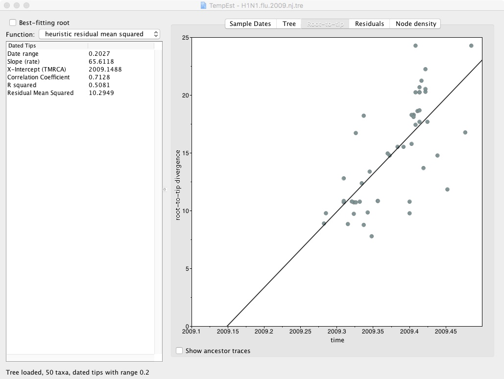
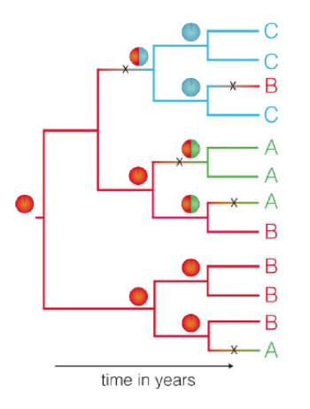
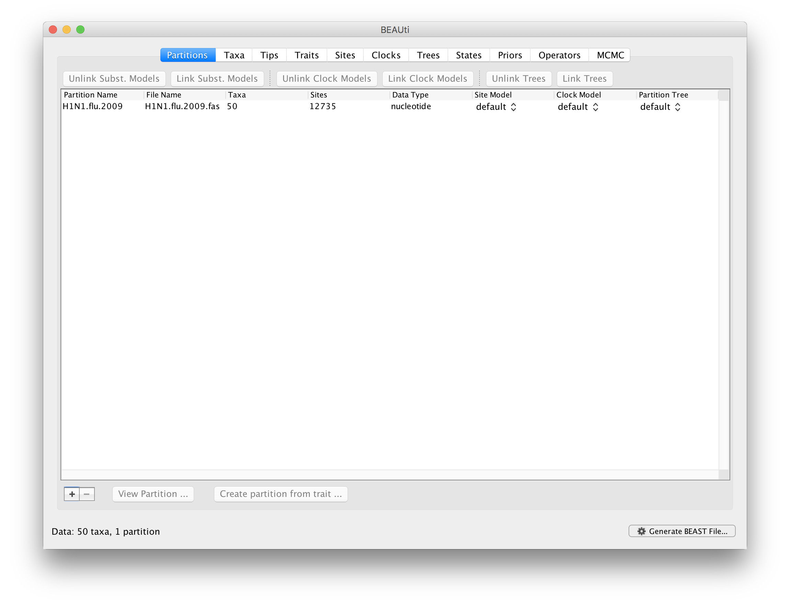
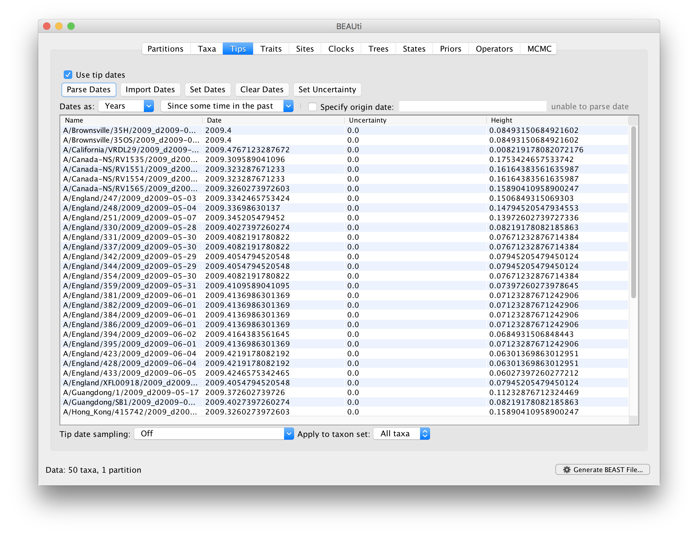
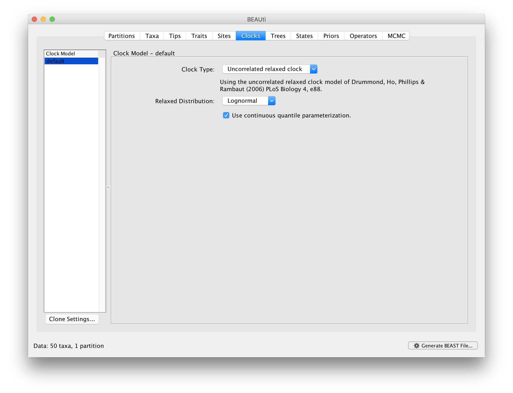
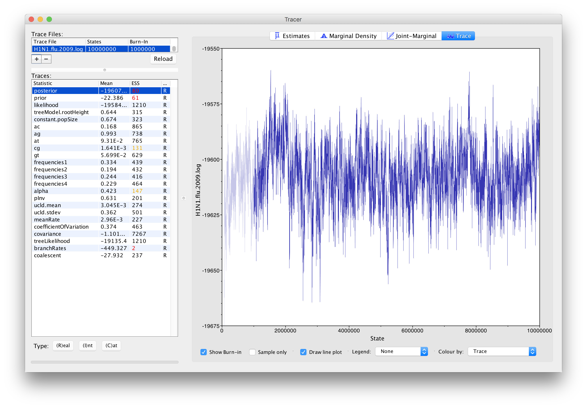
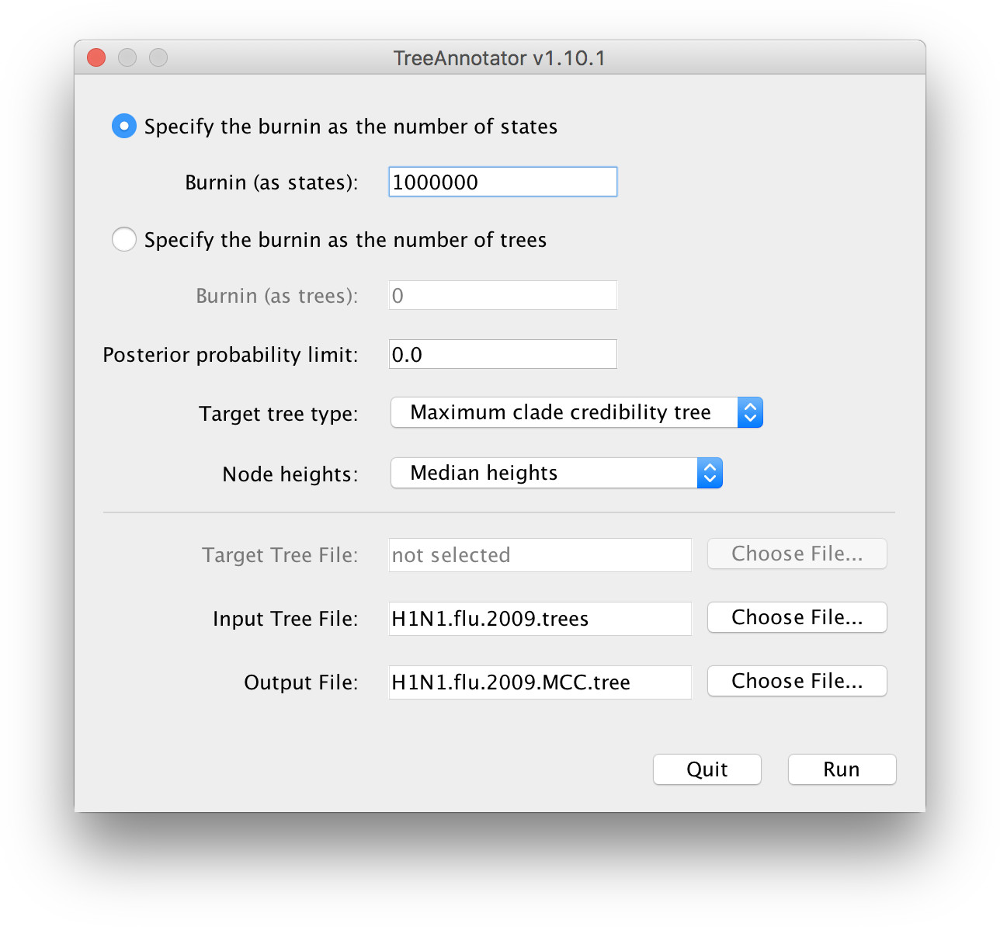

# Pylogenetics
The study of evolutionary relationships among biological entities

## Objectives
By the end of this practical you should:

- Understand the relationship between genetic relatedness and transmission events.
- Know how to reconstruct and interpret a phylogenetic tree
- Understand how time and spatial diffusion of an epidemic is inferred from a phylogeny

## Introduction
In the lecture, we saw how epidemiological processes leave a measurable imprint on pathogen genomes sampled from infected individuals. These processes can be recovered from genetic data sampled at different times and places, using statistical inference methods that take into account the sequences’ shared ancestry.

In this practical session, we will reconstruct and interpret the Influenza A H1N1 2009 (H1N1/09) epidemic in England, based on a set of viral sequences isolated during the outbreak.

We will identify transmission chains of H1N1/09, reconstruct their migration patterns, estimate the number of independent introductions in England, and infer the time and geographical location of these introduction events. In order to do so, we will apply the following procedure:

1. We will reconstruct the phylogeny of influenza genomes sampled in England and other countries where H1N1 infections were diagnosed.
2. We will apply a molecular clock model to the data in order to fit the phylogeny to real time scales.
3. We will infer the migration patterns of H1N1 into and within England using Bayesian Markov chain Monte Carlo (MCMC) phylogeographic inference.

<hr>


## Section 1 - Phylogenetic reconstruction
We will use the packages **AliView** and **RAxML** to view genetic sequence files and build a maximum-likelihood (ML) phylogenetic tree.

The file **‘H1N1.flu.2009.fas’** is a multi-FASTA file containing 50 full-length influenza A H1N1/09 genomes. These nucleotide sequences correspond to influenza viruses sampled in Canada (n = 5), China (n = 3), England (n = 23), Mexico (n = 4), Peru (n = 1), and the United States of America (USA; n = 14) between April and June 2009. The sequences are 12,735 nucleotides long.

We will use AliView to manually inspect the FASTA file:

Activate the correct environment with `conda activate phylogenetics`.
Open AliView by running the commmand `aliview`.
Import the sequence file: **File > Open File**, navigate to **~/data/phylogenetics** and select the file **H1N1.flu.2009.fas**.

!!! Important

    To infer the phylogenetic relationship of a set of sequences, these need to be ‘aligned’. That is, nucleotide positions need to be arranged in columns to ensure that we compare homologous positions to one another. In evolutionary biology, homology means similarity due to descent from a common ancestor. Two genes are homologous if they descend from an ancestral gene. Likewise, two nucleotides in different sequences are homologous if they correspond to the same nucleotide position in the ancestral gene. Note that two objects can be ‘similar’ without being ‘identical’. The sequences shown here have been aligned but if your data are not, it will need to be aligned. This can be done in AliView, as well as in other programs including MUSCLE, ClustalW and MAFFT.

The sequence alignment is displayed as a matrix, where rows correspond to viral samples and columns to nucleotide positions (see **Figure 1**). Cells are coloured by type of nucleotides (A, C, G or T) and missing information, or gaps, are indicated by a dash (“-“).


The unique identifier of the sequences is shown at the left hand side of the nucleotide matrix and contains the strain name (e.g. A/England/247/2009) followed by the date of sampling (e.g. d2009-05-31) in the format dYYYY-MM-DD.

In the matrix, we can spot ‘rare’ nucleotide substitutions present in one or more sequences (scroll along the sequence alignment to spot some). These single nucleotide polymorphisms (SNPs) allow us to identify viruses that are genetically related (they share a common SNP) and infer epidemiological linkage between them. If viruses sampled from different individuals have the same SNPs, we can assume that they form a specific strain infecting these individuals. This is the property we use to reconstruct transmission chains from a phylogenetic tree.

## Tree reconstruction
**RAxML** [1] is a freely available software used to reconstruct phylogenetic relationships between individuals using a maximum-likelihood (ML) approach. This approach takes into account a substitution model to assess the probability of particular mutations. You can also perform bootstrapping, a method for validating the tree by repeating the analysis a specified number of times to produce pseudoreplicates. This acts as a support for the tree topology of the final tree that is produced by calculating the number of pseudoreplicates in which a given node of a tree is found.

Open your command-line terminal and navigate to the folder containing the **H1N1.flu.2009.fas** sequence file.
```
cd ~/data/phylogenetics/`
```
Run the following command (This may take a few minutes to complete):
```
raxmlHPC -m GTRGAMMA -s H1N1.flu.2009.fas -n H1N1.flu.2009.ML -p 11334 -k -f a -x 13243 -N 100
```

- **raxmlHPC**: This will run RAxML on the command-line and uses the following parameters:
- **m GTRGAMMA**: This sets the substitution model to be used. We are using GTR (generalised time reversible) with a gamma distribution.
- **s H1N1.flu.2009.fas**: This is your input file.
- **n H1N1.flu.2009.ML**: This is the name that will appended to output files.
- **p 11334**: This is a random seed number.
- **k**: Trees are printed with branch lengths.
- **f a**: This tells RAxML to conduct a rapid Bootstrap analysis and search for the best-scoring ML tree in a single run.
-**x 13243**: This is a random seed number for bootstrapping.
-**N 100**: This specifies the number of bootstrap runs.
Once the software has finished running, the file RAxML_bipartitions.H1N1.flu.2009.ML will contain the ML tree with bootstrap supports. Add the extension .tre to the file:

```
mv RAxML_bipartitions.H1N1.flu.2009.ML RAxML_bipartitions.H1N1.flu.2009.ML.tre
```
And open the tree to view in the program FigTree, for this run the command:
```
figtree
```
FigTree is a tree editor with a graphic interface and is freely available at [http://tree.bio.ed.ac.uk/software/figtree](http://tree.bio.ed.ac.uk/software/figtree). It runs on all operating systems.

When prompted at opening, name the bootstrap values “bootstrap support”. You can now view the ML tree with bootstrap support values. Click on the **node labels** section on the left of the viewer and select **bootstrap support** from the **Display** drop down box. This will display the bootstrap support for each of the nodes of the tree. Go to **Trees** > **Increasing Node Order** to display the tree by increasing node order.

!!!Note
    Note. Many of the values shown are low (the scale is 0 [no support] to 100 [full support]). Typically values over 70% (in this case a bootstrap value of 70) are taken as showing strong support. Low values here may suggest that you need to change the substitution model or run the analysis with more bootstrap runs. For the purposes of time for this exercise, we will continue with the trees produced here.


## Tree Interpretation

Take a few minutes to familiarize yourself with the tree.

!!! reminder
    The components of a phylogenetic tree are shown in Figure 2. The sequences, or taxa (plural for taxon), are positioned at the end of the external branches. Related sequences are linked by a node (their most recent common ancestor). Two or more sequences descending from a node form a ‘clade’ (or cluster). The length of a branch represents the genetic distance between two nodes or between a node and a taxon, i.e., the number of mutations accumulated since divergence. The root corresponds to the common ancestor of all the taxa.


Since the sequences represent viruses sampled from different individuals, a clade in the tree corresponds to a transmission chain. The number of sequences in a clade reflects the number of infections sampled from that transmission chain. The root of the tree corresponds to the origin of the epidemic.


After looking at your tree with `figtree`, can you answer these questions:

!!! Question
    === "Q1"

        How many times was H1N1/2009 introduced in England during the outbreak?

    === "Answer"

        Q1. The viruses sampled in England form 3 distinct clades, suggesting 3 introduction events (colored in red in the figure below). The first one involves 18 cases (top of the tree), the second 2 cases (A/England/247/2009 and A/England/251/2009), and the third one 3 cases (A/England/247/2009, A/England/312/2009, and A/England/415/2009).

        

!!! Question
    === "Q2"

        What is/are the most likely geographical origins of the English strain(s)? (Take the sampling dates into account in your reasoning)

    === "Answer"

        Q2. Cluster 1 is closest to a Canadian clade made of 4 cases. The two clades share a recent common ancestor located at node 1. All Canadian isolates were sampled in April 2009, while the viruses in the English Cluster 1 were sampled in May or June the same year. We can, therefore, assume that the strain migrated from the Americas to Europe (as we know it did…). We can also infer precedence of the Canadian outbreak by the fact that the Canadian sequences are genetically more similar to the common ancestor (node 1) than the English ones, as indicated by shorter branch lengths.

        Cluster 2 is closest to a Canadian isolate (A/Toronto/3141/2009). Their common ancestor is located at node 2. The Toronto isolate predates the English ones, suggesting an introduction from Canada.

        Cluster 3 is closest to a US isolate (A/New York/3532/2009). Their common ancestor is located at node 3. Again, we can conclude from the time of sampling and branch lengths that Clade 3 was imported from the US.


## Dating the Introduction(s) of H1N1/09 in England

We will now estimate the time frame of these migration events. This time frame can be inferred from the rate at which mutations are accumulated in gene sequences. If, for instance, two sequences differ by 4 mutations and their rate of evolution is known to be around one substitution per nucleotide position per year, then 2 years have elapsed since they diverged from their common ancestor (i.e., 1 substitution x 2 years x 2 sequences = 4 mutations).

The first step of this procedure involves testing whether the genomes in the tree have evolved at a constant rate over time or not. This is called testing the **molecular clock hypothesis**.

If the molecular clock is constant or **strict**, the genetic distance between two sequences will be proportional to the time since these sequences last shared a common ancestor (as in the example given above). If the molecular clock is not constant, the correlation between genetic distance and time since divergence is weaker. The molecular clock is then said to be **relaxed**. Assuming a strict or relaxed molecular clock will have an impact on the dating of phylogenetic nodes. We will, therefore, test the molecular clock hypothesis before dating the tree.

## Molecular Clock Testing

Open the software TempEst by running the following command:

```
tempest
```

TempEst [2] is a tool designed to investigate the ‘temporal signal’ of molecular phylogenies. It tests whether there is sufficient genetic change between sampling times to reconstruct a statistical relationship between genetic divergence and time, which is the essence of a molecular clock in your data. You can download the software for free from [http://tree.bio.ed.ac.uk/software/tempest](http://tree.bio.ed.ac.uk/software/tempest).

<u>How does it work?</u> TempEst performs ‘root-to-tip’ linear regressions, which can be used as a simple diagnostic tool for molecular clock models. It implies plotting the genetic divergence of the sequences (i.e., the sum of the branch lengths from a sequence - the tip - to the root of the tree) against the sampling time of the sequences (Figure 3). A linear trend with few residuals indicates that evolution follows a strict molecular clock. The same trend with greater scatter from the regression line suggests that a relaxed molecular clock model may be most appropriate. No trend at all indicates that the data contains little temporal signal and is unsuitable for inference using phylogenetic molecular clock models.


Import the ML tree you saved earlier or, if you can’t find it anymore, select the file named **RAxML_bipartitions.H1N1.flu.2009.ML.tre** in your folder. If you are not prompted for the tree when `TempEst` opens, import it using the drop-down menu: `File` > `Open…`

We now have to tag the sequences with their sampling date. A list of all the sequences in the tree will appear (in the default `Sample Dates` tab). In order to plot root-to-tip genetic distances against sampling time, each sequence has to be associated with its date of sampling. Sampling dates are indicated at the end of the sequences’ name, preceded by the suffix ‘_d’, in the format YYYY-MM-DD. For instance, the sequence named ‘A/Lima/WRAIR1687P/2009_d2009-06-27’ was sampled on the 27th of June 2009.

In the Sample Date tab, click on `Parse Dates`. In the `Parse Dates for Taxa` window, select the following options:
- The date is given by a numerical field in the taxon label that is defined by a prefix and its order (Order: **Last**; Prefix: **_d**)
- Parse as a calendar date (Date format: **yyy-MM-dd**)

Click `OK`, and the time of sampling will appear in the **Date** column.

Go to the `Root-to-tip` tab to see the root-to-tip linear regression plot. Check the box marked **Best-fitting root**. Summary statistics of the plot are shown in the left-hand side window:

- **Date range**: the maximum time interval between two sampled sequences.
- **Slope**: The slope of the regression line; corresponds to the rate of evolution, here the average number of nucleotide substitutions per unit of time (here, per year).
- **X-intercept**: the time at which the viral population had no genetic diversity, which corresponds to the time of the most recent common ancestor of the sampled population (tMRCA).
- **Correlation Coefficient**: A measure of the relationship between time and the number of accumulated mutations (range: -1, 1). A positive/negative value implies a positive/negative linear relationship between time and diversity (i.e., as time increases, so does genetic divergence). A value close to 0 suggests no relationship between time and genetic divergence.
- **R squared**: A measure of how close the data is to the regression line, i.e., what proportion of the variation in genetic divergence is explained by a strict molecular clock hypothesis.

!!!Question

    === "Q3" 
    
        Can we assume that the rate of evolution of the viruses in the phylogeny is constant over time (i.e., that the molecular clock is strict)?

    === "Answer" 
    
        The root-to-tip linear regression plot shows a positive correlation between time and divergence (correlation coefficient = 0.71; see the figure above). This suggests that the phylogeny has sufficient temporal signal to conduct a molecular clock analysis on this dataset.

        However, there is a certain degree of scatter from the regression line, and only 51% of the variation in genetic divergence is explained by a strict molecular clock hypothesis (R squared = 0.51). We will, therefore, assume significant variation from a strict molecular clock in this dataset and opt for a relaxed molecular clock (i.e., the rate of evolution varies over time and across lineages). This is despite a relatively short sampling interval (about 3 months) and moderate genetic diversity in the sampled population.

        


## Dating Migration Events

Now that the properties of the molecular clock in our dataset have been established, we will estimate the time(s) at which H1N1/09 was introduced in England.

!!! reminder

    In a ‘classic’ phylogenetic tree, branch lengths reflect as the number of nucleotide substitutions per site. Rates of evolution are expressed as the number of substitutions per site per unit of time. By dividing the length of a branch by the rate of evolution, we end up with a tree where branch lengths represent time units. A branch therefore represents the time elapsed between two nodes. Or, in our case, the time elapsed between two transmission events.

The reconstruction of dated phylogenetic trees is computationally intense and could not be achieved within the time imparted for this practical. A dated H1N1/09 phylogeny was therefore built prior to the session, under the appropriate molecular clock model, using the Bayesian MCMC approach implemented in the software **BEAST** v.1.8 [3]. The resulting dated tree is in your folder under the name **H1N1.flu.2009.mol_clock.tre**. A more detailed example of how to set up a BEAST v1.8. analysis, including producing the input files and analysing the output is shown in the **Appendix**.

How does it work? Each tip of the tree has a known time, given by the sampling date of the sequence. Internal nodes are given arbitrary starting times consistent with their order in the tree (from the tips to the root). An additional parameter, the evolution rate, is used to scale these times into expected number of nucleotide substitutions per site. Markov chain Monte Carlo integration is then used to summarize the probability density function of a model tested against the data, providing a representative sample of parameter values of the chosen model. The model includes the tree topology, the times of internal nodes and the evolution rate.

We will use the program **FigTree** to display the dated tree and its annotations.

Open **FigTree** by running the command:
```
figtree
```

Import the dated tree: `File `> `Open…` > **H1N1.flu.2009.mol_clock.2.tre**

A phylogeny will appear. Again, go to `Tree` > `Increasing Node Order` to display the tree in the same way as the one you generated with RAxML. This will ease comparison. Note that the major clusters do not change, just the order in which the clusters are organised from top to bottom. The dated tree should be very similar to the ML tree you reconstructed in Session 1. However, in this tree, the branch lengths represent days rather than genetic distances. Notice the scale at the bottom of the tree.

On the lefthand side toolbar, tick the `Node Labels` box. The age of the nodes will appear.

The age of a node is expressed as the number of days prior to the most recent sampling date in the tree. Here, the most recent sample is A/Lima/WRAIR1687P/2009, sampled on the 27th of June 2009. If, for instance, a node age equals 21 days, it means that the date at this node is the 6th of June 2009.


!!! Question

    === "Q4" 
        According to the molecular clock dating, what are the date(s) of introduction of H1N1/09 in England (rounded down)?
        Tip: If mental arithmetic is not your thing, you can use the 2009 calendar provided as Appendix to back-calculate the date of the nodes.

    === "Answer" 
        The most recent viral sequence (A/Lima/WRAIR1687P/2009) was sampled on 27/06/2009. The ancestral node of Cluster 1 has an age of 63 days (rounded down) prior to the most recent sample. The estimated date of the first introduction of H1N1/09 in England is thus 25/04/2009.

        The ancestral node of Cluster 2 has an age of 57 days (rounded down) prior to the most recent sample. The estimated date of the second introduction of H1N1/09 in England is thus 01/05/2009.

        The ancestral node of Cluster 3 has an age of 40 days (rounded down) prior to the most recent sample. The estimated date of the third introduction of H1N1/09 in England is thus 18/05/2009.

## Identifying the geographical origin(s) of the H1N1/09 strains imported in England

We will finally reconstruct the migration pathways of these H1N1/09 strains.

!!! reminder

    When individuals are infected in one location and then move to another, or infect someone whilst travelling, this is apparent as a “change” in the location ascribed to one branch of the tree. These changes in location along a phylogenetic tree can be inferred from the location values at the tips and the shape of the tree (see Figure 4). To do so, a model of location exchange process is fitted to the data and the most likely location of the viral strain positioned at the nodes of the tree, together with its probability, can be estimated using a MCMC sampling procedure similar to the one used in Section 2.



This approach was applied to the H1N1/09 phylogeny, using an asymmetric continuous-time Markov chain [5], as implemented in the program BEAST. The asymmetric model uses separate parameters for forward and reverse rates of movement between each pair of locations. The tree file we used for the molecular clock analysis (**H1N1.flu.2009.mol_clock.2.tre**) also contains the result of the inferred migration patterns.

On the left hand side toolbar, pull down the `Node Labels` menu and under` Display`, select **Location**. The most likely location of the ancestral virus located at the nodes will appear.

To` display` the posterior probability of the most likely node location, select **Location.prob** in the Display menu of the `Node Labels`.


!!! Question

    === "Q5"
        
        Which country is the most likely source of the H1N1/09 epidemic? What is the probability of that location?

    === "Answer"
        The most likely location state at the root of the tree is the US (posterior probability: 0.84).

!!! Question
    === "Q6"
        Where were the English strains of H1N1/09 imported from? How confident are we? How does your answer compare to that of Q4?**

    === "Answer"
         - The location at the node from which Cluster 1 is branching off (node 1 in the figure shown with the answer to Q1) is the US (posterior probability: 0.55).
         - The location at the node from which Cluster 2 is branching off (node 2 in the figure shown with the answer to Q1) is Canada (posterior probability: 0.48).
         - The location state at the node from which Cluster 3 is branching off (node 3 in the figure shown with the answer to Q1) is the US (posterior probability: 0.87).

        The geographical origin of the founder viruses is consistent for Cluster 2 and 3. However, for Cluster 1, the tree topology suggests relatedness with a Canadian cluster while the phylogeographic reconstruction places the founder virus of that cluster in the US. The most likely explanation is that the English and Canadian viruses were both imported from the US.


### References

1. A. Stamatakis: 'RAxML Version 8: A tool for Phylogenetic Analysis and Post-Analysis of Large Phylogenies'. *Bioinformatics*, 2014
2. A. Rambaut, T. T. Lam, L. Max Carvalho, and O. G. Pybus, ‘Exploring the temporal structure of heterochronous sequences using TempEst (formerly Path-O-Gen)’, *Virus Evol.*, vol. 2, no. 1, p. vew007, Jan. 2016.
3. A. J. Drummond, M. A. Suchard, D. Xie, and A. Rambaut, ‘Bayesian Phylogenetics with BEAUti and the BEAST 1.7’, *Mol. Biol. Evol.*, vol. 29, no. 8, pp. 1969–1973, Jan. 2012.
4. N. R. Faria et al., ‘The early spread and epidemic ignition of HIV-1 in human populations’, *Science*, vol. 346, no. 6205, pp. 56–61, Mar. 2014.
5. P. Lemey, A. Rambaut, A. J. Drummond, and M. A. Suchard, ‘Bayesian phylogeography finds its roots’, *PLoS Comput. Biol.*, vol. 5, no. 9, p. e1000520, Sep. 2009.

## Appendix

### Phylogenetic Tree Building with BEAST

(Note: This example is for initializing a BEAST v.1.8 analysis; BEAST2 has a different interface.)

**1. Creating a BEAST Input File Using BEAUti**

Launch BEAUti by typing `beauti` into the command line or opening it from the dashboard.

1.1. Load the FASTA sequence file **H1N1.flu.2009.fas** by clicking the `+` button or going to `File` > `Open…`.



This first will give you information on the number of taxa (50), the number of sites (12735), and the data type (nucleotide).

If you want to partition the data, i.e. if you have samples that you know are from different populations or lineages, you can go onto the ‘Taxa’ tab and set these partitions. This will allow you to specify whether these groups are monophyletic as well as divergence dates between groups. For this exercise, we will not assume any partitioning of samples.

1.2. Attach a date to each sample.

This can be done in the same way as was shown in TempEst:
In the Tips tab, tick the box for **Use tip dates**, and then click on **Guess Dates**. In the **Guess date values for all taxa** window, select the following options:

- The date is given by a numerical field in the taxon label that is defined by a prefix and its order (Order: Last; Prefix: _d)
- Parse as a calendar date (Date format: **yyyy-MM-dd**)
Alternatively, you can create a tab-delimited file (.txt) with two columns corresponding to the taxa names and sample dates, and use **Import Date**s.




1.3. Set the location for each sample

To attach further traits to each sample, such as location, in the `Traits` tab, click on `Import Traits` and open a tab-delimited file (.txt) with two columns corresponding to the taxa names and location (or characteristic of choice).

1.4. Set a site (substitution) model. 

This allows us to substitution and site heterogeneity models. The rate and likelihood of base substitution over the genome will be variable so we will set some parameters to describe the model of substitution. We will set the substitution model to GTR – Generalized Time Reversible model – as this is the most frequently used model and allows for variable base frequencies. It is also reversible (i.e. T->A same rate as A->T). We can also set the site heterogeneity model, i.e. the frequency of each site to a **Gamma** distribution with 4 categories.

In the Sites tab, select **GTR** from the ‘**Substitution model**’ dropdown box. We will set the ‘**Site Heterogeneity model**’ as ‘**Gamma**’ with 4 categories.


1.5 Set a clock model.
The **‘Clocks’** tab will allow us to set the molecular clock for mutations along each branch of the tree. If we set this to **‘Strick clock’** this specifies that the mutation rate along each branch will be invariable. As we have shown in the TempEst analysis that our data varies significantly from a strict molecular clock, we will select a relaxed clock to allow for rate variation across branches in our tree.

In the Clocks tab, select **‘Uncorrelated relaxed clock’** from the **‘Clock Type’** dropdown box and keep the **‘Relaxed Distribution’** option as **‘Lognormal**’.




1.6 Set a tree model.

As the phylogenetic tree is built through a coalescent approach, backwards through time based on the genetic diversity at tips/samples, you can will need to set a model for the demographic history of the population that describes the effective population size through time. For example, **‘Constant size’** will state that the effective population size has remained constant through evolutionary time. For the purposes of this exercise, we will choose a constant population size.

In the `Trees` tab, select **‘Coalescent: Constant Size’** from the **‘Tree Prior’** dropdown box.

<i> Note: You can also input a starting tree on which BEAST will base the topology of the Bayesian tree. This may be a neighbor-joining or parsimony tree and can speed up the analysis by approximating the topology as a prior. We will start with a random tree.</i>

The '**States**', '**Priors**’ and '**Operators**' tabs allow us to specify whether to reconstruct sequences, set specific priors for each parameter, and to specify which operators to include in the output log file. We will leave all these as default values.

1.7 Define the length of the MCMC chain

Finally, the **‘MCMC’** tab is where we will define the steps in the MCMC chain that is used to construct trees. Here we are interested in the length of the chain. This is the number of iterations (number of steps in the random walk) the program will go through to converge on the best tree topology. The higher this number, the more support there will be for the final tree and the more chance of convergence.

Define the length of the chain by typing '**10000000**' in the '**Length of chain**' box.

The name of the output files can be specified here. This will determine the names of the files that will be created after the BEAST run, .log, .trees, and .ops. The output file from BEAUti will be a **.xml** file for BEAST input. We will call this H1N1.flu.2009, so type this in the ‘**File name stem**’ box, if it doesn’t already appear there.


Then click on the `Generate BEAST file` button at the bottom right of the screen to generate the .xml file that will be used as the input for BEAST.

2. Running the BEAST analysis
BEAST can be run on the command line or through the desktop application. We will run BEAST on command line.

To run BEAST, open up a terminal and make sure you are in the folder containing your .xml file from the BEAUti output and type:
```
beast H1N1.flu.2009.xml
```
This will create three files; .log, .trees, and .ops, with the “H1N1.flu.2009.” prefix.

3. Evaluating your BEAST run
Open the program TRACER by typing `tracer`. This will allow you to check the output from BEAST and determine how effectively the MCMC has mixed, i.e. how close it is to reaching a steady state (converging). This can be used to manually evaluate the performance of the BEAST run.

Load in the ‘**H1N1.flu.2009.log**’ file to Tracer to see the output.




Here we want to look at the **ESS score**. This is the Effective Sample Size, which is a measure of the number of effectively independent draws from the posterior distribution that the Markov chain is equivalent to. Low scores are highlighted in red, with scores >200 considered sufficient to demonstrate good mixing.

To increase ESS scores, you can run the analysis for longer (more MCMC iterations), or do multiple independent runs that can be combined with the program **LogCombiner**. Very low scores for many parameters may though suggest that the prior parameters are not a good fit and should be varied.

In our data, we can see that most values are over 200, with only the prior and posterior values highlighted in red. Looking at the “Trace” of the MCMC though, we can see that it remaining reasonably steady around -19600 for the prior parameter, suggesting that this support will increase (ESS will increase) if the MCMC chain was longer.

4. Producing a single phylogenetic tree

The program **TreeAnnotator** summarises the sample of trees produced by BEAST (in the .tree file) onto a single maximum clade credibility tree. The posterior probabilities of the nodes in the target tree, the posterior estimates and HPD limits of the node heights and (in the case of a relaxed molecular clock model) the rates, are shown.

Load in the ‘**H1N1.flu.2009.trees**’ file to TreeAnnotator through `Choose File…` in `Input Tree File`. Select what to the call the output file, e.g. **H1N1.flu.2009.tre**

You can also set the number of burnin states (The number of initial MCMC runs to discard).

Then select `Run `to produce a single maximum clade credibility tree.


<hr>
## Calendar


