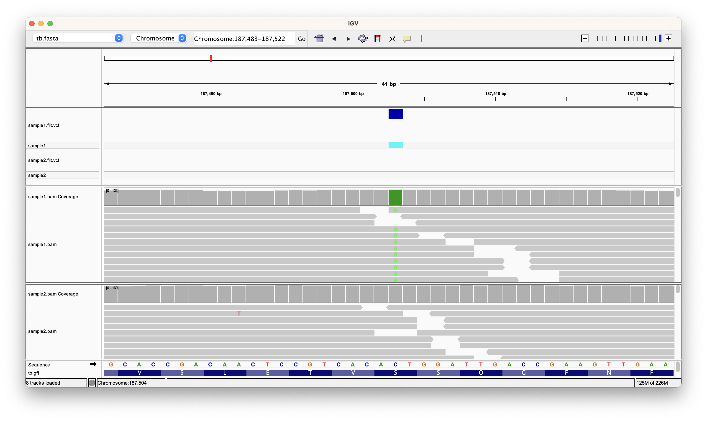
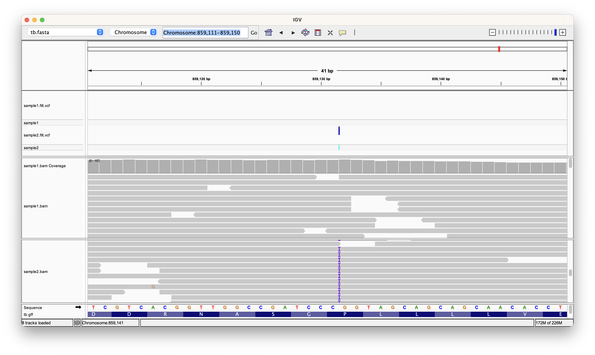
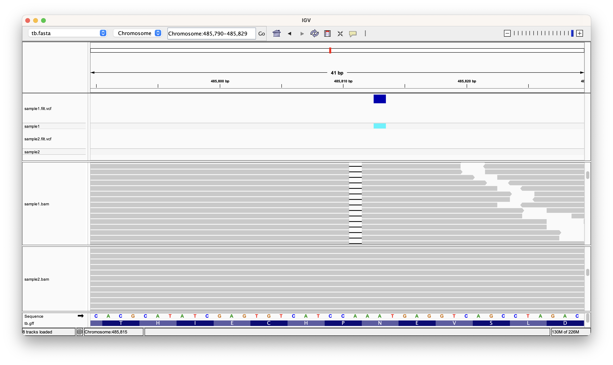
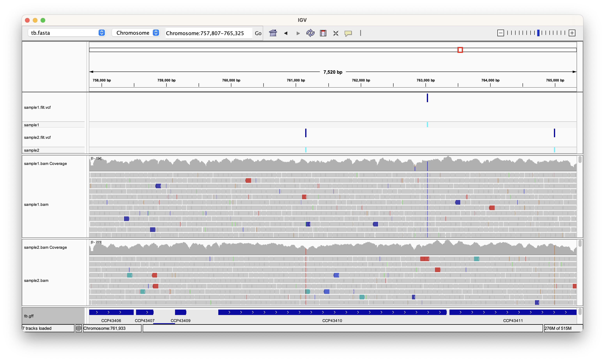
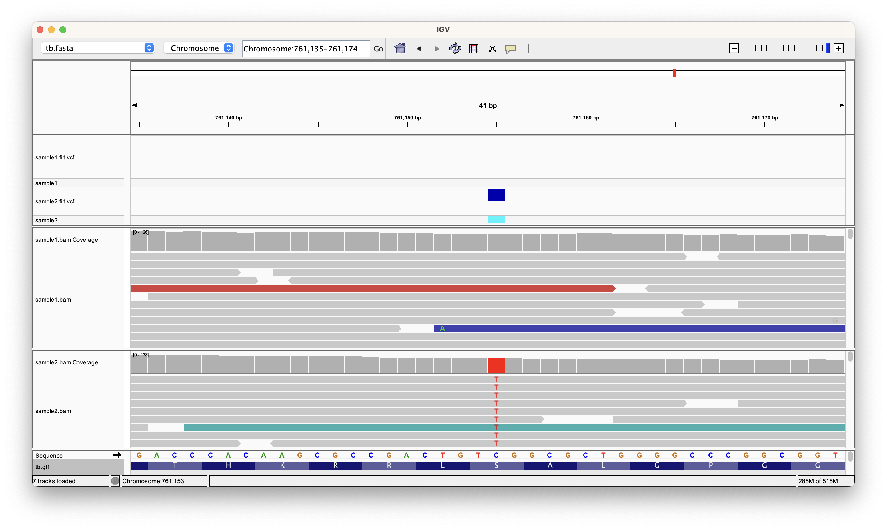
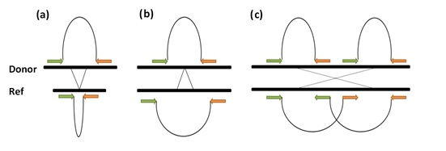

# Variant detection

## Introduction

New sequencing technologies are mostly used for re-sequencing, namely when a well-assembled reference genome from the same organism or one very similar is available. Instead of assembling the reads to produce a new genome sequence, re-sequencing projects aim to compare the sampled genome with the reference by read mapping. Short read alignment was considered in the previous practical. Here, we will focus on downstream analyses aiming to identify Single Nucleotide Polymorphisms (SNPs), insertions and deletions (indels) and large structural variants (SVs) in the sequenced sample.

Most of the software for variant detection and calling require alignment files (e.g. BAM format) as input. We will be using samtools/bcftools and GATK for SNP and small indel discovery.

Historically, structural variation refers to relatively large polymorphisms that alter the chromosome structure. Indels belong to this group of genetic variation. Among the early methods for discovering structural variants (SVs), whole-genome array comparative hybridisation (Carter[^1]) and SNP arrays (Cooper[^2]) have been successfully applied despite their resolution limitations

The advent of high-throughput sequencing platforms has opened new possibilities in this area. New tools have been developed to detect unusual patterns of reads, or pairs of reads, left by SVs. Such signatures can be broadly grouped into three categories of signature: discordant mapping of read pairs, read splitting, and depth of coverage. SV detection programs implement algorithms aiming to identify such signatures, or combinations of them, from sequence alignment files (Medvedev[^3])

## SNP detection and calling

Some differences between the reference and the mapped reads are due to sequencing errors. By definition, a quality score of 30 (Q30), refers to, on average, 1 in every 1000 bases in the reads is expected to be incorrect (Q20 1/100, Q40 1/10000 etc.). Nevertheless, the high depth of coverage achieved by current sequencing platforms SNPs can be distinguished from sequencing errors. True SNPs are expected to be shown as mismatches occurring consistently across multiple reads at the same reference position, whereas mismatches found at spurious locations are likely to be caused by sequencing errors. SNP calling tools make use of this fact to calculate statistical significance and filter out false positives.

### Exercise 1: Identifying Single Nucleotide Polymorphisms (SNPs)

Activate the relevant `conda` environment and open up a new session of `igv`:

```
conda activate variant_detection
igv
```

!!! info
    You can list all installed environments with `conda env list`.

 
1. Click "Genomes" on the top menu bar followed by "Load Genome From File...". Select the reference fasta file at "~/data/tb/tb.fasta".
2. Click "File" on the top menu bar followed by "Load From File...". Select the genome annotation file at "~/data/tb/tb.gff".
3. Click "File" on the top menu bar followed by "Load From File...". Select the bam file for sample 1 at "~/data/tb/sample1.bam".

We are going to check at positions 187,503 and 587,585 in the genome. To zoom into a position in the genome you have to input the location into the search bar in the format of **Chromosome:position** or **Chromosome:start-end** if you want to visualise a range. For example - to go to position 187,503 type in **Chromosome:187503** and hit ++enter++. You should see an image similar to the one below.


!!! exercise
    


!!! question "Exercise"
    
    === "Question 1"

        What does the coverage and alignment track show you? Do you think there is a SNP in this position?
        Go to position 587,585 and check if we have any variants.

    === "Answer 1"

        You should be able to see that almost all the reads have a different nucleotide from the reference at potision **187,503** so we can conclude that we have a SNP here.
        For position **587,585** it is a bit more complicated. You might notice that we have both the reference and alternate alleles at this position. Further, it looks like all alternate alleles are located at the very end of reads and alsways in the reads going in the same direction. This is most likely an artefact of alignment and not a real variant.

        


### Exercise 2: Calling SNPs and short indels using SAM/BCFtools

In previous exercises raw reads were mapped onto the reference genome using BWA (Li[^4]) for several Mtb samples, resulting in alignment files of BAM format. The combination of SAMtools (Li[^5]) and BCFtools (Danecek[^6]) is a widely established approach to call SNPs and small indels (Li[^4]). SAMtools gathers information from input BAM files and computes the likelihood of each possible genotype. BCFtools takes SAMtools output and performs the actual genotype calling. Results are stored in files of VCF format (Variant Call Format).

We had an insight into the SNP detection in the previous practical, using a single c. Let us start by looking at again at bcftools mpileup command options that we will need to change to optimise SNP calling.

Open up a new terminal window and type:

```
bcftools mpileup
```

Table 1 Some bcftools mpileup parameters.

| Option | Type | Default | Description   |
|--------|------|---------|---------------|
| -C     | INT  | 0       | Coefficient for downgrading mapping quality for reads containing excessive mismatches. Given a read with a phred-scaled probability q of being generated from the mapped position, the new mapping quality is about sqrt((INT-q)/INT)*INT. A zero value disables this functionality; if enabled, the recommended value for BWA is 50. |
| -d     | INT  | 250     | Max per-BAM depth to avoid excessive memory usage.   |
| -f     | FILE | null    | The faidx-indexed reference file in the FASTA format. The file can be optionally compressed by gzip.             |
| -q     | INT  | 0       | Minimum mapping quality for an alignment to be used.               |
| -Q     | INT  | 13      | Minimum base quality for a base to be considered.      |


Read through the following command (we will execute them later):

```
# bcftools mpileup -B -Q 23 -d 2000 -C 50 -f ~/data/tb/tb.fasta ~/data/tb/sample1.bam
```

Note that we are considering many more reads (depth) per position (-d) and imposing more strict quality thresholds (-Q). bcftools mpileup output must be piped to the bcftools call command, the second step in SNP calling. To display all available parameters type:

```
bcftools call
```

There is no need to understand every single parameter; the options we will need to use are listed in Table 2.

Table 2 Some bcftools call parameters.

|                                   | Option   | Description                                                                    |
|-----------------------------------|----------|--------------------------------------------------------------------------------|
| File Format Options               | --ploidy | Predefined ploidy of the organism/data.                                        |
| Input/Output Options              | -A       | Keep all possible alternate alleles at variant sites.                          |
|                                   | -f       | Output format fields.                                                          |
|                                   | -V       | Skip indels/snps.                                                              |
|                                   | -v       | Output variant sites only.                                                     |
| Consensus/variant Calling Options | -c       | The original calling method (conflicts with -m)                                |
|                                   | -m       | Alternative model for multiallelic and rare-variant calling.                   |
|                                   | -n       | Likelihood of novel mutation for constrained trio calling (conflicts with –c). |
|                                   | -p       | Variant if P(ref\|D)                                                           |
|                                   | -P       | Mutation rate (use bigger for greater sensitivity) use qith –m [1.1 e-3].      |

The complete bcftools call command would be as follows (it will be run later):

```
# bcftools call –m –v –O v > sample1.raw.vcf
```

Having understood bcftools mpileup and bcftools call parameters, we can combine both instructions to perform SNP and short indel calling as follows:

```
mkdir ~/data/tb/variants
cd ~/data/tb/variants/
bcftools mpileup -B -Q 23 -d 2000 -C 50 -f ~/data/tb/tb.fasta ~/data/tb/sample1.bam | bcftools call --ploidy 1 -m -v -O v - > sample1.raw.vcf
```

As we saw in the Introduction to Linux Practical the character ‘|’ is used to ‘pipe’ bcftools mpileup output into bcftools call as input. We can further filter the resulting variant calls using the vcfutils varFilter command, which like bcftools, is installed as part of the samtools package. Parameters within this tool can be reviewed when executing:

```
vcfutils.pl varFilter
```

!!! terminal "Terminal output"
    ```
    Usage:   vcfutils.pl varFilter [options] 

    Options: -Q INT    minimum RMS mapping quality for SNPs [10]
            -d INT    minimum read depth [2]
            -D INT    maximum read depth [10000000]
            -a INT    minimum number of alternate bases [2]
            -w INT    SNP within INT bp around a gap to be filtered [3]
            -W INT    window size for filtering adjacent gaps [10]
            -1 FLOAT  min P-value for strand bias (given PV4) [0.0001]
            -2 FLOAT  min P-value for baseQ bias [1e-100]
            -3 FLOAT  min P-value for mapQ bias [0]
            -4 FLOAT  min P-value for end distance bias [0.0001]
            -e FLOAT  min P-value for HWE (plus F<0) [0.0001]
            -p        print filtered variants

    Nb: Some of the filters rely on annotations generated by SAMtools/BCFtools.
    ```

The `-D` option of varFilter controls the maximum read depth, which should be adjusted at least to approximately twice the average read depth. Finally, type the following commands to obtain a high quality set of variants in VCF format:

```
cat sample1.raw.vcf | vcfutils.pl varFilter -d 10 -D 2000 > sample1.filt.vcf
```

!!! important
    Run the code above for sample2. The bam has already been preprocessed so all you have to do is replace “sample1” in the command with “sample2”

### Exercise 3: Calling SNPs and short indels using GATK

The Genome Analysis Toolkit (GATK) includes a wide variety of tools, with a primary focus on variant discovery and genotyping. The standard GATK data processing pipeline starts by applying the HaplotypeCaller to identify variable sites with respect to the reference. HaplotypeCaller will be set up by default to work on diploid organisms, therefore we will use the `--ploidy 1` for bacterial genomes like Mycobacterium tuberculosis. We will run GATK for SNPs and small indel calling to complement samtools/bcftools output.

Run the following two commands to call SNPs and indels using GATK instead of Samtools:

```
cd ~/data/tb/variants/
gatk HaplotypeCaller -R ~/data/tb/tb.fasta -I ~/data/tb/sample1.bam -O sample1.gatk.raw.vcf -ploidy 1
```

Be sure to read the output to make sure that the sample1.gatk.raw.vcf file has been created correctly.

### Exercise 4: Visualisation of variants (in VCF files) using IGV

We can open the resulting VCF files within the terminal window with the more (or less or head or cat) command:

```
less sample1.filt.vcf
```


!!! terminal "Terminal output"
    The output should look like this:
    ```
    #CHROM	POS	ID	REF	ALT	QUAL	FILTER	INFO	FORMAT	sample1
    Chromosome	1595	.	G	T	58	.	DP=16;VDB=1.106034e-02;RPB=2.849794e+00;AF1=0.5;AC1=1;DP4=8,4,2,2;MQ=39;FQ=61
    ;PV4=0.6,0.11,1,0.027	GT:PL:GQ	0/1:88,0,202:91
    Chromosome	1849	.	C	A	222	.	DP=148;VDB=3.647138e-01;AF1=1;AC1=2;DP4=0,0,77,66;MQ=44;FQ=-282	GT:PL:GQ	1/1:255,255,0:99
    Chromosome	1977	.	A	G	222	.	DP=70;VDB=1.915965e-02;AF1=1;AC1=2;DP4=0,0,14,54;MQ=44;FQ=-232	GT:PL:GQ	1/1:255,205,0:99
    ```

Press ++enter++ to scroll down to the end of the file or ‘q’ to exit back to the prompt.

### VCF format

VCF (Variant Call Format) is a text file format employed to store genetic variation with respect to a reference genome. It contains meta-information lines (beginning with ##), a header line (starting with #) and then data lines each containing information about a variable position in the genome. All variants, including SNPs and indels, are defined by the chromosome (CHROM), position (base pairs) in the reference genome (POS), ID, reference allele (REF), alternative allele (ALT) and a quality score for the detected variant (QUAL). The FILTER field contains information about the filters applied, and INFO gathers additional information. A detailed description of VCF format specification can be found at: [http://samtools.github.io/hts-specs/VCFv4.3.pdf](http://samtools.github.io/hts-specs/VCFv4.3.pdf)

VCF files can be opened and visualised in genome browsers such as IGV.

Launch an IGV instances as before (or use the same one if you kept it open) and load sample1.bam and sample2.bam in each of them as explained in Exercise 1.

In the menu bar, select **Load From File...** and select the VCF files in ~/data/tb/variants for both samples(i.e. sample1.filt.vcf and sample2.filt.vcf).

Then the SNPs should appear in the VCF track above the reads panel as shown below. On the other hand, sequencing errors are not called SNPs at those positions.
Making use of search bar to visit the two regions we visited in Exercise 1 (containing positions 187,503 and 587,585 respectively). Remember that we were trying to distinguish real SNPs from sequencing errors. 



!!! question "Exercise"
    The SNPs called from GATK can be examined in the same way. Try load the VCF files you generated with GATK and check if you get the same calls as with bcftools.

Zoom out to visualise more variants. Double-click on the reads panel to zoom in. Go back to the VCF terminal view, take note of any indels found and try to locate them using Tablet. Note that insertions and deletions are represented in a different way in IGV. 

Here is an insertion at 859,131 in sample2. Insertions are represented using purple strips on the reads. You can clck on the strip to find out what the sequence of the insertion is.



Here is a deletion at position 485,810 in sample1, note that because of how the deletion is labelled in each case (IGV or VCF) they appear shifted in position. This is because the variant falls on top of a homopolymer run of As so we can place the deletion on any of them.




### Drug resistance in Mycobacterium tuberculosis

One area where polymorphisms are elevated in Mycobacterium tuberculosis is in genes relating to antibiotic action. Resistance to anti-tuberculosis drugs is caused predominantly by point mutations (i.e. SNPs) that arise spontaneously and offer the bacterium survival advantage during (incomplete) drug treatment. Since SNPs conferring drug resistance have been characterised (Sandgren[^7]) it has been proposed that drug susceptibility can be inferred based on the presence/absence of such markers (Peacock, 2013). In this exercise we will be looking at Rifampicin resistance-conferring mutations found in the rpoB gene.

| osition | gene | Reference Nucleotide | Alternative Nucleotide | Reference Codon | Alternative Codons | Reference Amino Acid | Alternative Amino Acid |
|---------|------|----------------------|------------------------|-----------------|--------------------|----------------------|------------------------|
| 761095  | rpoB | T                    | C                      | CTG             | CCG                | L                    | P                      |
| 761101  | rpoB | A                    | T                      | CAA             | CTA                | Q                    | L                      |
| 761109  | rpoB | G                    | T                      | GAC             | TAC                | D                    | Y                      |
| 761110  | rpoB | A                    | T                      | GAC             | GTC                | D                    | V                      |
| 761128  | rpoB | C                    | T                      | TCG             | TTG                | S                    | L                      |
| 761139  | rpoB | C                    | T;G;A                  | CAC             | TAC;GAC;AAC        | H                    | Y;D;N                  |
| 761140  | rpoB | A                    | G;T                    | CAC             | CGC;CTC            | H                    | R;L                    |
| 761155  | rpoB | C                    | T;G                    | TCG             | TTG;TGG            | S                    | L;W                    |
| 761161  | rpoB | T                    | C                      | CTG             | CCG                | L                    | P                      |

Load the Annotation track and go to the rpoB (Rv0667) gene region, to do so in the left side information table where the Chromosome is listed click on the tab “Features” then at the bottom from the list Select filter by select “Name” (type ‘Rv0667’ in the Search Box) and try to spot one of the above SNPs in the gene.


    

!!! question "Exercise"
    
    === "Question 2"

        The SNPs called from GATK can be examined in the same way. Try load the VCF files you generated with GATK and check if you get the same calls as with bcftools.

    === "Answer 2"

        Sample 2 has a SNP at position 761155. It changes the nucleotide from a C to a T. By looking at the table you can see that this leads to the mutation S450L which is the most prominant resistance mutation for rifampicin. 

        

## Large structural variant (SV) detection and calling

While small indels can be detected by finding gaps within mapped reads, larger structural variation requires alternative approaches. When working with short reads and high depth of coverage, samtools/bcftools and GATK are established pipelines for detection and calling of SNPs and small indels. However, there are other algorithms and software for the identification of larger SVs (Medvedev[^3]). In the following exercises, we will introduce the main approaches and employ representative tools deploying such strategies. The software’s quality is measured in terms of sensitivity, specificity and accuracy of predicting breakpoint locations.

Depth of coverage (DOC) methods assume that the number of mapped reads in a given region follow a (modified) Poisson distribution, and are expected to be proportional to the number of times such a region occurs in the sequenced genome. Deleted regions will have much fewer or no reads mapping to it, whereas a duplicated region will have more reads (Chiang[^9]). The larger the event, the stronger the detected signal for these signatures. The main disadvantages of this approach are its inefficacy at detecting weaker signals caused by small events, breakpoint resolution and that gain signatures do not localise where the insertion occurred.

### Exercise 5: SV detection using discordant paired-end mapping (PEM) and split read approaches (Delly software)

Mapping of paired-end reads (PEM) and DOC methods were the first to be implemented when reads were much shorter (~35bp). PEM is the most prominent method to detect large SVs (Medvedev[^3]). DOC signatures also support SVs including a copy number change in the sequenced genome, namely deletions and tandem duplications. Nevertheless, with longer (paired) reads achieved nowadays (up 150bp with Illumina HiSeq machines), read split methods outperform PEM software in terms of breakpoint resolution, higher discovery rates and lower false positives (Suzuki[^10]). Recently published tools, Delly (Rausch[^11]) make use of a complementary strategy under the assumption that SVs supported by different signatures are called with higher confidence. Both aforementioned tools use a split read approach assisted by the PEM. This exercise will combine paired-end and split-read alignment methods to increase sensitivity and specificity in SV calling. In particular we will be using Delly software to detect large structural variants.

Change to variants directory and run the following commands:

```
cd ~/data/tb/variants/
delly call -o sample1.delly.bcf -q 20 -s 3 -g ~/data/tb/tb.fasta ~/data/tb/sample1.bam
delly call -o sample2.delly.bcf -q 20 -s 3 -g ~/data/tb/tb.fasta ~/data/tb/sample2.bam
```

It should take no longer than 5 minutes per file. Type the program name to display all options:

```
delly
```

!!! terminal "Terminal output"
    
    The screen output should look like this:
    ```
    **********************************************************************
    Program: Delly
    This is free software, and you are welcome to redistribute it under
    certain conditions (GPL); for license details use '-l'.
    This program comes with ABSOLUTELY NO WARRANTY; for details use '-w'.

    Delly (Version: 0.7.8)
    Contact: Tobias Rausch (rausch@embl.de)
    **********************************************************************

    Usage: delly  

    Commands:

        call         discover and genotype structural variants
        merge        merge structural variants across VCF/BCF files and within a single VCF/BCF file
        filter       filter somatic or germline structural variants
    ```

The software has two sequential steps. First, structural variants are predicted based on PEM signatures, in other words, when mapped pair insert size happens to be greater than expected.


Paired-end options include, like all PEM-based software, the insert size cut-off (-s). The minimum paired-end mapping quality (-q) has been set to 20, therefore all reads with mapping quality below this threshold will be discarded. Structural variants detected by PEM will be outputted to the file indicated with ‘-o’.
The specification of the standard deviation units (-s) is probably the most important cut-off for PEM methods. A deletion is detected when the pair mapped distance exceeds the upper threshold defined as s times (s = 3) the standard deviation (σ) over the mean (μ + 3σ).



Second, Delly makes use of soft-clipped information to find exact breakpoints. Read splitting approaches rely on mapping broken reads that span breakpoints and are located in nearby locations. The structural variant signature in this case consists of one of the reads mapping to the reference and its split mate mapping with one of its parts approximately one insert size away. For insertions, the broken read will have its splits parts adjacent to each other, with a missing middle part of the read. In both cases, breakpoints can be resolved with base-pair precision.


Split-read options include the reference genome file name (-g), the output file name containing structural variants inferred by split-read method (-b) and other parameters.


Delly software produces one output file per run, called sample1.delly.bcf and sample2.delly.bcf in our two runs. These are in a BCF-style format.Therefore you should run the following commands to get the VCF formatted files. As with short variants, we can also do some filtering to reduce our list to high-confidence variants.

```
bcftools view -i 'FILTER="PASS" && ALT="<DEL>" && (END-POS)<20000' -c 2 sample1.delly.bcf > sample1.delly.vcf
bcftools view -i 'FILTER="PASS" && ALT="<DEL>" && (END-POS)<20000' -c 2 sample2.delly.bcf > sample2.delly.vcf
```

Bcftools will allow us to perform this filtering using the `-i` followed by a filtering string. This refers to values that are stored in the VCF file for each variant. Each expression is evaluated and multiple expressions can be chained with `&&`. Variants will be selected using the following criteria:

1. Firstly, using `FILTER="PASS"` we select all variants which have the FILTER parameter set to **PASS**. This is filter value is generated by delly and is a measure of its confidence in the variant.
2. Then we keep only deletions with `ALT="<DEL>"`
3. After that, using `(END-POS)<20000`, we keep variants less than 20kb as larger variants are somewhat unrealistic in Mtb.

Finally, with `-c 2` we select variants which delly believes are homozygous alternate. Delly assumes a diploid model and so can have heterozygous homozygous alternate depending on the amount of evidence. This doens't really make sense for Mtb but it is a hack to allow us to select only those with the most evidence.

Now you should be able to open them in your favourite text viewer/editor (cat, less, nano, more or vim):

!!! terminal "Terminal output"
    ```
    Chromosome 79569 DEL00000002 C <DEL> . PASS PRECISE;SVTYPE=DEL;SVMETHOD=EMBL.DELLYv0.7.8; CHR2=Chromosome;END=83036;PE=73;MAPQ=60;CT=3to5;CIPOS=-6,6; CIEND=-6,6;INSLEN=0;HOMLEN=5;SR=10;SRQ=1; CONSENSUS=CCCGGTGGACCCGGTGGACCCGGTGGACCCGGTGGACGCCGTGGTC GCCGTGGGACGGGCGCGACGGCACGCCGCGGCCGCGTTGCGCTCCGG;CE=1.67548 GT:GL:GQ:FT:RCL:RC:RCR:CN:DR:DV:RR:RV 1/1:-112.094,-9.62652,0:96:PASS:1230:199:1027:0:1:80:0:32
    ```

### Exercise 6: Visualisation of predicted structural variants using IGV

So far we have use IGV to visualise SNPs. In this exercise we will run it again to manually annotate larger deletions predicted by Delly tools in Exercise 5.

SV detection tools output not only potential structural differences, but also a confidence value attach to them. An important threshold is the minimum number of supporting reads (found in Delly output) for an event to be retained. Hits with very few supporting reads (column 5) are expected to be false positives (FP). Repetitive and highly polymorphic regions in the genome are the main sources of such FP events.

Launch an IGV instances as before (or use the same one if you kept it open) and load sample1.bam and sample2.bam in each of them as explained in Exercise 1.

In the tool bar, select Import features as if we were going to load an annotation file. But this time select the compressed VCF files in ~/data/tb/ (i.e. sample1.delly.vcf.gz for the instance with sample1 loaded and sample2.delly.vcf.gz for the instance with sample2 loaded).

Find the region 77,823-84,798 and establish whether differences in the alignment can be visually identified between samples . Note: The coverage plot can also give you a clear insight.


!!! question "Exercise"
    
    === "Question 1"

        Which characteristic signatures of deletions (gap of coverage, long-spanning read pairs and split-reads) can be identified? (Read the notes below to help answer this question) 

    === "Answer 1"

        We can see a gap in the coverage and many reads which end abruptly at the same positions (split reads).


References

[^1]: Carter, N. (2007). Methods and strategies for analyzing copy number variation using DNA microarrays. Nature genetics, 39, 1–11. doi:10.1038/ng2028.Methods

[^2]: Cooper, G. M., Zerr, T., Kidd, J. M., Eichler, E. E., & Nickerson, D. a. (2008). Systematic assessment of copy number variant detection via genome-wide SNP genotyping. Nature genetics, 40(10), 1199–203. doi:10.1038/ng.236

[^3]: Medvedev, P., Stanciu, M., & Brudno, M. (2009). Computational methods for discovering structural variation with next-generation sequencing. nature methods, 6(11), S13–S20. doi:10.1038/NMEtH.1374

[^4]: Li, H., & Durbin, R. (2010). Fast and accurate long-read alignment with Burrows–Wheeler transform. Bioinformatics, 26(5), 589–595. Retrieved from http://www.ncbi.nlm.nih.gov/pubmed/20080505

[^5]: Li, H. (2011). A statistical framework for SNP calling, mutation discovery, association mapping and population genetical parameter estimation from sequencing data. Bioinformatics (Oxford, England), 27(21), 2987–93. doi:10.1093/bioinformatics/btr509

[^6]: Danecek, P., Auton, A., Abecasis, G., Albers, C. a, Banks, E., DePristo, M. a, … Durbin, R. (2011). The variant call format and VCFtools. Bioinformatics (Oxford, England), 27(15), 2156–8. doi:10.1093/bioinformatics/btr330

[^7]: Sandgren, A., Strong, M., Muthukrishnan, P., Weiner, B. K., Church, G. M., & Murray, M. B. (2009). Tuberculosis drug resistance mutation database. PLoS medicine, 6(2), e2. doi:10.1371/journal.pmed.1000002

[^8]: Sharon J. Peacock, P. D. (2013). Whole-Genome Sequencing for Rapid Susceptibility Testing of M. tuberculosis. The New England Journal of Medicine.

[^9]: Chiang, D., Getz, G., Jaffe, D., & O’Kelly, M. (2008). High-resolution mapping of copy-number alterations with massively parallel sequencing. Nature methods, 6(1), 99–103. doi:10.1038/nmeth.1276.High-resolution

[^10]: Suzuki, S., Yasuda, T., & Shiraishi, Y. (2011). ClipCrop: a tool for detecting structural variations with single-base resolution using soft-clipping information. BMC, 12(Suppl 14), S7. doi:10.1186/1471-2105-12-S14-S7

[^11]: Rausch, T., Zichner, T., Schlattl, a., Stutz, a. M., Benes, V., & Korbel, J. O. (2012). DELLY: structural variant discovery by integrated paired-end and split-read analysis. Bioinformatics, 28(18), i333–i339. doi:10.1093/bioinformatics/bts378
